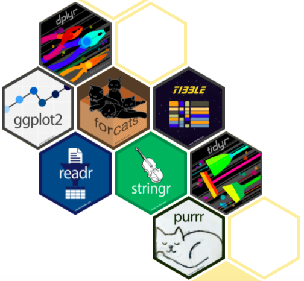

```{r setup, include=FALSE}
library(emo)
#library(icons)
library(kableExtra)
#library(betweenthepipes)
library(tidyverse)
library(showtext)
library(palmerpenguins)
options(knitr.kable.NA = '')
options(htmltools.dir.version = FALSE, htmltools.preserve.raw = FALSE)
knitr::opts_chunk$set(fig.retina = 3, 
                      warning = FALSE, 
                      message = FALSE,
                      fig.path = "figs/Lec2/")

font_add_google(name = "Open Sans",   # Name of the font on the Google Fonts site
                family = "open_sans")
font_add_google(name = "Source Serif Pro",   # Name of the font on the Google Fonts site
                family = "source_serif_pro")
showtext_auto()

cmu_theme <- function () { 
  theme_linedraw(base_size=11, base_family="source_serif_pro") %+replace% 
    theme(
      panel.background  = element_blank(),
      plot.background = element_rect(fill = "transparent", color = NA), 
      legend.background = element_rect(fill = "transparent", color = NA),
      legend.key = element_rect(fill = "transparent", color = NA),
      axis.ticks = element_blank(),
      panel.grid.major = element_line(color = "grey90", size = 0.3), 
      panel.grid.minor = element_blank(),
      plot.title = element_text(size = 18, hjust = 0, vjust = 0.5, face = "bold", margin = margin(b = 0.2, unit = "cm")),
      plot.subtitle = element_text(size = 12, hjust = 0, vjust = 0.5, margin = margin(b = 0.2, unit = "cm")),
      plot.caption = element_text(size = 7, hjust = 1, face = "italic", margin = margin(t = 0.1, unit = "cm")),
      axis.text.x = element_text(size = 13),
      axis.text.y = element_text(size = 13)
    )
}

```

```{r xaringan-themer, include=FALSE, warning=FALSE}
library(xaringanthemer)

style_mono_accent(
  header_font_google = google_font("Open Sans"),
  text_font_google   = google_font("Source Serif Pro", "400", "400i"),
  code_font_google   = google_font("Roboto Mono"),
  link_color = "#bb0000",
  base_color = "#bb0000",
  extra_fonts = list(
    google_font("Lato")
  ),
  extra_css = list(
    ".title-slide h2" = list("font-family" = "Source Serif Pro"),
    ".title-slide h3" = list("font-family" = "Source Serif Pro")
  )
)
```

class: inverse, center, middle

# 36-315: Statistical Graphics and Visualization
## Lecture 2

Meghan Hall <br> Department of Statistics & Data Science <br> Carnegie Mellon University <br> May 24, 2021

---
layout: true
<div class="my-footer"><span>cmu-36315.netlify.app</span></div>
---

# From last time

<br>

.large[Syllabus overview]
<br>
.medium[Email me with any questions]

<br>

.large[Why do we visualize data?]
<br>
.medium[Explore, diagnose, explain]

---

# Updates

<br>

.large[Alternate lab]
<br>
.medium[8:00pm-9:20pm EDT, Tuesday/Thursday]

<br>

.large[Office hours]
<br>
.medium[Listed on Canvas, start Friday!]

---

# Today

<br>

.large[The grammar of graphics]
<br>
.medium[How graphics are constructed in R]

<br>

.large[Tidyverse principles]
<br>
.medium[For any necessary data manipulation]

---

# ggplot

<br>
<br>
<br>

.large[What exactly is the **g**rammar of **g**raphics?]
<br>
<br>
.medium["the whole system and structure of a language"]

---

# ggplot

<br>

.large[A graphic...]
<br>
<br>
.medium[maps the **data** +]
<br>
<br>
.medium[to the **aesthetic attributes** +]
<br>
<br>
.medium[of **geometric points** +]
<br>
<br>
--
.medium[*with possible **statistical transformations** +*]
<br>
<br>
.medium[*different **coordinate systems** +*]
<br>
<br>
.medium[*and **faceting** *]

---

# ggplot

<br>
<br>
<br>

.huge.center[Data **+** Mapping]

---

# How do we "map" data?

<br>

.medium[Encoding data into visual cues dictates how we signify *changes* and *comparisons*]
<br>
<br>
.medium[A non-exhaustive list:]

* length
* color (or saturation)
* position
* size
* shape
* area
* volume
* angle

---

class: center

# .left[Today's data]

<br>
<br>

.pull-left[


]

.pull-right[


]

<br>
<br>

.right[*Artwork by @allison_horst*]

---

# How are we encoding this?

```{r color, echo = FALSE, fig.align = "center", fig.height = 6.5}
penguins %>% 
  ggplot(aes(x = flipper_length_mm, y = body_mass_g, color = species)) +
  geom_point() + 
  scale_y_continuous(name = "Mean Body Mass in Grams") +
  scale_x_continuous(name = "Flipper Length in mm") +
  cmu_theme() +
  theme(panel.grid.major.x = element_blank(), #
        axis.title = element_text(size = 13, face = "bold"),
        legend.title = element_blank(),
        legend.position = c(0.25, 0.9),
        legend.text = element_text(size = 13))
```

---

# How are we encoding this?

```{r length, echo = FALSE, fig.align = "center", fig.height = 5.5}
penguins %>% 
  group_by(species) %>% 
  summarize(mass_mean = mean(body_mass_g, na.rm = TRUE)) %>% 
  ggplot(aes(x = species, y = mass_mean)) +
  geom_bar(stat = "identity") + 
  scale_y_continuous(name = "Mean Body Mass in Grams") +
  scale_x_discrete(name = "Penguin Species") +
  cmu_theme() +
  theme(panel.grid.major.x = element_blank(),
        axis.title = element_text(size = 13, face = "bold"))
```

---

# How are we encoding this?

```{r length-color, echo = FALSE, fig.align = "center", fig.height = 5.5}
penguins %>% 
  group_by(species) %>% 
  summarize(mass_mean = mean(body_mass_g, na.rm = TRUE)) %>% 
  ggplot(aes(x = species, y = mass_mean, fill = species)) +
  geom_bar(stat = "identity") + 
  scale_y_continuous(name = "Mean Body Mass in Grams") +
  scale_x_discrete(name = "Penguin Species") +
  labs(fill = "Species") +
  cmu_theme() +
  theme(panel.grid.major.x = element_blank(),
        legend.position = "top",
        axis.title = element_text(size = 13, face = "bold"))
```

--

.right.large[`r emo::ji("thinking")`]

---

# How are we encoding this?

```{r size, echo = FALSE, fig.align = "center", fig.height = 5.5}
penguins %>% 
  ggplot(aes(x = flipper_length_mm, y = species, size = body_mass_g)) +
  geom_point(position = "jitter") + 
  scale_y_discrete(name = "Species") +
  scale_x_continuous(name = "Flipper Length in mm") +
  labs(size = "Body mass (g)") +
  cmu_theme() +
  theme(panel.grid.major.y = element_blank(),
        axis.title = element_text(size = 13, face = "bold"),
        legend.position = "top",
        legend.text = element_text(size = 13))
```

--

.right.large[`r emo::ji("thinking")`]

---

# How are we encoding this?

```{r pie, echo = FALSE, fig.align = "center", fig.height = 5.5}
penguins %>% 
  count(species) %>% 
  ggplot(aes(x = "", y = n, fill = species)) +
  geom_bar(stat = "identity", width = 1, color = "white") +
  coord_polar("y", start = 0) +
  labs(fill = "Species") +
  theme_void(base_family="source_serif_pro")
```

--

.right.large[`r emo::ji("thinking")`]

---

# ggplot

<br>
<br>
<br>

.huge.center[Data **+** Mapping]

--

1. **layer**
<br>
<br>
2. scale
<br>
<br>
3. coord
<br>
<br>
4. facet
<br>
<br>
5. theme

---

# Mapping components: layer

<br>

.large[**geom**]
<br>
.medium[Geometric elements (bars, lines, points, etc.)]

--

<br>

.large[**stat**]
<br>
.medium[Statistical transformations (summarizing data)]

---

# Mapping components: layer

```{r layer-1, eval = FALSE}
penguins %>% 
  ggplot(aes(x = species))
```

--

```{r layer-1, echo = FALSE, fig.align = 'center', fig.height = 5}
```

---

# Mapping components: layer

```{r layer-2, eval = FALSE}
penguins %>% 
  ggplot(aes(x = species)) +
  geom_bar()
```

--

```{r layer-2, echo = FALSE, fig.align = 'center', fig.height = 5}
```

---

# Mapping components: layer

```{r layer-3, eval = FALSE}
penguins %>% 
  group_by(species) %>% #<<
  summarize(mass_mean = mean(body_mass_g, na.rm = TRUE)) %>% #<<
  ggplot(aes(x = species, y = mass_mean)) +
  # what happens if you don't include the stat argument?
  geom_bar(stat = "identity")
```

--

```{r layer-3, echo = FALSE, fig.align = 'center', fig.height = 4.25}
```

---

# Mapping components: layer

```{r layer-4, eval = FALSE}
penguins %>% 
  ggplot(aes(x = bill_length_mm, y = bill_depth_mm)) +
  geom_point()
```

--

```{r layer-4, echo = FALSE, fig.align = 'center', fig.height = 4.5}
```

---

# Mapping components: layer

```{r layer-5, eval = FALSE}
penguins %>% 
  ggplot(aes(x = sex, y = body_mass_g)) +
  geom_boxplot()
```

--

```{r layer-5, echo = FALSE, fig.align = 'center', fig.height = 4.5}
```

---

# Mapping components: layer

```{r layer-6, eval = FALSE}
penguins %>% 
  ggplot(aes(x = body_mass_g)) +
  geom_histogram()
```

--

```{r layer-6, echo = FALSE, fig.align = 'center', fig.height = 4.5}
```

---

# ggplot

<br>
<br>
<br>

.huge.center[Data **+** Mapping]


1. layer
<br>
<br>
2. **scale**
<br>
<br>
3. coord
<br>
<br>
4. facet
<br>
<br>
5. theme

---

# Mapping components: scale

<br>

.large[data `r emo::ji("right arrow")` aesthetics]
<br>
.medium[shape, color, size, etc.]

--

<br>

.large[how you interpret the plot]
<br>
.medium[scales and legends]

---

# Mapping components: scale

```{r scale-1, eval = FALSE}
penguins %>% 
  ggplot(aes(x = bill_length_mm, y = bill_depth_mm)) +
  geom_point()
```


```{r scale-1, echo = FALSE, fig.align = 'center', fig.height = 4.5}
```

---

# Mapping components: scale

```{r scale-2, eval = FALSE}
penguins %>% 
  ggplot(aes(x = bill_length_mm, y = bill_depth_mm)) +
  geom_point(color = "blue", size = 2)
```

--

```{r scale-2, echo = FALSE, fig.align = 'center', fig.height = 4.5}
```

---

# Mapping components: scale

```{r scale-3, eval = FALSE}
penguins %>% 
  ggplot(aes(x = bill_length_mm, y = bill_depth_mm)) +
  geom_point(aes(color = species), size = 2)
```

--

```{r scale-3, echo = FALSE, fig.align = 'center', fig.height = 4.5}
```

---

# Mapping components: scale

```{r scale-4, eval = FALSE}
penguins %>% 
  ggplot(aes(x = bill_length_mm, y = bill_depth_mm)) +
  geom_point(aes(color = species), size = 2) +
  scale_color_manual(values = c("#aa6600","#666666","#224477"))
```

--

```{r scale-4, echo = FALSE, fig.align = 'center', fig.height = 4.5}
```

---

# Mapping components: scale

```{r scale-5, eval = FALSE}
penguins %>% 
  ggplot(aes(x = bill_length_mm, y = bill_depth_mm)) +
  geom_point(aes(color = species), size = 2) +
  scale_color_manual(values = c("#aa6600","#666666","#224477")) +
  scale_x_continuous(name = "Bill Length (mm)", 
                     breaks = seq(30, 60, by = 5), limits = c(30, 60))
```

--

```{r scale-5, echo = FALSE, fig.align = 'center', fig.height = 4.25}
```

---

# ggplot

<br>
<br>
<br>

.huge.center[Data **+** Mapping]


1. layer
<br>
<br>
2. scale
<br>
<br>
3. **coord**
<br>
<br>
4. facet
<br>
<br>
5. theme

---

# Mapping components: coord

<br>

.large[x and y]
<br>
.medium[or latitude and longitude, or radius and angle]

--

<br>

.large[we'll discuss more about maps later!]

---

# Mapping components: coord

```{r coord-1, eval = FALSE}
penguins %>% 
  group_by(species) %>%
  summarize(mass_mean = mean(body_mass_g, na.rm = TRUE)) %>% 
  ggplot(aes(x = species, y = mass_mean)) +
  geom_bar(stat = "identity")
```


```{r coord-1, echo = FALSE, fig.align = 'center', fig.height = 4.25}
```

---

# Mapping components: coord

```{r coord-2, eval = FALSE}
penguins %>% 
  group_by(species) %>%
  summarize(mass_mean = mean(body_mass_g, na.rm = TRUE)) %>% 
  ggplot(aes(x = species, y = mass_mean)) +
  geom_bar(stat = "identity") +
  coord_flip() #<<
```

--

```{r coord-2, echo = FALSE, fig.align = 'center', fig.height = 4.25}
```

---

# Mapping components: coord

```{r coord-3, eval = FALSE}
penguins %>% 
  count(sex) %>% 
  ggplot(aes(x = "", y = n, fill = sex)) +
  geom_bar(stat = "identity", width = 1, color = "white") +
  coord_polar("y", start = 0) + #<<
  theme_void()
```

--

```{r coord-3, echo = FALSE, fig.align = 'center', fig.height = 3}
```

--

.right.large[`r emo::ji("thinking")`]

---

# ggplot

<br>
<br>
<br>

.huge.center[Data **+** Mapping]


1. layer
<br>
<br>
2. scale
<br>
<br>
3. coord
<br>
<br>
4. **facet**
<br>
<br>
5. theme

---

# Mapping components: facet

<br>

.large[create small multiples]
<br>
.medium[useful for the *explore* part of data viz]

---

# Mapping components: facet

```{r facet-1, eval = FALSE}
penguins %>% 
  filter(!is.na(sex)) %>% 
  ggplot(aes(x = sex, y = body_mass_g)) +
  geom_point(position = "jitter")
```


```{r facet-1, echo = FALSE, fig.align = 'center', fig.height = 4.5}
```

---

# Mapping components: facet

```{r facet-2, eval = FALSE}
penguins %>% 
  filter(!is.na(sex)) %>% 
  ggplot(aes(x = sex, y = body_mass_g)) +
  geom_point(position = "jitter") +
  facet_wrap(~species) #<<
```

--

```{r facet-2, echo = FALSE, fig.align = 'center', fig.height = 4.5}
```

---

# ggplot

<br>
<br>
<br>

.huge.center[Data **+** Mapping]


1. layer
<br>
<br>
2. scale
<br>
<br>
3. coord
<br>
<br>
4. facet
<br>
<br>
5. **theme**

---

# Mapping components: theme

<br>

.large[adjust individual pieces of the plot]
<br>
.medium[font size, gridlines, legend position, etc.]

--

<br>

.large[or go full out with a custom theme!]

---

# Mapping components: theme

```{r theme-1, eval = FALSE}
penguins %>% 
  ggplot(aes(x = bill_length_mm, y = bill_depth_mm)) +
  geom_point(aes(color = species), size = 2) +
  scale_color_manual(values = c("#aa6600","#666666","#224477"))
```


```{r theme-1, echo = FALSE, fig.align = 'center', fig.height = 4.5}
```

---

# Mapping components: theme

```{r theme-2, eval = FALSE}
penguins %>% 
  ggplot(aes(x = bill_length_mm, y = bill_depth_mm)) +
  geom_point(aes(color = species), size = 2) +
  scale_color_manual(values = c("#aa6600","#666666","#224477")) +
  theme(legend.position = "top", legend.title = element_blank())
```

--

```{r theme-2, echo = FALSE, fig.align = 'center', fig.height = 4.25}
```

---

# Mapping components: theme

```{r theme-3, eval = FALSE}
penguins %>% 
  filter(!is.na(sex)) %>% 
  ggplot(aes(x = sex, y = body_mass_g)) +
  geom_point(position = "jitter") +
  facet_wrap(~species)
```


```{r theme-3, echo = FALSE, fig.align = 'center', fig.height = 4.5}
```

---

# Mapping components: theme

```{r theme-4, eval = FALSE}
penguins %>% 
  filter(!is.na(sex)) %>% 
  ggplot(aes(x = sex, y = body_mass_g)) +
  geom_point(position = "jitter") +
  facet_wrap(~species) +
  theme(panel.grid.major.x = element_blank())
```

--

```{r theme-4, echo = FALSE, fig.align = 'center', fig.height = 4.25}
```

---

# ggplot in review

<br>

.large[A graphic...]
<br>
<br>
.medium[maps the **data** +]
<br>
<br>
.medium[to the **aesthetic attributes** +]
<br>
<br>
.medium[of **geometric points** +]
<br>
<br>
.medium[*with possible **statistical transformations** +*]
<br>
<br>
.medium[*different **coordinate systems** +*]
<br>
<br>
.medium[*and **faceting** *]

---

# What's the tidyverse?

.center[]

---

# What's the tidyverse?

<br>

.large[An "opinionated" set of packages]
<br>
.medium[Similar philosophies, grammar, data structures]

<br>

.large[`dplyr`, `stringr`, `tidyr`, `readr`, `forcats`]
<br>
.medium[Useful for basic data manipulation]

<br>

.large[Best resource: [r4ds.had.co.nz/](https://r4ds.had.co.nz/)]

---

# Useful functions from `dplyr`

```{r count}
penguins %>% 
  count(species)
```

--

```{r filter-1}
penguins %>% 
  filter(species == "Gentoo") %>% 
  count(species)
```

---

# Useful functions from `dplyr`

```{r filter-2, eval = FALSE}
penguins %>% 
  filter(species %in% c("Gentoo","Chinstrap")) %>% 
  count(species)
```

```{r filter-3, eval = FALSE}
penguins %>% 
  filter(species == "Gentoo" | species == "Chinstrap") %>% 
  count(species)
```

```{r filter-4}
penguins %>% 
  filter(species != "Adelie") %>% 
  count(species)
```

---

# Useful functions from `dplyr`

```{r filter-5}
penguins %>% 
  count(sex)
```

```{r filter-6}
penguins %>% 
  filter(!is.na(sex)) %>% 
  count(sex)
```

---

# Useful functions from `dplyr`

```{r group-1}
penguins %>% 
  group_by(species) %>% 
  summarize(mass_mean = mean(body_mass_g))
```

--

```{r group-2}
penguins %>% 
  filter(is.na(body_mass_g))
```

---

# Useful functions from `dplyr`

```{r group-3}
penguins %>% 
  group_by(species) %>% 
  summarize(mass_mean = mean(body_mass_g, na.rm = TRUE))
```

---

# Useful functions from `dplyr`

<br>
.medium[`select()` is like `filter()` but for variables instead of observations]
<br>
<br>
.medium[`arrange()` sorts data]
<br>
<br>
.medium[`mutate()` creates new variables (`ifelse` and `case_when` are often useful)]
<br>
<br>
.medium[`rename()` does exactly what you think]
<br>
<br>
.medium[`left_join()` (and other joins) combines data frames based on common keys]

---

# Useful functions from `stringr` and `tidyr`

<br>
.medium[`str_detect()` detects whether or not a pattern is present in a string]
<br>
<br>
.medium[`str_replace()` replaces a pattern in a string with something else]
<br>
<br>
--
<br>
.medium[`pivot_longer()` "lengthens" data, increasing the number of rows & decreasing the number of columns]
<br>
<br>
.medium[`pivot_wider()` does the opposite]

---

# Upcoming

<br>

.large[Lab 1 on Tuesday May 25]
<br>
.medium[Assignments due 11:30am EDT Wednesday]

<br>

.large[Lecture 3 on Wednesday May 26]
<br>
.medium[Data types and bar charts]
