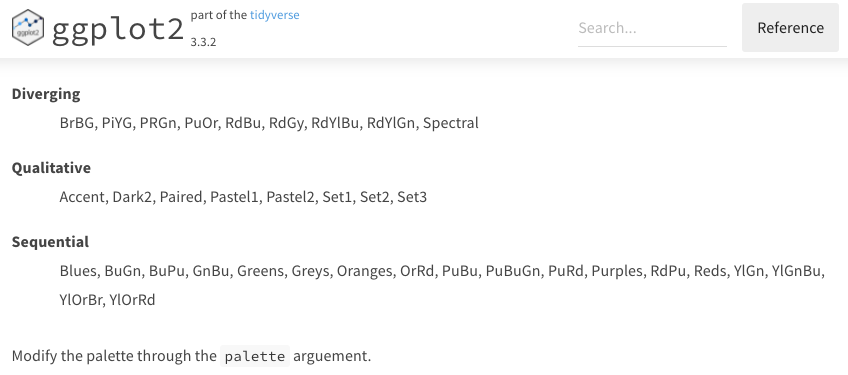

```{r setup, include=FALSE}
library(emo)
#library(icons)
library(kableExtra)
#library(betweenthepipes)
library(tidyverse)
library(showtext)
library(scales)
library(palmerpenguins)
library(ggridges)
library(ggtext)
library(lubridate)
library(friends)
library(ggrepel)
library(scico)
library(ggthemes)
library(ggdark)
library(hrbrthemes)

options(knitr.kable.NA = '')
options(htmltools.dir.version = FALSE, htmltools.preserve.raw = FALSE)
knitr::opts_chunk$set(fig.retina = 3, 
                      warning = FALSE, 
                      message = FALSE,
                      fig.path = "figs/Lec9/")

font_add_google(name = "Open Sans",   # Name of the font on the Google Fonts site
                family = "open_sans")
font_add_google(name = "Source Serif Pro",   # Name of the font on the Google Fonts site
                family = "source_serif_pro")
font_add_google(name = "Permanent Marker",   # Name of the font on the Google Fonts site
                family = "perm_marker")
showtext_auto()

cmu_theme <- function () { 
  theme_linedraw(base_size=11, base_family="source_serif_pro") %+replace% 
    theme(
      panel.background  = element_blank(),
      plot.background = element_rect(fill = "transparent", color = NA), 
      legend.background = element_rect(fill = "transparent", color = NA),
      legend.key = element_rect(fill = "transparent", color = NA),
      axis.ticks = element_blank(),
      panel.grid.major = element_line(color = "grey90", size = 0.3), 
      panel.grid.minor = element_blank(),
      plot.title = element_text(size = 18, hjust = 0, vjust = 0.5, face = "bold", margin = margin(b = 0.2, unit = "cm")),
      plot.subtitle = element_text(size = 12, hjust = 0, vjust = 0.5, margin = margin(b = 0.2, unit = "cm")),
      plot.caption = element_text(size = 7, hjust = 1, face = "italic", margin = margin(t = 0.1, unit = "cm")),
      axis.text.x = element_text(size = 13),
      axis.text.y = element_text(size = 13)
    )
}

tx_data <- read_csv("https://raw.githubusercontent.com/meghall06/CMU-36-315-site/main/data/alldata.csv")

tx_map <- 
  map_data("county", region = "texas")

tx_data_agg <- tx_data %>% 
  filter(Age == "All Ages" & County != "STATE OF TEXAS") %>% 
  mutate(hispanic_perc = Hispanic_Total / Total) %>% 
  select(County, hispanic_perc) %>% 
  mutate(county_lower = str_replace_all(County, " COUNTY", ""),
         county_lower = str_to_lower(county_lower))

tx_map <- tx_map %>%  
  left_join(tx_data_agg, by = c("subregion" = "county_lower"))

recessions <- list(interval(ymd("1969-12-01"), ymd("1970-11-01")),
                   interval(ymd("1973-11-01"), ymd("1975-03-01")),
                   interval(ymd("1980-01-01"), ymd("1980-07-01")), 
                   interval(ymd("1981-07-01"), ymd("1982-11-01")),
                   interval(ymd("1990-07-01"), ymd("1991-03-01")),
                   interval(ymd("2001-03-01"), ymd("2001-11-01")),
                   interval(ymd("2007-12-01"), ymd("2009-06-01")))

economics <- economics %>% 
  mutate(recession = ifelse(date %within% recessions, "recession", "not a recession"))

recession_list <- tribble(
  ~"start", ~"end", ~"status",
  #--|--|----
  "1967-07-01", "1970-11-01", "not a recession",
  "1969-12-01", "1970-11-01", "recession",
  "1970-11-01", "1973-11-01", "not a recession",
  "1973-11-01", "1975-03-01", "recession",
  "1975-03-01", "1980-01-01", "not a recession",
  "1980-01-01", "1980-07-01", "recession",
  "1980-07-01", "1981-07-01", "not a recession",
  "1981-07-01", "1982-11-01", "recession",
  "1982-11-01", "1990-07-01", "not a recession",
  "1990-07-01", "1991-03-01", "recession",
  "1991-03-01", "2001-03-01", "not a recession",
  "2001-03-01", "2001-11-01", "recession",
  "2001-11-01", "2007-12-01", "not a recession",
  "2007-12-01", "2009-06-01", "recession",
  "2009-06-01", "2015-04-01", "not a recession")

recession_list <- recession_list %>% 
  mutate(start = ymd(start),
         end = ymd(end))

fever <- tribble(
  ~"time", ~"temp",
  #--|--|----
  "Thurs\nmorning", 98.5,
  "Thurs\nmidday", 98.9,
  "Thurs\nevening", 98.7,
  "Fri\nmorning", 98.7,
  "Fri\nmidday", 98.5,
  "Fri\nevening", 99.5,
  "Sat\nmorning", 97.9
)

data <- read_csv("figs/Lec1/Datasaurus_data.csv", col_names = c("x","y"))
```

```{r xaringan-themer, include=FALSE, warning=FALSE}
library(xaringanthemer)

style_mono_accent(
  header_font_google = google_font("Open Sans"),
  text_font_google   = google_font("Source Serif Pro", "400", "400i"),
  code_font_google   = google_font("Roboto Mono"),
  link_color = "#bb0000",
  base_color = "#bb0000",
  extra_fonts = list(
    google_font("Lato")
  ),
  extra_css = list(
    ".title-slide h2" = list("font-family" = "Source Serif Pro"),
    ".title-slide h3" = list("font-family" = "Source Serif Pro")
  )
)
```

class: inverse, center, middle

# 36-315: Statistical Graphics and Visualization
## Lecture 9

Meghan Hall <br> Department of Statistics & Data Science <br> Carnegie Mellon University <br> June 11, 2021

---
layout: true
<div class="my-footer"><span>cmu-36315.netlify.app</span></div>
---

# From last time

<br>

.large[Taking plots to the next level]
<br>
.medium[effective *and* elegant]

<br>

.large[Redoing plots we've seen before]
<br>
.medium[get familiar with the syntax and the options]

---

# Note on homework/labs

<br>

.large[Read the instructions!]
<br>
.medium[that's where most points are coming off]

<br>

.large[.Rmd assignment files might not knit]
<br>
.medium[can add `eval = FALSE` to the function in the setup chunk]

---

# Today

<br>

.large[More details]
<br>
.medium[colors, fonts, annotations]

<br>

.large[Putting it all together with themes]
<br>
.medium[built-in, external options, custom]

---

class: left

# Today's agenda

<br>

.large[

1. **colors**

2. fonts

3. annotations

4. themes

]

---

# Types of color scales

<br>
<br>
.large[Qualitative]
<br>
.medium[distinguishing discrete items that don't have an order (nominal categorical)]
<br>
.medium[colors should be distinct and equal with none standing out]
<br>
<br>
--
<br>
.large[Sequential]
<br>
.medium[when data values are mapped to one shade]
<br>
.medium[e.g., in a choropleth, for an ordered categorical variable]
<br>
<br>
--
<br>
.large[Divergent]
<br>
.medium[think of it as two sequential scales with a natural midpoint]
<br>
.medium[midpoint could represent 0 (assuming +/- values)]
<br>
.medium[or 50% if your data spans the full scale]

---

# What's *not* appropriate

<br>
<br>
.large[Using a sequential scale on an unordered variable]
<br>
.medium[viewers will assume there's a relationship]
<br>
<br>
--
<br>
.large[Using a divergent scale on a data without a natural midpoint]
<br>
<br>
--
<br>
.large[Using a discrete scale on a continuous variable]
<br>
.medium[will disguise the trend]
<br>
<br>

---

# Options for finding palettes

<br>
<br>
.large[Internal within `ggplot2`]
<br>
.medium[ColorBrewer]
<br>
<br>
--
.center[]

---

# ColorBrewer

```{r color-1, echo = FALSE, fig.align = "center", fig.height = 6.75}
penguins %>% 
  filter(species != "Gentoo") %>% 
  mutate(label = case_when(flipper_length_mm == 192 & 
                             body_mass_g == 2700 ~ "Chinstrap",
                           flipper_length_mm == 184 & 
                             body_mass_g == 4650 ~ "Adelie")) %>% 
  ggplot(aes(x = flipper_length_mm, y = body_mass_g, 
             size = bill_length_mm, color = species)) +
  geom_point(alpha = 0.5) +
  scale_size(range = c(0.1, 7), breaks = c(35, 40, 45, 50, 55), 
             name = "Bill Length (mm)") +
  geom_label_repel(aes(x = flipper_length_mm, y = body_mass_g,
                       color = species, label = label),
                   inherit.aes = FALSE) +
  scale_color_discrete(guide = "none") +
  labs(x = "Flipper Length (mm)",
       y = "Body Mass (g)",
       title = "Chinstrap penguins tend to have longer flippers and longer bills",
       caption = "Data from the palmerpenguins package") +
  theme(legend.position = "top",
        panel.background = element_blank(),
        panel.grid.major = element_line(color = "grey90", size = 0.2),
        axis.ticks = element_line(color = "grey90", size = 0.2),
        legend.key = element_rect(fill = "transparent"))
```

---

.h-1[# ColorBrewer]

.tiny[
```{r color-2, eval = FALSE}
penguins %>% 
  filter(species != "Gentoo") %>% 
  mutate(label = case_when(flipper_length_mm == 192 & 
                             body_mass_g == 2700 ~ "Chinstrap",
                           flipper_length_mm == 184 & 
                             body_mass_g == 4650 ~ "Adelie")) %>% 
  ggplot(aes(x = flipper_length_mm, y = body_mass_g, 
             size = bill_length_mm, color = species)) +
  geom_point(alpha = 0.5) +
  scale_size(range = c(0.1, 7), breaks = c(35, 40, 45, 50, 55), 
             name = "Bill Length (mm)") +
  geom_label_repel(aes(x = flipper_length_mm, y = body_mass_g,
                       color = species, label = label),
                   inherit.aes = FALSE) +
  scale_color_brewer(palette = "Set2", guide = "none") + #<<
  labs(x = "Flipper Length (mm)",
       y = "Body Mass (g)",
       title = "Chinstrap penguins tend to have longer flippers and longer bills",
       caption = "Data from the palmerpenguins package") +
  theme(legend.position = "top",
        panel.background = element_blank(),
        panel.grid.major = element_line(color = "grey90", size = 0.2),
        axis.ticks = element_line(color = "grey90", size = 0.2),
        legend.key = element_rect(fill = "transparent"))
```
]

---

# ColorBrewer

```{r color-2, echo = FALSE, fig.align = "center", fig.height = 6.75}
```

---

# ColorBrewer

```{r color-3, echo = FALSE, fig.align = "center", fig.height = 6.75}
tx_map %>% 
  mutate(perc_bin = case_when(hispanic_perc >= 0.8 ~ "80-100%",
                              hispanic_perc >= 0.6 ~ "60-80%",
                              hispanic_perc >= 0.4 ~ "40-60%",
                              hispanic_perc >= 0.2 ~ "20-40%",
                              TRUE ~ "0-20%")) %>% 
  ggplot(aes(x = long, y = lat, group = group, fill = perc_bin)) +
  geom_polygon(color = "white") +
  scale_fill_manual(values = c("#EEEEFB","#BDBDEF","#8C8CE3",
                               "#4A4AD3","#191970"),
                    name = NULL) +
  labs(title = "Percentage of Hispanic people by county in Texas",
       subtitle = "2019 population estimate") +
  theme_void() +
  theme(legend.position = c(0.17, 0.8))
```

---

.h-1[# ColorBrewer]

.tiny[
```{r color-4, eval = FALSE}
tx_map %>% 
  mutate(perc_bin = case_when(hispanic_perc >= 0.8 ~ "80-100%",
                              hispanic_perc >= 0.6 ~ "60-80%",
                              hispanic_perc >= 0.4 ~ "40-60%",
                              hispanic_perc >= 0.2 ~ "20-40%",
                              TRUE ~ "0-20%")) %>% 
  ggplot(aes(x = long, y = lat, group = group, fill = perc_bin)) +
  geom_polygon(color = "white") +
  scale_fill_brewer(palette = "Oranges", name = NULL) + #<<
  labs(title = "Percentage of Hispanic people by county in Texas",
       subtitle = "2019 population estimate") +
  theme_void() +
  theme(legend.position = c(0.17, 0.8))
```
]

---

# ColorBrewer

```{r color-4, echo = FALSE, fig.align = "center", fig.height = 6.75}
```

---

.h-1[# ColorBrewer]

.tiny[
```{r color-5, eval = FALSE}
tx_map %>% 
  mutate(perc_bin = case_when(hispanic_perc >= 0.8 ~ "80-100%",
                              hispanic_perc >= 0.6 ~ "60-80%",
                              hispanic_perc >= 0.4 ~ "40-60%",
                              hispanic_perc >= 0.2 ~ "20-40%",
                              TRUE ~ "0-20%")) %>% 
  ggplot(aes(x = long, y = lat, group = group, fill = perc_bin)) +
  geom_polygon(color = "white") +
  scale_fill_brewer(palette = "BrBG", name = NULL) + #<<
  labs(title = "Percentage of Hispanic people by county in Texas",
       subtitle = "2019 population estimate") +
  theme_void() +
  theme(legend.position = c(0.17, 0.8))
```
]

---

# ColorBrewer

```{r color-5, echo = FALSE, fig.align = "center", fig.height = 6.75}
```

---

# Options for finding palettes

<br>
<br>
.large[Internal within `ggplot2`]
<br>
.medium[ColorBrewer]
<br>
.medium[viridis: five different options; available for discrete & continuous data]
<br>

---

.h-1[# viridis]

.tiny[
```{r color-6, eval = FALSE}
tx_map %>% 
  ggplot(aes(x = long, y = lat, group = group, fill = hispanic_perc)) +
  geom_polygon(color = "white") +
  scale_fill_viridis_c(name = NULL, labels = percent, #<<
                       direction = -1, option = "D") + #<<
  labs(title = "Percentage of Hispanic people by county in Texas", 
       subtitle = "2019 population estimate") +
  theme_void() +
  theme(legend.position = c(0.2, 0.8))
```
]

---

# viridis

```{r color-6, echo = FALSE, fig.align = "center", fig.height = 6.75}
```

---

# Options for finding palettes

<br>
<br>
.large[Internal within `ggplot2`]
<br>
.medium[ColorBrewer]
<br>
.medium[viridis: five different options; available for discrete & continuous data]
<br>
<br>
.large[External options]
<br>
.medium[[`ggsci`](https://cran.r-project.org/web/packages/ggsci/vignettes/ggsci.html), [`paletteer`](https://github.com/EmilHvitfeldt/paletteer), [`scico`](https://github.com/thomasp85/scico), [coolors.co](coolors.co)]
<br>
.medium[colorblind safe: `scico` and `viridis`]
<br>
<br>

---

# `scico`

`scico_palette_show()`

```{r color-7, echo = FALSE, fig.align = "center", fig.height = 6}
scico_palette_show()
```

---

.h-1[# `scico`]

.tiny[
```{r color-8, eval = FALSE}
lincoln_weather %>% 
  select(CST, temp = `Max Temperature [F]`) %>% 
  mutate(date = ymd(CST), 
         month = month(date, label = TRUE),
         day = day(date)) %>% 
  ggplot(aes(x = month, y = day, fill = temp)) +
  geom_tile(color = "white") +
  scale_y_continuous(trans = "reverse", 
                     breaks = seq(1, 31, 5)) + 
  labs(title = "Maximum temperature by day in Lincoln, NE in 2016") +
  scale_fill_scico(palette = "imola", #<<
                   breaks = seq(20, 90, 10), #<<
                   name = " °F") + #<<
  guides(fill = guide_colorsteps()) +
  theme(axis.ticks = element_blank(),
        panel.background = element_blank(),
        axis.title = element_blank(),
        axis.text = element_text(face = 2)) +
  coord_cartesian(expand = FALSE)
```
]

---

# `scico`

```{r color-8, echo = FALSE, fig.align = "center", fig.height = 6.75}
```

---

# Options for finding palettes

<br>
<br>
.large[Internal within `ggplot2`]
<br>
.medium[ColorBrewer]
<br>
.medium[viridis: five different options; available for discrete & continuous data]
<br>
<br>
.large[External options]
<br>
.medium[[`ggsci`](https://cran.r-project.org/web/packages/ggsci/vignettes/ggsci.html), [`paletteer`](https://github.com/EmilHvitfeldt/paletteer), [`scico`](https://github.com/thomasp85/scico), [coolors.co](coolors.co)]
<br>
.medium[colorblind safe: `scico` and `viridis`]
<br>
<br>
.large[Entities with known colors]
<br>
.medium[universities, sports teams, etc.]
<br>
.medium[hex codes available online]
<br>
<br>

---

class: left

# Today's agenda

<br>

.large[

1. colors

2. **fonts**

3. annotations

4. themes

]

---

# Fonts

<br>
<br>
.large[Be careful about readability]
<br>
.medium[outlandish fonts should be used sparingly, if at all]
<br>
.medium[know your audience]
<br>
<br>
--
<br>
.large[Can use fonts external to your computer]
<br>
.medium[using the `showtext` package]
<br>
.medium[easiest to use [Google fonts](https://fonts.google.com/)]
<br>
<br>

---

# Fonts

```{r, eval = FALSE}
# name: name of the font on Google Fonts
# family: the name you'll use to reference the font in your code

font_add_google(name = "Permanent Marker",
                family = "perm_marker") 

# "turns on" showtext

showtext_auto() 
```

---

.h-1[# Fonts]

.tiny[
```{r font-1, eval = FALSE}
txhousing %>% 
  filter(year >= 2010) %>% 
  ggplot(aes(x = as.character(year), y = median)) +
  geom_violin(draw_quantiles = c(0.25, 0.5, 0.75)) +
  geom_jitter(alpha = .25, width = .3, size = 0.5, color = "#bb0000") +
  scale_y_continuous(labels = dollar, breaks = seq(100000, 300000, 50000)) +
  labs(title = "The distribution of median home prices by city in Texas") +
  theme(axis.title = element_blank(),
        panel.background = element_blank(),
        panel.grid.major.y = element_line(color = "grey90", size = 0.2),
        panel.border = element_rect(color = "black", fill = NA, size = 0.5),
        axis.ticks = element_blank(),
        axis.text = element_text(size = 10, face = 2),
        plot.title.position = "plot",
        plot.title = element_text(family = "perm_marker", size = 18)) #<<
```
]

---

# Fonts

```{r font-1, echo = FALSE, fig.align = "center", fig.height = 6.75}
```

---

class: left

# Today's agenda

<br>

.large[

1. colors

2. fonts

3. **annotations**

4. themes

]

---

# Annotations

<br>
<br>
.large[Useful for adding extra information to plots]
<br>
.medium[besides labeling specific points]
<br>
<br>
--
<br>
.large[Options:]
<br>
.medium[add text with `annotate("text")`]
<br>

---

# Annotations

```{r anno-1, echo = FALSE, fig.align = "center", fig.height = 6.75}
friends_info %>% 
  mutate(label = ifelse(us_views_millions > 50, title, NA_character_)) %>%
  ggplot(aes(x = us_views_millions, y = imdb_rating, color = season)) + 
  geom_jitter(size = 2) +
  scale_colour_gradient(low = "#fafafa",high = "#191970",breaks = seq(1, 10, 1),
                        name = "Season") +
  geom_label_repel(aes(label = label, x = us_views_millions,
                       y = imdb_rating), size = 4, inherit.aes = FALSE) +
  scale_x_continuous(labels = label_number(suffix = "M")) +
  scale_y_continuous(breaks = seq(7, 10, 0.5)) +
  labs(title = "Two Friends episodes were viewed far more than the rest",
       subtitle = "Both highlighted episodes were two-part episodes",
       x = "US views",
       y = "IMDB rating") +
  theme(legend.position = c(0.75, 0.08),
        legend.direction = "horizontal",
        legend.background = element_blank(),
        legend.title = element_text(color = "#353839", size = 11, face = "bold", vjust = 0.75),
        axis.ticks = element_blank(),
        panel.background = element_blank(),
        panel.border = element_rect(color = "black", fill = NA, size = 0.5),
        panel.grid.major = element_line(color = "grey90", size = 0.3))
```

---

.h-1[# Annotations]

.tiny[
```{r anno-2, eval = FALSE}
friends_info %>% 
  ggplot(aes(x = us_views_millions, y = imdb_rating, color = season)) + 
  geom_jitter(size = 2) +
  scale_colour_gradient(low = "#fafafa",high = "#191970",breaks = seq(1, 10, 1),
                        name = "Season") +
  scale_x_continuous(labels = label_number(suffix = "M")) +
  scale_y_continuous(breaks = seq(7, 10, 0.5)) +
  labs(title = "Two Friends episodes were viewed far more than the rest",
       subtitle = "Both highlighted episodes were two-part episodes",
       x = "US views",
       y = "IMDB rating") +
  annotate("text", x = 49, y = 8.7, label = "The One After the Super\nBowl aired in 1996", #<<
           size = 4.5, hjust = 0.85) + #<<
  annotate("text", x = 49, y = 9.7, label = "The Last One aired in 2004", #<<
           size = 4.5, hjust = 0.85) + #<<
  theme(legend.position = c(0.75, 0.08),
        legend.direction = "horizontal",
        legend.background = element_blank(),
        legend.title = element_text(color = "#353839", size = 11, face = "bold", vjust = 0.75),
        axis.ticks = element_blank(),
        panel.background = element_blank(),
        panel.border = element_rect(color = "black", fill = NA, size = 0.5),
        panel.grid.major = element_line(color = "grey90", size = 0.3))
```
]

---

# Annotations

```{r anno-2, echo = FALSE, fig.align = "center", fig.height = 6.75}
```

---

# Annotations

<br>
<br>
.large[Useful for adding extra information to plots]
<br>
.medium[besides labeling specific points]
<br>
<br>
<br>
.large[Options:]
<br>
.medium[add text with `annotate("text")`]
<br>
.medium[add arrows with `geom_curve`]
<br>

---

.h-1[# Annotations]

.tiny[
```{r anno-3, eval = FALSE}
friends_info %>% 
  ggplot(aes(x = us_views_millions, y = imdb_rating, color = season)) + 
  geom_jitter(size = 2) +
  scale_colour_gradient(low = "#fafafa",high = "#191970",breaks = seq(1, 10, 1),
                        name = "Season") +
  scale_x_continuous(labels = label_number(suffix = "M")) +
  scale_y_continuous(breaks = seq(7, 10, 0.5)) +
  labs(title = "Two Friends episodes were viewed far more than the rest",
       subtitle = "Both highlighted episodes were two-part episodes",
       x = "US views",
       y = "IMDB rating") +
  annotate("text", x = 49, y = 8.7, label = "The One After the Super\nBowl aired in 1996", 
           size = 4.5, hjust = 0.85) + 
  annotate("text", x = 49, y = 9.7, label = "The Last One aired in 2004", 
           size = 4.5, hjust = 0.85) + 
  geom_curve(aes(x = 45, y = 8.9, xend = 52, yend = 8.9), #<<
             size = 1, color = "dark grey", curvature = -0.7, #<<
             arrow = arrow(length = unit(0.07, "npc"))) + #<<
  geom_curve(aes(x = 45, y = 9.6, xend = 52, yend = 9.6), #<<
             size = 1, color = "dark grey", curvature = 0.7, #<<
             arrow = arrow(length = unit(0.07, "npc"))) + #<<
  theme(legend.position = c(0.75, 0.08),
        legend.direction = "horizontal",
        legend.background = element_blank(),
        legend.title = element_text(color = "#353839", size = 11, face = "bold", vjust = 0.75),
        axis.ticks = element_blank(),
        panel.background = element_blank(),
        panel.border = element_rect(color = "black", fill = NA, size = 0.5),
        panel.grid.major = element_line(color = "grey90", size = 0.3))
```
]

---

# Annotations

```{r anno-3, echo = FALSE, fig.align = "center", fig.height = 6.75}
```

---

# Annotations

<br>
<br>
.large[Useful for adding extra information to plots]
<br>
.medium[besides labeling specific points]
<br>
<br>
<br>
.large[Options:]
<br>
.medium[add text with `annotate("text")`]
<br>
.medium[add arrows with `geom_curve`]
<br>
.medium[add multiple lines with `geom_linerange`]
<br>

---

# Annotations

```{r anno-4, echo = FALSE, fig.align = "center", fig.height = 6.75}
msleep %>% 
  filter(vore %in% c("carni","herbi")) %>% 
  mutate(name = fct_reorder(name, sleep_total),
         name = fct_reorder(name, vore),
         vore = fct_recode(vore, "herbivore" = "herbi", "carnivore" = "carni")) %>%
  group_by(vore) %>% 
  mutate(mean = mean(sleep_total)) %>% 
  ggplot(aes(x = sleep_total, y = name, color = vore)) +
  geom_point(size = 2) +
  scale_color_manual(values = c("#bb0000","#098641")) +
  scale_x_continuous(name = NULL, labels = number_format(suffix = " hrs", accuracy = 1)) +
  labs(y = NULL, x = "Total sleep per day (hrs)",
       title = "<span style = 'color:#bb0000;'>**Carnivores**</span> sleep slightly more per day than <span style = 'color:#098641;'>**herbivores**</span>",
       subtitle = "Among these species, carnivores sleep one hour more per day on average") +
  theme(plot.title = element_markdown(),
        plot.subtitle = element_text(margin = margin(-5, 0, 10, 0)),
        plot.title.position = "plot",
        legend.position = "none",
        panel.background  = element_blank(),
        plot.background = element_rect(fill = "transparent", color = NA),
        panel.grid.major = element_line(color = "black", size = 0.1),
        axis.ticks = element_blank(),
        axis.text.y = element_text(size = 6.75))
```

---

.h-1[# Annotations]

.tiny[
```{r anno-5, eval = FALSE}
msleep %>% 
  filter(vore %in% c("carni","herbi")) %>% 
  mutate(name = fct_reorder(name, sleep_total),
         name = fct_reorder(name, vore),
         vore = fct_recode(vore, "herbivore" = "herbi", "carnivore" = "carni")) %>%
  group_by(vore) %>% 
  mutate(mean = mean(sleep_total)) %>% 
  ggplot(aes(x = sleep_total, y = name, color = vore)) +
  geom_point(size = 2) +
  scale_color_manual(values = c("#bb0000","#098641")) +
  scale_x_continuous(name = NULL, labels = number_format(suffix = " hrs", accuracy = 1)) +
  labs(y = NULL, x = "Total sleep per day (hrs)",
       title = "<span style = 'color:#bb0000;'>**Carnivores**</span> sleep slightly more per day than <span style = 'color:#098641;'>**herbivores**</span>",
       subtitle = "Among these species, carnivores sleep one hour more per day on average") +
  geom_linerange(aes(x = 10.4, ymin = 1, ymax = 19), #<<
                 color = "#bb0000", size = 1.5, linetype = "dotted") + #<<
  geom_linerange(aes(x = 9.5, ymin = 20, ymax = 51), #<<
                 color = "#098641", size = 1.5, linetype = "dotted") + #<<
  theme(plot.title = element_markdown(),
        plot.subtitle = element_text(margin = margin(-5, 0, 10, 0)),
        plot.title.position = "plot",
        legend.position = "none",
        panel.background  = element_blank(),
        plot.background = element_rect(fill = "transparent", color = NA),
        panel.grid.major = element_line(color = "black", size = 0.1),
        axis.ticks = element_blank(),
        axis.text.y = element_text(size = 6.75))
```
]

---

# Annotations

```{r anno-5, echo = FALSE, fig.align = "center", fig.height = 6.75}
```

---

# Annotations

<br>
<br>
.large[Useful for adding extra information to plots]
<br>
.medium[besides labeling specific points]
<br>
<br>
<br>
.large[Options:]
<br>
.medium[add text with `annotate("text")`]
<br>
.medium[add arrows with `geom_curve`]
<br>
.medium[add multiple lines with `geom_linerange`]
<br>
.medium[add shaded areas with `geom_rect` or `annotate("rect")`]
<br>

---

# Annotations

```{r anno-6, echo = FALSE, fig.align = "center", fig.height = 6.75}
economics %>% 
  ggplot(aes(x = date, y = unemploy, color = recession, group = 1)) + 
  geom_line(size = 1) +
  scale_color_manual(values = c("dark grey","#bb0000")) +
  labs(y = "Unemployed (in thousands)",
       x = NULL,
       title = "The number of unemployed people tends to increase during a <span style = 'color:#bb0000;'>**recession**</span>") +
  theme(panel.background = element_blank(),
        panel.grid.major = element_line(color = "grey90", size = 0.3),
        panel.border = element_rect(color = "black", fill = NA, size = 0.5),
        axis.ticks = element_blank(),
        plot.title = element_markdown(),
        plot.title.position = "plot",
        legend.position = "none")
```

---

.h-1[# Annotations]

.tiny[
```{r anno-7, eval = FALSE}
economics %>% 
  ggplot() + 
  geom_rect(aes(xmin = start, xmax = end, fill = status), #<<
            ymin = -Inf, ymax = Inf, alpha = 0.5, data = recession_list) + #<<
  geom_line(aes(x = date, y = unemploy), size = 1) +
  scale_fill_manual(values = c("white","#bb0000")) +
  labs(y = "Unemployed (in thousands)",
       x = NULL,
       title = "The number of unemployed people tends to increase during a <span style = 'color:#bb0000;'>**recession**</span>") +
  theme(panel.background = element_blank(),
        panel.grid.major = element_line(color = "grey90", size = 0.3),
        panel.border = element_rect(color = "black", fill = NA, size = 0.5),
        axis.ticks = element_blank(),
        plot.title = element_markdown(),
        plot.title.position = "plot",
        legend.position = "none")
```
]

---

# Annotations

```{r anno-7, echo = FALSE, fig.align = "center", fig.height = 6.75}
```

---

.h-1[# Annotations]

.tiny[
```{r anno-8, eval = FALSE}
friends_info %>% 
  ggplot(aes(x = us_views_millions, y = imdb_rating, color = season)) + 
  geom_jitter(size = 2) +
  scale_colour_gradient(low = "#fafafa",high = "#191970",breaks = seq(1, 10, 1),
                        name = "Season") +
  scale_x_continuous(labels = label_number(suffix = "M")) +
  scale_y_continuous(breaks = seq(7, 10, 0.5)) +
  labs(title = "Two Friends episodes were viewed far more than the rest",
       subtitle = "Both highlighted episodes were two-part episodes",
       x = "US views",
       y = "IMDB rating") +
  annotate("text", x = 49, y = 8.7, label = "The One After the Super\nBowl aired in 1996", 
           size = 4.5, hjust = 0.85) + 
  annotate("text", x = 49, y = 9.7, label = "The Last One aired in 2004", 
           size = 4.5, hjust = 0.85) + 
  geom_curve(aes(x = 45, y = 8.9, xend = 52, yend = 8.9), 
             size = 1, color = "dark grey", curvature = -0.7, 
             arrow = arrow(length = unit(0.07, "npc"))) + 
  geom_curve(aes(x = 45, y = 9.6, xend = 52, yend = 9.6), 
             size = 1, color = "dark grey", curvature = 0.7, 
             arrow = arrow(length = unit(0.07, "npc"))) + 
  annotate("rect", xmin = 38, xmax = 52, ymin = 8.57, ymax = 8.82, #<<
           alpha = 0.2, color = "grey", fill = "black") + #<<
  annotate("rect", xmin = 37, xmax = 51.5, ymin = 9.6, ymax = 9.8, #<<
           alpha = 0.2, color = "grey", fill = "black") + #<<
  theme(legend.position = c(0.75, 0.08),
        legend.direction = "horizontal",
        legend.background = element_blank(),
        legend.title = element_text(color = "#353839", size = 11, face = "bold", vjust = 0.75),
        axis.ticks = element_blank(),
        panel.background = element_blank(),
        panel.border = element_rect(color = "black", fill = NA, size = 0.5),
        panel.grid.major = element_line(color = "grey90", size = 0.3))
```
]

---

# Annotations

```{r anno-8, echo = FALSE, fig.align = "center", fig.height = 6.75}
```

---

# Annotations

<br>
<br>
.large[Useful for adding extra information to plots]
<br>
.medium[besides labeling specific points]
<br>
<br>
<br>
.large[Options:]
<br>
.medium[add text with `annotate("text")`]
<br>
.medium[add arrows with `geom_curve`]
<br>
.medium[add multiple lines with `geom_linerange`]
<br>
.medium[add shaded areas with `geom_rect` or `annotate("rect")`]
<br>
.medium[add lines with `geom_hline`, `geom_vline`, `geom_abline`]
<br>

---

# Annotations

```{r anno-9, echo = FALSE, fig.align = "center", fig.height = 6.75}
mpg %>% 
  filter(year == 2008 & class == "suv") %>% 
  group_by(manufacturer) %>% 
  summarize(median = median(cty),
            n = n()) %>% 
  mutate(manufacturer = str_to_title(manufacturer),
         label = paste0(manufacturer, "\n", n,
                        ifelse(n > 1, " models", " model"))) %>%
  ggplot(aes(x = reorder(label, -median), y = median)) +
  geom_bar(stat = "identity") +
  scale_y_continuous(expand = expansion(mult = c(0, .1))) +
  labs(title = "Subaru SUVs have highest median city mpg",
       subtitle = "Among manufacturers in 2008",
       x = NULL,
       y = "Miles per gallon") +
  theme(axis.ticks = element_blank(),
        panel.background = element_blank(),
        panel.grid.major.y = element_line(color = "grey90", size = 0.2),
        panel.border = element_rect(color = "black", fill = NA, size = 0.5))
```

---

.h-1[# Annotations]

.tiny[
```{r anno-10, eval = FALSE}
mpg %>% 
  filter(year == 2008 & class == "suv") %>% 
  group_by(manufacturer) %>% 
  summarize(median = median(cty),
            n = n()) %>% 
  mutate(manufacturer = str_to_title(manufacturer),
         label = paste0(manufacturer, "\n", n,
                        ifelse(n > 1, " models", " model"))) %>%
  ggplot(aes(x = reorder(label, -median), y = median)) +
  geom_bar(stat = "identity") +
  scale_y_continuous(expand = expansion(mult = c(0, .1))) +
  geom_hline(yintercept = 13.6, #<<
             color = "#bb0000", size = 2) + #<<
  labs(title = "Subaru SUVs have highest median city mpg",
       subtitle = "Among manufacturers in 2008; mean value shown in red",
       x = NULL,
       y = "Miles per gallon") +
  theme(axis.ticks = element_blank(),
        panel.background = element_blank(),
        panel.grid.major.y = element_line(color = "grey90", size = 0.2),
        panel.border = element_rect(color = "black", fill = NA, size = 0.5))
```
]

---

# Annotations

```{r anno-10, echo = FALSE, fig.align = "center", fig.height = 6.75}
```

---

class: left

# Today's agenda

<br>

.large[

1. colors

2. fonts

3. annotations

4. **themes**

]

---

# Themes

<br>
<br>
.large[Why use a theme?]
<br>
.medium[adding this, for example, to every.single.plot is annoying and a waste of time]
<br>
<br>

```{r, eval = FALSE}
theme(panel.background = element_blank(),
      panel.grid.major = element_line(color = "grey90", size = 0.3),
      axis.ticks = element_line(color = "grey90", size = 0.3),
      legend.key = element_rect(fill = "transparent"),
      axis.text = element_text(face = 2))
```

---

# Themes

<br>
<br>
.large[Built-in themes]
<br>
.medium[8 options within `ggplot2`]
<br>
<br>
<br>

---

.left[# Themes]

.pull-left[
`theme_gray`
```{r theme-1, echo = FALSE, fig.align = "left", fig.height = 6}
mpg %>% 
  filter(year == 2008 & class == "suv") %>% 
  group_by(manufacturer) %>% 
  summarize(median = median(cty),
            n = n()) %>% 
  mutate(manufacturer = str_to_title(manufacturer),
         label = paste0(manufacturer, "\n", n,
                        ifelse(n > 1, " models", " model"))) %>%
  ggplot(aes(x = reorder(label, -median), y = median)) +
  geom_bar(stat = "identity") +
  scale_y_continuous(expand = expansion(mult = c(0, .1))) +
  labs(title = "Subaru SUVs have highest median city mpg",
       subtitle = "Among manufacturers in 2008",
       x = NULL,
       y = "Miles per gallon") +
  theme_gray()
```
]
--
.pull-left[
`theme_bw`
```{r theme-2, echo = FALSE, fig.align = "left", fig.height = 6}
mpg %>% 
  filter(year == 2008 & class == "suv") %>% 
  group_by(manufacturer) %>% 
  summarize(median = median(cty),
            n = n()) %>% 
  mutate(manufacturer = str_to_title(manufacturer),
         label = paste0(manufacturer, "\n", n,
                        ifelse(n > 1, " models", " model"))) %>%
  ggplot(aes(x = reorder(label, -median), y = median)) +
  geom_bar(stat = "identity") +
  scale_y_continuous(expand = expansion(mult = c(0, .1))) +
  labs(title = "Subaru SUVs have highest median city mpg",
       subtitle = "Among manufacturers in 2008",
       x = NULL,
       y = "Miles per gallon") +
  theme_bw()
```
]

---

.left[# Themes]

.pull-left[
`theme_linedraw`
```{r theme-3, echo = FALSE, fig.align = "left", fig.height = 6}
mpg %>% 
  filter(year == 2008 & class == "suv") %>% 
  group_by(manufacturer) %>% 
  summarize(median = median(cty),
            n = n()) %>% 
  mutate(manufacturer = str_to_title(manufacturer),
         label = paste0(manufacturer, "\n", n,
                        ifelse(n > 1, " models", " model"))) %>%
  ggplot(aes(x = reorder(label, -median), y = median)) +
  geom_bar(stat = "identity") +
  scale_y_continuous(expand = expansion(mult = c(0, .1))) +
  labs(title = "Subaru SUVs have highest median city mpg",
       subtitle = "Among manufacturers in 2008",
       x = NULL,
       y = "Miles per gallon") +
  theme_linedraw()
```
]
--
.pull-left[
`theme_light`
```{r theme-4, echo = FALSE, fig.align = "left", fig.height = 6}
mpg %>% 
  filter(year == 2008 & class == "suv") %>% 
  group_by(manufacturer) %>% 
  summarize(median = median(cty),
            n = n()) %>% 
  mutate(manufacturer = str_to_title(manufacturer),
         label = paste0(manufacturer, "\n", n,
                        ifelse(n > 1, " models", " model"))) %>%
  ggplot(aes(x = reorder(label, -median), y = median)) +
  geom_bar(stat = "identity") +
  scale_y_continuous(expand = expansion(mult = c(0, .1))) +
  labs(title = "Subaru SUVs have highest median city mpg",
       subtitle = "Among manufacturers in 2008",
       x = NULL,
       y = "Miles per gallon") +
  theme_light()
```
]

---

.left[# Themes]

.pull-left[
`theme_dark`
```{r theme-5, echo = FALSE, fig.align = "left", fig.height = 6}
mpg %>% 
  filter(year == 2008 & class == "suv") %>% 
  group_by(manufacturer) %>% 
  summarize(median = median(cty),
            n = n()) %>% 
  mutate(manufacturer = str_to_title(manufacturer),
         label = paste0(manufacturer, "\n", n,
                        ifelse(n > 1, " models", " model"))) %>%
  ggplot(aes(x = reorder(label, -median), y = median)) +
  geom_bar(stat = "identity") +
  scale_y_continuous(expand = expansion(mult = c(0, .1))) +
  labs(title = "Subaru SUVs have highest median city mpg",
       subtitle = "Among manufacturers in 2008",
       x = NULL,
       y = "Miles per gallon") +
  theme_dark()
```
]
--
.pull-left[
`theme_minimal`
```{r theme-6, echo = FALSE, fig.align = "left", fig.height = 6}
mpg %>% 
  filter(year == 2008 & class == "suv") %>% 
  group_by(manufacturer) %>% 
  summarize(median = median(cty),
            n = n()) %>% 
  mutate(manufacturer = str_to_title(manufacturer),
         label = paste0(manufacturer, "\n", n,
                        ifelse(n > 1, " models", " model"))) %>%
  ggplot(aes(x = reorder(label, -median), y = median)) +
  geom_bar(stat = "identity") +
  scale_y_continuous(expand = expansion(mult = c(0, .1))) +
  labs(title = "Subaru SUVs have highest median city mpg",
       subtitle = "Among manufacturers in 2008",
       x = NULL,
       y = "Miles per gallon") +
  theme_minimal()
```
]

---

.left[# Themes]

.pull-left[
`theme_classic`
```{r theme-7, echo = FALSE, fig.align = "left", fig.height = 6}
mpg %>% 
  filter(year == 2008 & class == "suv") %>% 
  group_by(manufacturer) %>% 
  summarize(median = median(cty),
            n = n()) %>% 
  mutate(manufacturer = str_to_title(manufacturer),
         label = paste0(manufacturer, "\n", n,
                        ifelse(n > 1, " models", " model"))) %>%
  ggplot(aes(x = reorder(label, -median), y = median)) +
  geom_bar(stat = "identity") +
  scale_y_continuous(expand = expansion(mult = c(0, .1))) +
  labs(title = "Subaru SUVs have highest median city mpg",
       subtitle = "Among manufacturers in 2008",
       x = NULL,
       y = "Miles per gallon") +
  theme_classic()
```
]
--
.pull-left[
`theme_void`
```{r theme-8, echo = FALSE, fig.align = "left", fig.height = 6}
mpg %>% 
  filter(year == 2008 & class == "suv") %>% 
  group_by(manufacturer) %>% 
  summarize(median = median(cty),
            n = n()) %>% 
  mutate(manufacturer = str_to_title(manufacturer),
         label = paste0(manufacturer, "\n", n,
                        ifelse(n > 1, " models", " model"))) %>%
  ggplot(aes(x = reorder(label, -median), y = median)) +
  geom_bar(stat = "identity") +
  scale_y_continuous(expand = expansion(mult = c(0, .1))) +
  labs(title = "Subaru SUVs have highest median city mpg",
       subtitle = "Among manufacturers in 2008",
       x = NULL,
       y = "Miles per gallon") +
  theme_void()
```
]

---

# Themes

<br>
<br>
.large[Built-in themes]
<br>
.medium[8 options within `ggplot2`]
<br>
<br>
<br>
.large[Themes available in other packages]
<br>
.medium[[`ggthemes`](https://github.com/jrnold/ggthemes), [`ggdark`](https://github.com/nsgrantham/ggdark), [`hrbrthemes`](https://github.com/hrbrmstr/hrbrthemes)]
<br>
<br>
<br>

---

.left[# Themes]

.pull-left[
`theme_economist`
```{r theme-9, echo = FALSE, fig.align = "left", fig.height = 6}
mpg %>% 
  filter(year == 2008 & class == "suv") %>% 
  group_by(manufacturer) %>% 
  summarize(median = median(cty),
            n = n()) %>% 
  mutate(manufacturer = str_to_title(manufacturer),
         label = paste0(manufacturer, "\n", n,
                        ifelse(n > 1, " models", " model"))) %>%
  ggplot(aes(x = reorder(label, -median), y = median)) +
  geom_bar(stat = "identity") +
  scale_y_continuous(expand = expansion(mult = c(0, .1))) +
  labs(title = "Subaru SUVs have highest median city mpg",
       subtitle = "Among manufacturers in 2008",
       x = NULL,
       y = "Miles per gallon") +
  theme_economist()
```
]
--
.pull-left[
`theme_fivethirtyeight`
```{r theme-10, echo = FALSE, fig.align = "left", fig.height = 6}
mpg %>% 
  filter(year == 2008 & class == "suv") %>% 
  group_by(manufacturer) %>% 
  summarize(median = median(cty),
            n = n()) %>% 
  mutate(manufacturer = str_to_title(manufacturer),
         label = paste0(manufacturer, "\n", n,
                        ifelse(n > 1, " models", " model"))) %>%
  ggplot(aes(x = reorder(label, -median), y = median)) +
  geom_bar(stat = "identity") +
  scale_y_continuous(expand = expansion(mult = c(0, .1))) +
  labs(title = "Subaru SUVs have highest median city mpg",
       subtitle = "Among manufacturers in 2008",
       x = NULL,
       y = "Miles per gallon") +
  theme_fivethirtyeight()
```
]

---

.left[# Themes]

.pull-left[
`dark_theme_minimal`
```{r theme-11, echo = FALSE, fig.align = "left", fig.height = 6}
mpg %>% 
  filter(year == 2008 & class == "suv") %>% 
  group_by(manufacturer) %>% 
  summarize(median = median(cty),
            n = n()) %>% 
  mutate(manufacturer = str_to_title(manufacturer),
         label = paste0(manufacturer, "\n", n,
                        ifelse(n > 1, " models", " model"))) %>%
  ggplot(aes(x = reorder(label, -median), y = median)) +
  geom_bar(stat = "identity") +
  scale_y_continuous(expand = expansion(mult = c(0, .1))) +
  labs(title = "Subaru SUVs have highest median city mpg",
       subtitle = "Among manufacturers in 2008",
       x = NULL,
       y = "Miles per gallon") +
  dark_theme_minimal()
```
]
--
.pull-left[
`theme_ipsum`
```{r theme-12, echo = FALSE, fig.align = "left", fig.height = 6}
mpg %>% 
  filter(year == 2008 & class == "suv") %>% 
  group_by(manufacturer) %>% 
  summarize(median = median(cty),
            n = n()) %>% 
  mutate(manufacturer = str_to_title(manufacturer),
         label = paste0(manufacturer, "\n", n,
                        ifelse(n > 1, " models", " model"))) %>%
  ggplot(aes(x = reorder(label, -median), y = median)) +
  geom_bar(stat = "identity") +
  scale_y_continuous(expand = expansion(mult = c(0, .1))) +
  labs(title = "Subaru SUVs have highest median city mpg",
       subtitle = "Among manufacturers in 2008",
       x = NULL,
       y = "Miles per gallon") +
  theme_ipsum()
```
]

---

# Themes

<br>
<br>
.large[Built-in themes]
<br>
.medium[8 options within `ggplot2`]
<br>
<br>
<br>
.large[Themes available in other packages]
<br>
.medium[[`ggthemes`](https://github.com/jrnold/ggthemes), [`ggdark`](https://github.com/nsgrantham/ggdark), [`hrbrthemes`](https://github.com/hrbrmstr/hrbrthemes)]
<br>
<br>
<br>
.large[Custom themes you create yourself]
<br>
.medium[often built off of a pre-set theme]
<br>
<br>

---

# Themes

```{r dino-graph-1, echo = FALSE, fig.align = "center", fig.height = 6.5}
data %>% 
  ggplot(aes(x = x, y = y)) + 
  geom_point(color = "#bb0000") +
  labs(title = "Sometimes visualizing data can reveal important details",
       subtitle = "From Alberto Cairo's Datasaurus") +
  cmu_theme() +
  scale_x_continuous(limits = c(0, 100)) +
  theme(panel.grid.major = element_blank(),
        axis.title = element_blank())
```

---

# Themes

```{r dino-graph-2, eval = FALSE, fig.align = "center", fig.height = 6.5}
data %>% 
  ggplot(aes(x = x, y = y)) + 
  geom_point(color = "#bb0000") +
  labs(title = "Sometimes visualizing data can reveal important details",
       subtitle = "From Alberto Cairo's Datasaurus") +
  cmu_theme() + #<<
  scale_x_continuous(limits = c(0, 100)) +
  theme(panel.grid.major = element_blank(), #<<
        axis.title = element_blank()) #<<
```

---

# Themes

```{r custom-1, eval = FALSE}
cmu_theme <- function () { 
  theme_linedraw(base_size=11, base_family="source_serif_pro") %+replace% #<<
    theme(
      panel.background  = element_blank(),
      plot.background = element_rect(fill = "transparent", color = NA), 
      legend.background = element_rect(fill = "transparent", color = NA),
      legend.key = element_rect(fill = "transparent", color = NA),
      axis.ticks = element_blank(),
      panel.grid.major = element_line(color = "grey90", size = 0.3), 
      panel.grid.minor = element_blank(),
      plot.title = element_text(size = 18, hjust = 0, vjust = 0.5, face = "bold", margin = margin(b = 0.2, unit = "cm")),
      plot.subtitle = element_text(size = 12, hjust = 0, vjust = 0.5, margin = margin(b = 0.2, unit = "cm")),
      plot.caption = element_text(size = 7, hjust = 1, face = "italic", margin = margin(t = 0.1, unit = "cm")),
      axis.text.x = element_text(size = 13),
      axis.text.y = element_text(size = 13)
    )
}
```

---

# Upcoming

<br>

.large[Lecture 10 on Monday June 11]

<br>

.large[Homework 3 due Tuesday June 15]

<br>

.large[Midterm on Thursday June 17]