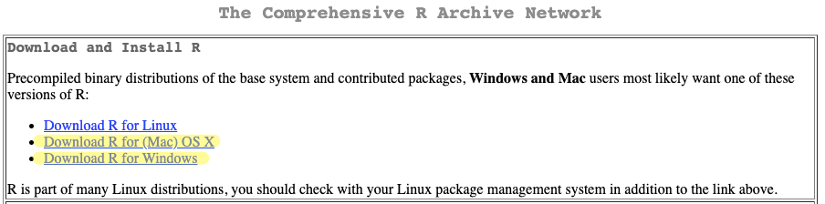
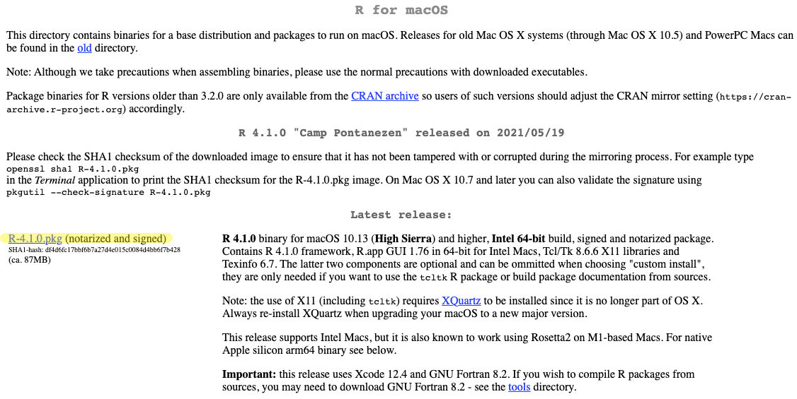
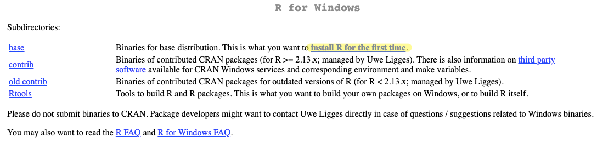
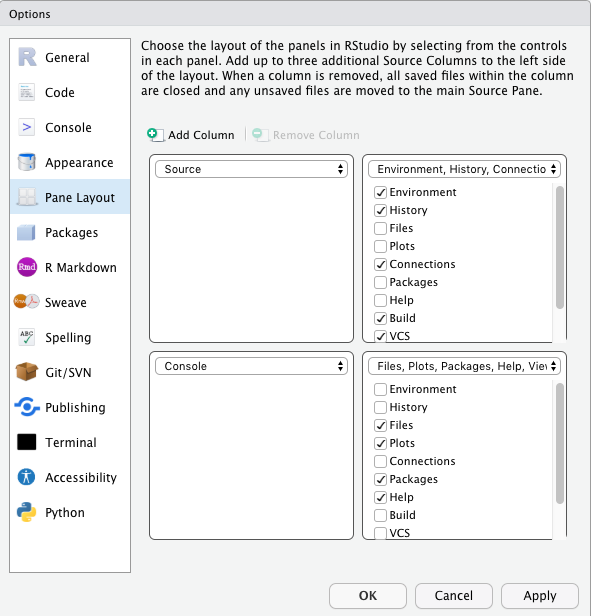

```{r setup, include=FALSE}
library(emo)
#library(icons)
library(kableExtra)
#library(betweenthepipes)
library(tidyverse)
library(showtext)
library(palmerpenguins)
options(knitr.kable.NA = '')
options(htmltools.dir.version = FALSE, htmltools.preserve.raw = FALSE)
knitr::opts_chunk$set(fig.retina = 3, 
                      warning = FALSE, 
                      message = FALSE,
                      fig.path = "figs/Lab1/")

font_add_google(name = "Open Sans",   # Name of the font on the Google Fonts site
                family = "open_sans")
font_add_google(name = "Source Serif Pro",   # Name of the font on the Google Fonts site
                family = "source_serif_pro")
showtext_auto()

cmu_theme <- function () { 
  theme_linedraw(base_size=11, base_family="source_serif_pro") %+replace% 
    theme(
      panel.background  = element_blank(),
      plot.background = element_rect(fill = "transparent", color = NA), 
      legend.background = element_rect(fill = "transparent", color = NA),
      legend.key = element_rect(fill = "transparent", color = NA),
      axis.ticks = element_blank(),
      panel.grid.major = element_line(color = "grey90", size = 0.3), 
      panel.grid.minor = element_blank(),
      plot.title = element_text(size = 18, hjust = 0, vjust = 0.5, face = "bold", margin = margin(b = 0.2, unit = "cm")),
      plot.subtitle = element_text(size = 12, hjust = 0, vjust = 0.5, margin = margin(b = 0.2, unit = "cm")),
      plot.caption = element_text(size = 7, hjust = 1, face = "italic", margin = margin(t = 0.1, unit = "cm")),
      axis.text.x = element_text(size = 13),
      axis.text.y = element_text(size = 13)
    )
}

```

```{r xaringan-themer, include=FALSE, warning=FALSE}
library(xaringanthemer)

style_mono_accent(
  header_font_google = google_font("Open Sans"),
  text_font_google   = google_font("Source Serif Pro", "400", "400i"),
  code_font_google   = google_font("Roboto Mono"),
  link_color = "#bb0000",
  base_color = "#bb0000",
  extra_fonts = list(
    google_font("Lato")
  ),
  extra_css = list(
    ".title-slide h2" = list("font-family" = "Source Serif Pro"),
    ".title-slide h3" = list("font-family" = "Source Serif Pro")
  )
)
```

class: inverse, center, middle

# 36-315: Statistical Graphics and Visualization
## Lab 1

Meghan Hall <br> Department of Statistics & Data Science <br> Carnegie Mellon University <br> May 25, 2021

---
layout: true
<div class="my-footer"><span>cmu-36315.netlify.app</span></div>
---

# Today

<br>

.large[Downloading R & RStudio]
<br>
.medium[]

<br>

.large[Learning the basics of R Markdown]
<br>
.medium[]

---

# Downloading R

<br>

.center.huge[**[cloud.r-project.org](https://cloud.r-project.org/)**]

<br>
<br>

.center[]

---

# Downloading R



---

# Downloading R

<br>
<br>



---

# Downloading RStudio

<br>
<br>

.center.large[**[rstudio.com/products/rstudio/download](https://www.rstudio.com/products/rstudio/download/)**]

<br>
<br>

.center.medium[RStudio Desktop FREE]

---

class: center

# .left[Setting up RStudio]

.left[.medium[Layout is up to you! Tools > Options > Pane Layout]<br>
My recommendation:
]



---

# R Markdown

<br>

.large[An .Rmd file combines code, figures, text and "knits" to various output files]
<br>
.medium[Key for reproducible data science]

--

<br>

.large[We'll be using it for labs, homeworks, midterm, final projects]
<br>
.medium[Submit a single .Rmd file and its knitted .html file]

---

# R Markdown

<br>

.large[R Markdown reference guide]
<br>
.medium[<https://www.rstudio.com/wp-content/uploads/2015/03/rmarkdown-reference.pdf>]

--

<br>

.large[R Markdown cheat sheet]
<br>
.medium[<https://www.rstudio.com/wp-content/uploads/2015/02/rmarkdown-cheatsheet.pdf>]

---

# Tips for learning in R

<br>

.medium[Don't be afraid of error messages!]

--

<br>

.medium[Googling is your friend]

--

<br>

.medium[When in doubt, Session > Restart R]<br>
*Also useful for making sure your .Rmd knits to .html*

--

<br>

.medium[Type it out instead of copy & paste (really)]

---

# Upcoming

<br>

.large[Lab assignment due 11:30am EDT Wednesday!]
<br>
.medium[Ask questions on Piazza if they don't get answered here]

<br>

.large[Lecture 3 on Wednesday May 26]
<br>
.medium[Data types and bar charts]

<br>

.large[Homework 1 due Tuesday June 1]
<br>
.medium[Will be posted soon]
