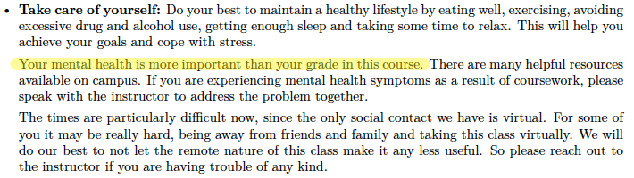

```{r setup, include=FALSE}
#library(emo)
#library(icons)
library(kableExtra)
#library(betweenthepipes)
library(tidyverse)
library(showtext)
options(knitr.kable.NA = '')
options(htmltools.dir.version = FALSE, htmltools.preserve.raw = FALSE)
knitr::opts_chunk$set(fig.retina = 3, 
                      warning = FALSE, 
                      message = FALSE,
                      fig.path = "figs/Lec1/")

font_add_google(name = "Open Sans",   # Name of the font on the Google Fonts site
                family = "open_sans")
font_add_google(name = "Source Serif Pro",   # Name of the font on the Google Fonts site
                family = "source_serif_pro")
showtext_auto()

data <- read_csv("figs/Lec1/Datasaurus_data.csv", col_names = c("x","y"))

cmu_theme <- function () { 
  theme_linedraw(base_size=11, base_family="source_serif_pro") %+replace% 
    theme(
      panel.background  = element_blank(),
      plot.background = element_rect(fill = "transparent", color = NA), 
      legend.background = element_rect(fill = "transparent", color = NA),
      legend.key = element_rect(fill = "transparent", color = NA),
      axis.ticks = element_blank(),
      panel.grid.major = element_line(color = "grey90", size = 0.3), 
      panel.grid.minor = element_blank(),
      plot.title = element_text(size = 18, hjust = 0, vjust = 0.5, face = "bold", margin = margin(b = 0.2, unit = "cm")),
      plot.subtitle = element_text(size = 12, hjust = 0, vjust = 0.5, margin = margin(b = 0.2, unit = "cm")),
      plot.caption = element_text(size = 7, hjust = 1, face = "italic", margin = margin(t = 0.1, unit = "cm")),
      axis.text.x = element_text(size = 13),
      axis.text.y = element_text(size = 13)
    )
}

```

```{r xaringan-themer, include=FALSE, warning=FALSE}
library(xaringanthemer)

style_mono_accent(
  header_font_google = google_font("Open Sans"),
  text_font_google   = google_font("Source Serif Pro", "400", "400i"),
  code_font_google   = google_font("Roboto Mono"),
  link_color = "#bb0000",
  base_color = "#bb0000",
  extra_fonts = list(
    google_font("Lato")
  ),
  extra_css = list(
    ".title-slide h2" = list("font-family" = "Source Serif Pro"),
    ".title-slide h3" = list("font-family" = "Source Serif Pro")
  )
)
```

class: inverse, center, middle

# 36-315: Statistical Graphics and Visualization
## Lecture 1

Meghan Hall <br> Department of Statistics & Data Science <br> Carnegie Mellon University <br> May 21, 2021

---
layout: true
<div class="my-footer"><span>cmu-36315.netlify.app</span></div>
---

# Teaching team

.large[Instructor: Meghan Hall]

<br>

.medium[Grad TA: Galen Vincent]

.medium[Undergrad TAs]

<br>
<br>

Office hours TBD

---

# Course objectives

1. Create statistical graphics.
<br>
<br>

--

2. Understand the fundamentals of data and reproducible data analysis.
<br>
<br>

--

3. Write about statistical graphics.
<br>
<br>

--

4. Speak about statistical graphics and data analyses.
<br>
<br>

--

5. Assess and critique statistical graphics.

---

# Course tools

<br>
<br>

.medium[R & RStudio]

<br>
<br>
--

.medium[`ggplot2` and related packages]

<br>
<br>
--

.medium[R Markdown]

<br>
<br>

---

# Course components

<br>
<br>
<br>

.center[]

---

# Course components

<br>
<br>

Lectures

--

Labs

--

Homework

--

Code style

---

# Code style

<br>
<br>
.large[Code must be written with the [tidyverse style guide](https://style.tidyverse.org/)]
<br>
<br>
.medium[Ignore section II, focus on I.2, I.4, I.5]

.medium[It will match lecture notes, lab notes, etc.]

.medium[You can use the R package [styler](https://styler.r-lib.org/) if you want]

---

# Course components

<br>
<br>

Lectures

Labs

Homework

Code style

--

Graphics discussion

--

Midterm

--

Group project

---

# Course components

```{r component-graph, echo = FALSE, fig.align = "center", fig.height = 6.5}
course_components <- tribble(
  ~Component, ~Percent,
  "Graphic discussion", 0.05,
  "Homework", 0.3,
  "Labs", 0.15,
  "Midterm", 0.15,
  "Final report", 0.2,
  "Final presentation", 0.15
)

course_components %>% 
  mutate(component = str_replace(Component, " ", "\n")) %>% 
  ggplot(aes(x = reorder(component, -Percent), y = Percent)) +
  geom_bar(stat = "identity", fill = "#bb0000") +
  labs(title = "Weight of course components in 36-315",
       subtitle = "Summer 2021") +
  geom_text(aes(reorder(component, -Percent), Percent, label = scales::percent(Percent, accuracy = 1)), 
            family = "source_serif_pro", fontface = 2, vjust = -0.75) +
  scale_y_continuous(labels = scales::percent_format(accuracy = 1), limits = c(0, 0.32)) +
  cmu_theme() +
  theme(axis.title = element_blank(),
        panel.grid.major.x = element_blank(),
        axis.text.x = element_text(size = 11))
```

---

# Various logistics 

<br>
<br>

Course website(s)

--

Piazza

--

Communication

--

Office hours

--

Extensions

--

Regrades

--

Integrity

---

# Why do we visualize data?

<br>
<br>

```{r dino-data, echo = FALSE}
data %>% 
  head(10) %>% 
  kable("html") %>%
  kable_styling(font_size = 16, position = "center", full_width = F) %>%
  row_spec(0, bold = T, color = "white", background = "#bb0000", align = "c")
```

---

# Why do we visualize data?

<br>

```{r dino-summary-1, echo = FALSE}
data %>% 
  summarize(`Mean of x` = mean(x),
            `Mean of y` = mean(y)) %>%  
  kable("html") %>%
  kable_styling(font_size = 16, position = "center", full_width = F) %>%
  row_spec(0, bold = T, color = "white", background = "#bb0000", align = "c")
```

--

<br>

```{r dino-summary-2, echo = FALSE}
data %>% 
  summarize(`SD of x` = sd(x),
            `SD of y` = sd(y)) %>%  
  kable("html") %>%
  kable_styling(font_size = 16, position = "center", full_width = F) %>%
  row_spec(0, bold = T, color = "white", background = "#bb0000", align = "c")
```

--

<br>

```{r dino-summary-3, echo = FALSE}
data %>% 
  pivot_longer(x:y, values_to = "value", names_to = "Variable") %>% 
  group_by(Variable) %>% 
  summarize(Min = min(value),
            Max = max(value)) %>% 
  kable("html") %>%
  kable_styling(font_size = 16, position = "center", full_width = F) %>%
  row_spec(0, bold = T, color = "white", background = "#bb0000", align = "c")
```

---

# Why do we visualize data?

```{r dino-graph, echo = FALSE, fig.align = "center", fig.height = 6.5}
data %>% 
  ggplot(aes(x = x, y = y)) + 
  geom_point(color = "#bb0000") +
  labs(title = "Sometimes visualizing data can reveal important details",
       subtitle = "From Alberto Cairo's Datasaurus") +
  cmu_theme() +
  scale_x_continuous(limits = c(0, 100)) +
  theme(panel.grid.major = element_blank(),
        axis.title = element_blank())
```

---

# Why do we visualize data?

<br>
<br>
<br>
.large[Explore]
<br>
<br>
<br>
.large[Diagnose]
<br>
<br>
<br>
.large[Explain]

---

# By the end of the class

<br>
<br>
.large[You can...]
<br>
<br>
&nbsp;&nbsp;&nbsp;&nbsp;&nbsp;.medium[Ask relevant questions from data]
<br>
<br>
&nbsp;&nbsp;&nbsp;&nbsp;&nbsp;.medium[Know which types of visualizations are appropriate for your data]
<br>
<br>
&nbsp;&nbsp;&nbsp;&nbsp;&nbsp;.medium[Know which types of visualizations are appropriate for your *audience*]
<br>
<br>
&nbsp;&nbsp;&nbsp;&nbsp;&nbsp;.medium[Create plots that are]
<br>
<br>
&nbsp;&nbsp;&nbsp;&nbsp;&nbsp;&nbsp;&nbsp;&nbsp;&nbsp;Effective in their properties
<br>
<br>
&nbsp;&nbsp;&nbsp;&nbsp;&nbsp;&nbsp;&nbsp;&nbsp;&nbsp;Elegant & aesthetically-pleasing


---

# Some golden rules of graphs

<br>
<br>

Don’t add complexity without a good reason.

--

Everything (everything!) must be readable.

--

Don’t distort data, intentionally or not.

--

Be mindful of the data-to-ink ratio.

--

All axes, labels, etc. should have real titles, not code variable names.

--

Always strive for clarity.

--

Titles, subtitles, and captions should add information.

---

# Upcoming

<br>

.large[Lecture 2 on Monday May 24]
<br>
.medium[grammar of graphics and tidyverse principles]

<br>

.large[Lab 1 on Tuesday May 25]
<br>
.medium[be on the lookout for a survey about times]
