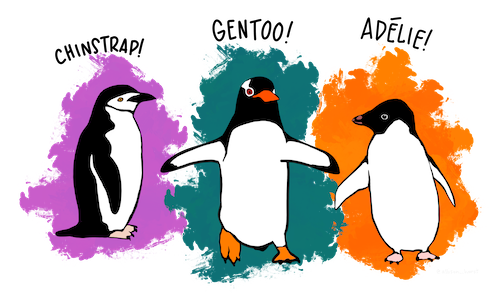

```{r setup, include=FALSE}
library(emo)
#library(icons)
library(kableExtra)
#library(betweenthepipes)
library(showtext)
library(tidyverse)
library(palmerpenguins)
library(xaringanExtra)
xaringanExtra::use_panelset()

options(knitr.kable.NA = '')
options(htmltools.dir.version = FALSE, htmltools.preserve.raw = FALSE)
knitr::opts_chunk$set(fig.retina = 3, 
                      warning = FALSE, 
                      message = FALSE,
                      fig.path = "figs/Lec14/")

font_add_google(name = "Open Sans",   # Name of the font on the Google Fonts site
                family = "open_sans")
font_add_google(name = "Source Serif Pro",   # Name of the font on the Google Fonts site
                family = "source_serif_pro")
showtext_auto()

cmu_theme <- function () { 
  theme_linedraw(base_size=11, base_family="source_serif_pro") %+replace% 
    theme(
      panel.background  = element_blank(),
      plot.background = element_rect(fill = "transparent", color = NA), 
      legend.background = element_rect(fill = "transparent", color = NA),
      legend.key = element_rect(fill = "transparent", color = NA),
      axis.ticks = element_blank(),
      panel.grid.major = element_line(color = "grey90", size = 0.3), 
      panel.grid.minor = element_blank(),
      plot.title = element_text(size = 18, hjust = 0, vjust = 0.5, face = "bold", margin = margin(b = 0.2, unit = "cm")),
      plot.subtitle = element_text(size = 12, hjust = 0, vjust = 0.5, margin = margin(b = 0.2, unit = "cm")),
      plot.caption = element_text(size = 7, hjust = 1, face = "italic", margin = margin(t = 0.1, unit = "cm")),
      axis.text.x = element_text(size = 13),
      axis.text.y = element_text(size = 13)
    )
}
```

```{r xaringan-themer, include=FALSE, warning=FALSE}
library(xaringanthemer)

style_mono_accent(
  header_font_google = xaringanthemer::google_font("Open Sans"),
  text_font_google   = xaringanthemer:: google_font("Source Serif Pro", "400", "400i"),
  code_font_google   = xaringanthemer::google_font("Roboto Mono"),
  link_color = "#bb0000",
  base_color = "#bb0000",
  extra_fonts = list(
    google_font("Lato")
  ),
  extra_css = list(
    ".title-slide h2" = list("font-family" = "Source Serif Pro"),
    ".title-slide h3" = list("font-family" = "Source Serif Pro")
  )
)
```

class: inverse, center, middle

# 36-315: Statistical Graphics and Visualization
## Lecture 14

Meghan Hall <br> Department of Statistics & Data Science <br> Carnegie Mellon University <br> June 25, 2021

---
layout: true
<div class="my-footer"><span>cmu-36315.netlify.app</span></div>
---

# Today

<br>

.large[Presentations with `xaringan`]
<br>
.medium[making slides with .Rmd]

<br>

.large[Tips for the final report]
<br>
.medium[what needs to be included]
<br>
.medium[how to get a great grade]

---

# Final report: what to include

.large[An overview of the data]
<br>
.medium[what's included, what's not included, what's missing]
<br>
.medium[at the appropriate level of detail]

--

<br>

.large[Your questions]
<br>
.medium[plots *and* summaries]
<br>
.medium[be thorough! a very short summary will *not* suffice]
<br>
.medium[describe the conclusion, not the graph]

--

<br>

.large[Conclusions]
<br>
.medium[limitations & ideas for future work]
<br>
.medium[what other data do you think could be useful?]

---

# Final report: tips to make it great

.large[Take care with your plots]
<br>
.medium[consistent colors, plot themes, customize beyond the standard, etc.]
<br>
.medium[if plots go together, use `cowplot`!]

--

<br>

.large[Show what you've learned in the class]
<br>
.medium[use plots appropriately]
<br>
.medium[use a variety of plot types (and tables!)]

--

<br>

.large[Leave the .html output code-free]
<br>
.medium[edit your setup chunk to `echo = FALSE`]

---

# Tips for the presentation

.large[Each team member needs to speak]

--

<br>

.large[Introduce the data set, briefly cover each question]
<br>
.medium[probably not time to discuss each plot]

--

<br>

.large[Touch on limitations & ideas for further work]
<br>
.medium[what other data would you like access to?]

--

<br>

.large[My recommendation: practice but don't memorize]

---

# `xaringan`

.large[Presentations with R Markdown]
<br>
.medium[.html output]
<br>
.medium[easy to incorporate plots & code]
<br>
.medium[other options: ioslides, Slidy, Beamer]

<br>

.large[Pros:]
<br>
.medium[easy to customize]
<br>
.medium[looks great]

<br>

.large[Cons:]
<br>
.medium[hard to share without hosting it somewhere]
<br>
.medium[easiest with a web connection]

---

# `xaringan`

<br>

.large[Get started:]
<br>
.medium[install the `xaringan` package]
<br>
.medium[File > New File > R Markdown > From Template > Ninja Presentation]
<br>
.medium[template file has lots of examples]

<br>

.large[[Chapter 7 of R Markdown: The Definitive Guide](https://bookdown.org/yihui/rmarkdown/xaringan.html)]

---

# `xaringan` basics

<br>

.large[Slide formatting made possible by [Markdown](https://commonmark.org/help/tutorial/)]
<br>
.medium[headings, bullet points, etc.]
<br>
.medium[can add links & images]

---

.left[

# Basic markdown

```{r echo=FALSE}
xaringanExtra::style_panelset_tabs(
  active_background = "#bb0000",
  active_foreground = "white"
)
```

.panelset[
.panel[.panel-name[What you code]
````
*Hello* my name is **Meghan**

- This
- makes
- bullet points

````
]

.panel[.panel-name[What you get]
*Hello* my name is **Meghan**

- This
- makes
- bullet points
]


]
]

---

.left[

# Headings

.panelset[
.panel[.panel-name[What you code]
````
# This is a slide heading

## This is a smaller heading

### This is yet a smaller heading
````
]

.panel[.panel-name[What you get]
# This is a slide heading

## This is a smaller heading

### This is yet a smaller heading
]


]
]

---

.left[

# Links & images

.panelset[
.panel[.panel-name[What you code]
````
The course website is linked [here](http://cmu-36315.netlify.app/)

.center[]

.right[*Art by Allison Horst*]
````
]

.panel[.panel-name[What you get]
The course website is linked [here](http://cmu-36315.netlify.app/)

.center[]

.right[*Art by Allison Horst*]
]


]
]

---

# `xaringan` basics

<br>

.large[Slide formatting made possible by [Markdown](https://commonmark.org/help/tutorial/)]
<br>
.medium[headings, bullet points, etc.]
<br>
.medium[can add links & images]

<br>

.large[Can add code & plots with *chunk options*]
<br>
.medium[all thanks to `knitr`]

<br>

.large[Resources:]
<br>
.medium[[R Markdown reference guide](https://www.rstudio.com/wp-content/uploads/2015/03/rmarkdown-reference.pdf?_ga=2.12010684.900091959.1624621011-959280118.1606761615)]
<br>
.medium[[R Markdown cookbook](https://bookdown.org/yihui/rmarkdown-cookbook/chunk-options.html)]
<br>
.medium[[chunk option details](https://yihui.org/knitr/options/)]

---

.left[

# Code

.panelset[
.panel[.panel-name[What you code]
````
```{r penguins-1, eval = FALSE}`r ''`
penguins %>% 
  count(species) %>% 
  ggplot(aes(x = reorder(species, -n), y = n, fill = species)) + 
  geom_bar(stat = "identity", show.legend = FALSE) + 
  scale_fill_viridis_d(option = "E") + 
  labs(x = NULL, y = NULL) + 
  theme_linedraw()
```
````
]

.panel[.panel-name[What you get]
```{r penguins-1, eval = FALSE}
penguins %>% 
  count(species) %>% 
  ggplot(aes(x = reorder(species, -n), y = n, fill = species)) + 
  geom_bar(stat = "identity", show.legend = FALSE) + 
  scale_fill_viridis_d(option = "E") + 
  labs(x = NULL, y = NULL) + 
  theme_linedraw()
```
]


]
]

---

.left[

# Plots

.panelset[
.panel[.panel-name[What you code]
````
```{r penguins-2, echo = FALSE, fig.height = 5, fig.align = "center"}`r ''`
penguins %>% 
  count(species) %>% 
  ggplot(aes(x = reorder(species, -n), y = n, fill = species)) + 
  geom_bar(stat = "identity", show.legend = FALSE) + 
  scale_fill_viridis_d(option = "E") + 
  labs(x = NULL, y = NULL) + 
  theme_linedraw()
```
````
]

.panel[.panel-name[What you get]
```{r penguins-2, echo = FALSE, fig.height = 5, fig.align = "center"}
penguins %>% 
  count(species) %>% 
  ggplot(aes(x = reorder(species, -n), y = n, fill = species)) + 
  geom_bar(stat = "identity", show.legend = FALSE) + 
  scale_fill_viridis_d(option = "E") + 
  labs(x = NULL, y = NULL) + 
  theme_linedraw()
```
]


]
]

---

.left[

# Tables

.panelset[
.panel[.panel-name[What you code]
````
### .center[the `penguins` data set]

```{r kable-1, echo = FALSE}`r ''`
penguins %>% 
  count(species) %>% 
  kable("html") %>%
  kable_styling(font_size = 16, position = "center", full_width = F) %>%
  row_spec(0, bold = T, color = "white", background = "#bb0000")
```
````
]

.panel[.panel-name[What you get]

### .center[the `penguins` data set]

```{r kable-1, echo = FALSE}
penguins %>% 
  count(species) %>% 
  kable("html") %>%
  kable_styling(font_size = 16, position = "center", full_width = F) %>%
  row_spec(0, bold = T, color = "white", background = "#bb0000")
```
]


]
]

---

# YAML

````
---
title: "Our Sample Presentation"
subtitle: "for learning xaringan"
author: "Meghan Hall"
institute: "Carnegie Mellon University"
date: "`r Sys.Date()`"
output:
  xaringan::moon_reader:
    lib_dir: libs
    nature:
      highlightStyle: github
      highlightLines: true
      countIncrementalSlides: false
---
````

---

# Your `setup` chunk

.large[Similar to that in other .Rmd documents]
<br>
.medium[load packages, add themes]
<br>
.medium[can set global chunk options]

````
```{r setup, include = FALSE}`r ''`
library(kableExtra)
library(tidyverse)
library(palmerpenguins)

options(knitr.kable.NA = '')
options(htmltools.dir.version = FALSE, htmltools.preserve.raw = FALSE)
knitr::opts_chunk$set(fig.retina = 3, 
                      warning = FALSE, 
                      message = FALSE,
                      fig.path = "figs/Lec14/")
```
````

---

# Customizing `xaringan`

<br>

.large[Some built-in themes]
<br>
.medium[list here: [https://github.com/yihui/xaringan/wiki/Themes](https://github.com/yihui/xaringan/wiki/Themes)]

<br>

.large[[`xaringanthemer`](https://pkg.garrickadenbuie.com/xaringanthemer/articles/xaringanthemer.html)]
<br>
.medium[can easily create a custom color palette based on one color]

<br>

.large[Or add even more css if you prefer!]
<br>
.medium[not at *all* required]

---

# Upcoming

<br>

.large[Lecture 15 Monday]
<br>
.medium[interactive options]
<br>
.medium[also: presentation sign-ups]

<br>

.large[Homework 5 due Tuesday]

<br>

.large[Lab 10 on Tuesday]

---

class: inverse, center, middle

# To RStudio!