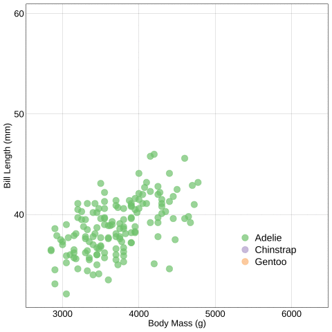
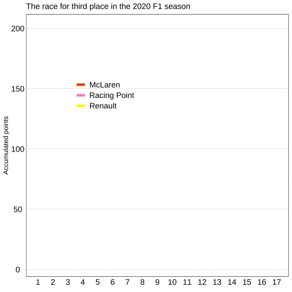
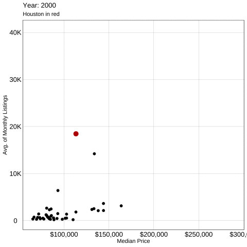
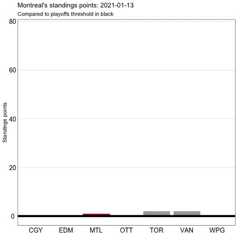

```{r setup, include=FALSE}
library(emo)
#library(icons)
library(kableExtra)
library(showtext)
library(tidyverse)
library(palmerpenguins)
library(gganimate)
library(plotly)
library(scales)
library(ggridges)
library(scico)
library(lubridate)
library(purrr)

options(knitr.kable.NA = '')
options(htmltools.dir.version = FALSE, htmltools.preserve.raw = FALSE)
knitr::opts_chunk$set(fig.retina = 3, 
                      warning = FALSE, 
                      message = FALSE,
                      fig.path = "figs/Lec15/")

font_add_google(name = "Open Sans",   # Name of the font on the Google Fonts site
                family = "open_sans")
font_add_google(name = "Source Serif Pro",   # Name of the font on the Google Fonts site
                family = "source_serif_pro")
showtext_auto()

cmu_theme <- function () { 
  theme_linedraw(base_size=11, base_family="source_serif_pro") %+replace% 
    theme(
      panel.background  = element_blank(),
      plot.background = element_rect(fill = "transparent", color = NA), 
      legend.background = element_rect(fill = "transparent", color = NA),
      legend.key = element_rect(fill = "transparent", color = NA),
      axis.ticks = element_blank(),
      panel.grid.major = element_line(color = "grey90", size = 0.3), 
      panel.grid.minor = element_blank(),
      plot.title = element_text(size = 18, hjust = 0, vjust = 0.5, face = "bold", margin = margin(b = 0.2, unit = "cm")),
      plot.subtitle = element_text(size = 12, hjust = 0, vjust = 0.5, margin = margin(b = 0.2, unit = "cm")),
      plot.caption = element_text(size = 7, hjust = 1, face = "italic", margin = margin(t = 0.1, unit = "cm")),
      axis.text.x = element_text(size = 13),
      axis.text.y = element_text(size = 13)
    )
}

lab_theme <- function () {
  theme_linedraw(base_size=11) %+replace% 
    theme(legend.background = element_rect(fill = "transparent", color = NA),
          legend.key = element_rect(fill = "transparent", color = NA),
          axis.ticks = element_blank(),
          panel.grid.minor = element_blank(),
          axis.text.x = element_text(size = 13),
          axis.text.y = element_text(size = 13))
}

constructor_pts <- read_csv('https://raw.githubusercontent.com/meghall06/CMU-36-315-site/main/data/constructor_pts.csv')

third_place <- constructor_pts %>% 
  filter(name %in% c("McLaren", "Renault", "Racing Point") & year == 2020)

nhl2021_games <- read_csv('https://raw.githubusercontent.com/meghall06/CMU-36-315-site/main/data/nhl2021_games.csv')
```

```{r xaringan-themer, include=FALSE, warning=FALSE}
library(xaringanthemer)

style_mono_accent(
  header_font_google = xaringanthemer::google_font("Open Sans"),
  text_font_google   = xaringanthemer:: google_font("Source Serif Pro", "400", "400i"),
  code_font_google   = xaringanthemer::google_font("Roboto Mono"),
  link_color = "#bb0000",
  base_color = "#bb0000",
  extra_fonts = list(
    google_font("Lato")
  ),
  extra_css = list(
    ".title-slide h2" = list("font-family" = "Source Serif Pro"),
    ".title-slide h3" = list("font-family" = "Source Serif Pro")
  )
)
```

class: inverse, center, middle

# 36-315: Statistical Graphics and Visualization
## Lecture 15

Meghan Hall <br> Department of Statistics & Data Science <br> Carnegie Mellon University <br> June 28, 2021

---
layout: true
<div class="my-footer"><span>cmu-36315.netlify.app</span></div>
---

# Schedule

<br>

.large[Presentation sign-ups this AM]

<br>

.large[Lab 10 tomorrow, due Wednesday]
<br>
.medium[HW 5 due tomorrow]

<br>

.large[Last live lecture today]
<br>
.medium[Wednesday: special topics]

---

# What do you turn in?

<br>

.large[Final report: 11:30am EDT Friday]
<br>
.medium[.html]
<br>
.medium[.Rmd (don't forget `echo = FALSE` to suppress code)]

<br>

.large[Final presentation: right after]
<br>
.medium[.Rmd file only]
<br>
.medium[probably won't knit, that's fine! just to check]

---

# Today

<br>

.large[Adding another layer to our plots]
<br>
.medium[animation with `gganimate`]
<br>
.medium[interactivity with `plotly`]

<br>

.large[Functional programming with `purrr`]
<br>
.medium[`map` functions as an alternative to for loops]

---

# `gganimate`

<br>

.large[Adds animation to existing plots]
<br>
.medium[[https://gganimate.com/](https://gganimate.com/)]
<br>
.medium[using various `transition_*` functions]

<br>

.large[Many other options we won't discuss today]
<br>
.medium[can specify how data & aesthetics fade, change, etc.]

<br>

.large[Can run plots like usual or:]
<br>
.medium[use `anim_save("filepath")` to save as gif]
<br>
.medium[will save last-run animation]

---

# `gganimate`

.large[When should you *not* animate?]
<br>
.medium[when it doesn't add anything to the plot]
<br>

--

```{r animate-1, eval = FALSE}
penguins %>% 
  ggplot(aes(x = body_mass_g, y = bill_length_mm, color = species)) +
  geom_point(alpha = 0.7, size = 4) +
  scale_color_brewer(type = "qual", name = NULL) +
  labs(x = "Body Mass (g)",
       y = "Bill Length (mm)") +
  lab_theme() +
  theme(legend.position = c(0.8, 0.2),
        legend.text = element_text(size = 14),
        axis.title = element_text(size = 13))
```

---

# `gganimate`

```{r animate-1, echo = FALSE, fig.align = "center", fig.height = 6.5}
```

---

# `gganimate`

.large[When should you *not* animate?]
<br>
.medium[when it doesn't add anything to the plot]
<br>

```{r animate-2, eval = FALSE}
penguins %>% 
  ggplot(aes(x = body_mass_g, y = bill_length_mm, color = species)) +
  geom_point(alpha = 0.7, size = 4) +
  scale_color_brewer(type = "qual", name = NULL) +
  labs(x = "Body Mass (g)",
       y = "Bill Length (mm)") +
  lab_theme() +
  theme(legend.position = c(0.8, 0.2),
        legend.text = element_text(size = 14),
        axis.title = element_text(size = 13)) %>% 
  transition_states(species, #<<
                    transition_length = 0.5, #<<
                    state_length = 1) #<<
```

---

# `gganimate`

.center[]

---

# `gganimate`

.large[When can you add animation?]
<br>
.medium[when it adds depth & emphasis to your story/conclusion]
<br>

--

```{r animate-3, eval = FALSE}
third_place %>%
  ggplot(aes(x = round, y = points, group = name, color = name)) +
  geom_line(size = 2) +
  scale_color_manual(values = c("#E0610E","#F596C8","#FFF500"),
                     name = NULL) +
  scale_x_continuous(breaks = seq(1, 17, 1)) +
  labs(title = "The race for third place in the 2020 F1 season",
       y = "Accumulated points", x = NULL) +
  lab_theme() +
  theme(legend.position = c(0.3, 0.7),
        panel.grid.major.x = element_blank(),
        legend.text = element_text(size = 13))
```

---

# `gganimate`

```{r animate-3, echo = FALSE, fig.align = "center", fig.height = 6.5}
```

---

# `gganimate`

.large[When can you add animation?]
<br>
.medium[when it adds depth & emphasis to your story/conclusion]
<br>

```{r animate-4, eval = FALSE}
third_place %>%
  ggplot(aes(x = round, y = points, group = name, color = name)) +
  geom_line(size = 2) +
  scale_color_manual(values = c("#E0610E","#F596C8","#FFF500"),
                     name = NULL) +
  scale_x_continuous(breaks = seq(1, 17, 1)) +
  labs(title = "The race for third place in the 2020 F1 season",
       y = "Accumulated points",
       x = NULL) +
  lab_theme() +
  theme(legend.position = c(0.3, 0.7),
        panel.grid.major.x = element_blank(),
        legend.text = element_text(size = 13)) +
  transition_reveal(round) #<<
```

---

# `gganimate`

.center[]

---

# `gganimate`

.large[When can you add animation?]
<br>
.medium[when it adds another useful dimension (usually time)]
<br>

--

```{r animate-5, eval = FALSE}
txhousing %>% 
  group_by(city, year) %>% 
  summarize(median = mean(median, na.rm = TRUE),
            listings = mean(listings, na.rm = TRUE)) %>% 
  ggplot(aes(x = median, y = listings, color = city == "Houston",
             size = city == "Houston")) +
  geom_point(show.legend = FALSE) +
  scale_color_manual(values = c("black","#bb0000")) +
  scale_size_manual(values = c(2, 4)) +
  scale_x_continuous(labels = dollar, name = "Median Price") +
  scale_y_continuous(labels = label_number_si()) +
  lab_theme() +
  labs(x = "Median Price", y = "Avg. of Monthly Listings",
       subtitle = "Houston in red")
```

---

# `gganimate`

```{r animate-5, echo = FALSE, fig.align = "center", fig.height = 6.5}
```

---

# `gganimate`

.large[When can you add animation?]
<br>
.medium[when it adds another useful dimension (usually time)]
<br>

```{r animate-6, eval = FALSE}
txhousing %>% 
  group_by(city, year) %>% 
  summarize(median = mean(median, na.rm = TRUE),
            listings = mean(listings, na.rm = TRUE)) %>% 
  ggplot(aes(x = median, y = listings, color = city == "Houston",
             size = city == "Houston")) +
  geom_point(show.legend = FALSE) +
  scale_color_manual(values = c("black","#bb0000")) +
  scale_size_manual(values = c(2, 4)) +
  scale_x_continuous(labels = dollar, name = "Median Price") +
  scale_y_continuous(labels = label_number_si()) +
  lab_theme() +
  labs(x = "Median Price", y = "Avg. of Monthly Listings",
       title = 'Year: {frame_time}', #<<
       subtitle = "Houston in red") +
  transition_time(year) #<<
```

---

# `gganimate`

.center[]

---

# `plotly`

<br>

.large[Adds interactivity (namely tooltips) to existing plots]
<br>
.medium[[https://plotly.com/ggplot2/](https://plotly.com/ggplot2/)]

<br>

.large[Assign your plot to an object]
<br>
.medium[and call within `ggplotly`]

---

# `plotly`

```{r plotly-1, eval = TRUE}
scatter_plain <- penguins %>% 
  ggplot(aes(x = body_mass_g, y = flipper_length_mm, 
             color = species)) +
  geom_jitter(size = 3, alpha = 0.8) +
  scale_color_brewer(type = "qual", name = NULL) +
  labs(x = "Body Mass (g)", y = "Flipper Length (mm)") +
  lab_theme()
```

```{r plotly-2, echo = FALSE, fig.align = "center", fig.height = 4}
penguins %>% 
  ggplot(aes(x = body_mass_g, y = flipper_length_mm, 
             color = species)) +
  geom_jitter(size = 3, alpha = 0.8) +
  scale_color_brewer(type = "qual", name = NULL) +
  labs(x = "Body Mass (g)",
       y = "Flipper Length (mm)") +
  lab_theme()
```

---

# `plotly`

```{r plotly-3, fig.align = "center", fig.height = 5.5}
ggplotly(scatter_plain)
```

---

# `plotly`

```{r plotly-4, eval = TRUE}
scatter_sex <- penguins %>% 
  ggplot(aes(x = body_mass_g, y = flipper_length_mm, color = species,
             text = paste("sex:", sex))) + #<<
  geom_jitter(size = 3, alpha = 0.8) +
  scale_color_brewer(type = "qual", name = NULL) +
  labs(x = "Body Mass (g)", y = "Flipper Length (mm)") +
  lab_theme()
```

```{r plotly-5, echo = FALSE, fig.align = "center", fig.height = 4}
penguins %>% 
  ggplot(aes(x = body_mass_g, y = flipper_length_mm, color = species,
             text = paste("sex:", sex))) + 
  geom_jitter(size = 3, alpha = 0.8) +
  scale_color_brewer(type = "qual", name = NULL) +
  labs(x = "Body Mass (g)",
       y = "Flipper Length (mm)") +
  lab_theme()
```

---

# `plotly`

```{r plotly-6, fig.align = "center", fig.height = 5.5}
ggplotly(scatter_sex, tooltip = c("text", "species"))
```

---

# `plotly`

```{r plotly-7, eval = TRUE}
scatter_more <- penguins %>% 
  mutate(`Body mass` = paste(body_mass_g, "grams"), #<<
         `Flipper length` = paste0(flipper_length_mm, "mm")) %>% #<<
  ggplot(aes(x = body_mass_g, y = flipper_length_mm, color = species,
             text = paste("sex:", sex), label = `Body mass`, #<<
             label1 = `Flipper length`)) + #<<
  geom_jitter(size = 3, alpha = 0.8) +
  scale_color_brewer(type = "qual", name = NULL) +
  labs(x = "Body Mass (g)",
       y = "Flipper Length (mm)") +
  lab_theme()
```

---

# `plotly`

```{r plotly-8, fig.align = "center", fig.height = 5.5}
ggplotly(scatter_more, 
         tooltip = c("text", "species", "Body mass", "Flipper length"))
```

---

# `plotly`

```{r plotly-9, echo = FALSE, fig.align = "center", fig.height = 6.5}
lincoln_weather %>% 
  select(CST, temp = `Max Temperature [F]`) %>% 
  mutate(date = ymd(CST), 
         month = month(date, label = TRUE),
         day = day(date),
         date_show = paste(month, day)) %>% 
  ggplot(aes(x = month, y = day, fill = temp, text = date_show)) +
  geom_tile(color = "white") +
  scale_y_continuous(trans = "reverse", 
                     breaks = seq(1, 31, 5)) + 
  labs(title = "Maximum temperature by day in Lincoln, NE in 2016") +
  scale_fill_scico(palette = "imola", 
                   breaks = seq(20, 90, 10), 
                   name = " °F") + 
  guides(fill = guide_colorsteps()) +
  theme(axis.ticks = element_blank(),
        panel.background = element_blank(),
        axis.title = element_blank(),
        axis.text = element_text(face = 2)) +
  coord_cartesian(expand = FALSE)
```

---

# `plotly`

```{r plotly-10, eval = TRUE}
heat <- lincoln_weather %>% 
  select(CST, temp = `Max Temperature [F]`) %>% 
  mutate(date = ymd(CST), 
         month = month(date, label = TRUE),
         day = day(date),
         date_show = paste(month, day)) %>% #<<
  ggplot(aes(x = month, y = day, text = date_show, fill = temp)) + #<<
  geom_tile(color = "white") +
  scale_y_continuous(trans = "reverse", 
                     breaks = seq(1, 31, 5)) + 
  labs(title = "Maximum temperature by day in Lincoln, NE in 2016") +
  scale_fill_scico(palette = "imola", 
                   breaks = seq(20, 90, 10), 
                   name = " °F") + 
  guides(fill = guide_colorsteps()) +
  theme(axis.ticks = element_blank(),
        panel.background = element_blank(),
        axis.title = element_blank(),
        axis.text = element_text(face = 2)) +
  coord_cartesian(expand = FALSE)
```

---

# `plotly`

```{r plotly-11, fig.align = "center", fig.height = 5.5}
ggplotly(heat, tooltip = c("text", "temp"))
```

---

# `purrr`

<br>

.large[Part of the `tidyverse`]
<br>
.medium[[https://purrr.tidyverse.org/](https://purrr.tidyverse.org/)]
<br>
.medium[[https://r4ds.had.co.nz/iteration.html#the-map-functions](https://r4ds.had.co.nz/iteration.html#the-map-functions)]

<br>

.large[Useful for *functional programming*]
<br>
.medium[provides an alternative to for loops]

<br>

.large[`map_*` functions allow you to iterate over elements]

---

# `purrr`

```{r purrr-1}
class(penguins$bill_depth_mm)
```

--

```{r purrr-2}
penguins %>% 
  map_chr(class)
```

--

```{r purrr-3}
new_df <- penguins %>% 
  map_df(class)
```

```{r purrr-4, echo = FALSE}
new_df %>% 
  kable("html") %>%
  kable_styling(font_size = 16, position = "center", full_width = F) %>%
  row_spec(0, bold = T, color = "white", background = "#bb0000")
```

---

# `purrr`

```{r purrr-5}
penguins %>% 
  map_dbl(mean, na.rm = TRUE)
```

--

```{r purrr-6}
penguins %>% 
  select_if(is.numeric) %>% 
  map_dbl(mean, na.rm = TRUE)
```

---

# `purrr`

<br>

.large[Very helpful for a very common task:]
<br>
.medium[split your data frame into pieces]
<br>
.medium[apply a function to perform an action on each piece]
<br>
.medium[put those pieces back together]

<br>

.large[The previous examples used known functions (`class`, `mean`)]
<br>
.medium[but we can also use user-defined functions]

---

# `purrr`

.center[Throughout the season, how did **Montreal's** standings points compare to the playoff threshold?]

.center[`nhl2021_games`]

.center[]

---

# `purrr`

.center[`nhl2021_games`]

```{r example-1, echo = FALSE}
nhl2021_games %>% 
  head(10) %>% 
  kable("html") %>%
  kable_styling(font_size = 16, position = "center", full_width = F) %>%
  row_spec(0, bold = T, color = "white", background = "#bb0000")
```

---

# `purrr`

```{r example-2}
north_div <- nhl2021_games %>% 
  mutate(winner = ifelse(home_score > away_score, "home", "away")) %>% 
  pivot_longer(home_team:away_team,
               names_to = c("home_away", ".value"),
               names_pattern = "(.+)_(.+)") %>% 
  mutate(points = case_when(winner == home_away ~ 2,
                            winner != home_away & max_period > 3 ~ 1,
                            TRUE ~ 0)) %>% 
  filter(team %in% c("WPG", "EDM", "CGY", "VAN", "MTL",
                     "OTT", "WPG", "TOR")) %>% 
  arrange(game_date)
```

```{r example-3, echo = FALSE}
north_div %>% 
  head(4) %>% 
  kable("html") %>%
  kable_styling(font_size = 16, position = "center", full_width = F) %>%
  row_spec(0, bold = T, color = "white", background = "#bb0000")
```

---

# `purrr`

```{r example-4}
north_total <- north_div %>% 
  group_by(team) %>% 
  mutate(total_points = cumsum(points)) %>% 
  summarize(total_points = max(total_points)) %>% 
  arrange(desc(total_points))
```

```{r example-5, echo = FALSE}
north_total %>%
  kable("html") %>%
  kable_styling(font_size = 16, position = "center", full_width = F) %>%
  row_spec(0, bold = T, color = "white", background = "#bb0000")
```

---

# `purrr`

```{r example-6, eval = FALSE}
north_total %>% 
  ggplot(aes(x = team, y = total_points, fill = team == "MTL")) + #<<
  geom_bar(stat = "identity", show.legend = FALSE) +
  scale_fill_manual(values = c("dark grey", "#AF1E2D")) + #<<
  geom_hline(yintercept = pluck(north_total, 2, 4), #<<
             color = "black", size = 2) +
  labs(x = NULL, y = "Standings points",
       title = "Montreal's standings points, 2021 season",
       subtitle = "Compared to playoffs threshold in black") +
  lab_theme()
```

---

# `purrr`

```{r example-6, echo = FALSE, fig.align = "center", fig.height = 6.5}
```

---

# `purrr`

Start with an example: what was the status as of April 1?

```{r example-7, eval = FALSE}
north_div %>% 
    filter(game_date <= "2021-04-01") %>% 
    mutate(game_date = "2021-04-01") %>% 
    group_by(team, game_date) %>% 
    mutate(total_points = cumsum(points)) %>% 
    summarize(total_points = max(total_points)) %>% 
    arrange(desc(total_points)) %>% 
    ungroup() %>% 
    mutate(rank = row_number(), 
           threshold = ifelse(rank == 4, total_points, NA))
```

```{r example-8, echo = FALSE}
north_div %>% 
    filter(game_date <= "2021-04-01") %>% 
    mutate(game_date = "2021-04-01") %>% 
    group_by(team, game_date) %>% 
    mutate(total_points = cumsum(points)) %>% 
    summarize(total_points = max(total_points)) %>% 
    arrange(desc(total_points)) %>% 
    ungroup() %>% 
    mutate(rank = row_number(), 
           threshold = ifelse(rank == 4, total_points, NA)) %>% 
  kable("html") %>%
  kable_styling(font_size = 16, position = "center", full_width = F) %>%
  row_spec(0, bold = T, color = "white", background = "#bb0000")
```

---

# `purrr`

Create the function with the game date as the argument

```{r example-9}
points_by_day <- function(day) {
  
  north_div %>% 
    filter(game_date <= day) %>% 
    mutate(game_date = day) %>% 
    group_by(team, game_date) %>% 
    mutate(total_points = cumsum(points)) %>% 
    summarize(total_points = max(total_points)) %>% 
    arrange(desc(total_points)) %>% 
    ungroup() %>% 
    mutate(rank = row_number(), 
           threshold = ifelse(rank == 4, total_points, NA))
  
}
```

---

# `purrr`

Apply the function with `map_df`: apply the `points_by_day` function to every unique value of `game_date` from `north_div`

```{r example-10}
points_by_day_df <- 
  map_df(unique(north_div$game_date), points_by_day)
```

--

That df has the following for every game day:

```{r example-11, echo = FALSE}
points_by_day_df %>% 
  filter(game_date == "2021-03-01") %>% 
  kable("html") %>%
  kable_styling(font_size = 16, position = "center", full_width = F) %>%
  row_spec(0, bold = T, color = "white", background = "#bb0000")
```

---

# `gganimate`

Use this new df with a `transition_manual` layer to create the animation

```{r example-12, eval = FALSE}
points_by_day_df %>% #<<
  ggplot(aes(x = team, y = total_points, fill = team == "MTL")) +
  geom_bar(stat = "identity", show.legend = FALSE) +
  scale_fill_manual(values = c("dark grey", "#AF1E2D")) +
  geom_hline(aes(yintercept = threshold), #<<
             color = "black", size = 2) +
  labs(x = NULL, y = "Standings points",
       title = "Montreal's standings points: {current_frame}", #<<
       subtitle = "Compared to playoffs threshold in black") +
  lab_theme() +
  theme(panel.grid.major.x = element_blank()) +
  transition_manual(game_date) #<<
```

---

# `gganimate`

.center[]

---

# Upcoming

<br>

.large[Homework 5 due Tuesday]

<br>

.large[Lab 10 due Wednesday]

<br>

.large[Final reports due 11:30am EDT Friday]
<br>
.medium[no matter when your presentation is]
