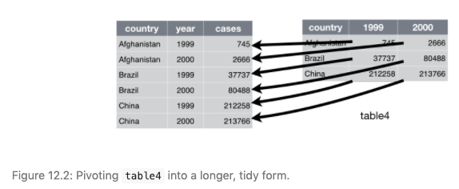

```{r setup, include=FALSE}
library(emo)
#library(icons)
library(kableExtra)
#library(betweenthepipes)
library(tidyverse)
library(showtext)
library(scales)
options(knitr.kable.NA = '')
options(htmltools.dir.version = FALSE, htmltools.preserve.raw = FALSE)
knitr::opts_chunk$set(fig.retina = 3, 
                      warning = FALSE, 
                      message = FALSE,
                      fig.path = "figs/Lec3/")

font_add_google(name = "Open Sans",   # Name of the font on the Google Fonts site
                family = "open_sans")
font_add_google(name = "Source Serif Pro",   # Name of the font on the Google Fonts site
                family = "source_serif_pro")
showtext_auto()

cmu_theme <- function () { 
  theme_linedraw(base_size=11, base_family="source_serif_pro") %+replace% 
    theme(
      panel.background  = element_blank(),
      plot.background = element_rect(fill = "transparent", color = NA), 
      legend.background = element_rect(fill = "transparent", color = NA),
      legend.key = element_rect(fill = "transparent", color = NA),
      axis.ticks = element_blank(),
      panel.grid.major = element_line(color = "grey90", size = 0.3), 
      panel.grid.minor = element_blank(),
      plot.title = element_text(size = 18, hjust = 0, vjust = 0.5, face = "bold", margin = margin(b = 0.2, unit = "cm")),
      plot.subtitle = element_text(size = 12, hjust = 0, vjust = 0.5, margin = margin(b = 0.2, unit = "cm")),
      plot.caption = element_text(size = 7, hjust = 1, face = "italic", margin = margin(t = 0.1, unit = "cm")),
      axis.text.x = element_text(size = 13),
      axis.text.y = element_text(size = 13)
    )
}

got <- read_csv("https://raw.githubusercontent.com/chrisalbon/war_of_the_five_kings_dataset/master/5kings_battles_v1.csv")

penguins_example <- tribble(
  ~id, ~`2007`, ~`2008`, ~`2009`,
  #--|--|----
  1, 2005, 2983, 3124,
  2, 3076, 2965, 3231,
  3, 3687, 3642, 3810,
)

```

```{r xaringan-themer, include=FALSE, warning=FALSE}
library(xaringanthemer)

style_mono_accent(
  header_font_google = google_font("Open Sans"),
  text_font_google   = google_font("Source Serif Pro", "400", "400i"),
  code_font_google   = google_font("Roboto Mono"),
  link_color = "#bb0000",
  base_color = "#bb0000",
  extra_fonts = list(
    google_font("Lato")
  ),
  extra_css = list(
    ".title-slide h2" = list("font-family" = "Source Serif Pro"),
    ".title-slide h3" = list("font-family" = "Source Serif Pro")
  )
)
```

class: inverse, center, middle

# 36-315: Statistical Graphics and Visualization
## Lecture 3

Meghan Hall <br> Department of Statistics & Data Science <br> Carnegie Mellon University <br> May 26, 2021

---
layout: true
<div class="my-footer"><span>cmu-36315.netlify.app</span></div>
---

# From last time

<br>

.large[The grammar of graphics]
<br>
.medium[How graphics are constructed in R]

<br>

.large[Tidyverse principles]
<br>
.medium[For any necessary data manipulation]

---

# Updates

<br>

.large[Lab 1]
<br>
.medium[Solution has been posted]
<br>
.medium[Piazza reminder]

<br>

.large[Homework 1]
<br>
.medium[Due Tuesday June 1, posted soon]

---

# Today

<br>

.large[Bar graphs]
<br>
.medium[Of all shapes & sizes]

<br>

.large[Tidyverse principles]
<br>
.medium[For any necessary data manipulation]

---

# Tidyverse review: the pipe

<br>
<br>
.huge.center[`%>%`]
<br>
<br>
.medium[Allows you to "chain" multiple operations together]
<br>
<br>
.medium[Helps avoid intermediate steps]
<br>
<br>
.medium[Easier to read!]
<br>
<br>
.medium[Remember the `ggplot` equivalent is `+`]

---

# Tidyverse review: the pipe

```{r pipe-1, eval = FALSE}
penguins1 <- mutate(penguins, big_penguin = 
                      ifelse(body_mass_g >= 5000, "yes", "no"))

penguins2 <- filter(penguins1, !is.na(body_mass_g))
```

--

```{r pipe-2, eval = FALSE}
penguins <- mutate(penguins, big_penguin = 
                     ifelse(body_mass_g >= 5000, "yes", "no"))

penguins <- filter(penguins, !is.na(body_mass_g))
```

--

```{r pipe-3, eval = FALSE}
big_penguins <- penguins %>% 
  mutate(big_penguin = 
           ifelse(body_mass_g >= 5000, "yes", "no")) %>% 
  filter(!is.na(body_mass_g))
```

---

# Tidyverse review: pivoting

.medium[Let's look at some sample data]

```{r pivot-1, echo = FALSE}
penguins_example %>% 
  kable("html") %>%
  kable_styling(font_size = 16, position = "center", full_width = F) %>%
  row_spec(0, bold = T, color = "white", background = "#bb0000")
```

--

.medium[Components of "tidy" data:]
1. Each variable must have its own column
2. Each observation must have its own row
3. Each value must have its own cell

---

# Tidyverse review: pivoting

```{r pivot-2}
penguins_pivoted <- penguins_example %>% 
  pivot_longer(`2007`:`2009`, 
               names_to = "year", values_to = "body_mass")
```

--

```{r pivot-3, echo = FALSE}
penguins_pivoted %>% 
  kable("html") %>%
  kable_styling(font_size = 16, position = "center", full_width = F) %>%
  row_spec(0, bold = T, color = "white", background = "#bb0000")
```

---

# Tidyverse review: pivoting

<br>

.left[]

<br>
<br>

.right[From [R for Data Science](https://r4ds.had.co.nz/)]

---

# Today's data

.center[]

---

# Today's data

```{r glimpse}
got %>% 
  glimpse()
```

---

# Today's data

```{r head, echo = FALSE}
got %>% 
  select(name, attacker_king, region, year, attacker_size) %>% 
  head(10) %>% 
  kable("html") %>%
  kable_styling(font_size = 16, position = "center", full_width = F) %>%
  row_spec(0, bold = T, color = "white", background = "#bb0000")
```


---

# Data types

<br>
<br>
.large[Categorical/qualitative]
<br>
.medium[Ordered vs. unordered/nominal]
<br>
.medium[`name`, `attacker_king`, `region`]
<br>
--
<br>
.large[Numeric/quantitative]
<br>
.medium[Discrete vs. continuous]
<br>
.medium[`attacker_size`, `defender_size`]
<br>
--
<br>
.large[What about `year`?]

---

# The beauty of a bar chart

<br>

.large[Comparing a numeric variable and a categorical one]
<br>
.medium[Standard, grouped, stacked]

<br>

.large[Easy for eyes to perceive comparisons by length]
<br>
.medium[Assuming a fixed start point]

---

class: left

# .left[Today's agenda]

.pull-left[

.large[standard bar chart] <br>
ordered <br>
with a label <br>
<br>
<br>
.large[grouped bar chart] <br>
legend_position` <br>
aggregate data <br>
<br>
<br>
.large[stacked bar chart] <br>
percent stacked <br>
add_count <br>
<br>

]

--

.pull-right[

.large[stacked bar chart] <br>
pivot_longer <br>
case_when <br>
<br>
<br>
.large[standard bar chart] <br>
separate <br>
pivot_longer <br>
<br>
<br>
.large[grouped bar chart] <br>
year as character <br>
string manipulation

]

---

class: left

# .left[Today's agenda]

.pull-left[

.large[**standard bar chart**] <br>
*ordered* <br>
*with a label* <br>
**in which regions do battles happen?** <br>
<br>
<br>
.large[grouped bar chart] <br>
legend_position` <br>
aggregate data <br>
<br>
<br>
.large[stacked bar chart] <br>
percent stacked <br>
add_count <br>
<br>

]

.pull-right[

.large[stacked bar chart] <br>
pivot_longer <br>
case_when <br>
<br>
<br>
.large[standard bar chart] <br>
separate <br>
pivot_longer <br>
<br>
<br>
.large[grouped bar chart] <br>
year as character <br>
string manipulation

]

---

# 1. Standard bar chart

```{r standard-1, fig.align = "center", fig.height = 5}
got %>% 
  ggplot(aes(x = region)) + 
  geom_bar()
```

---

# 1. Standard bar chart

```{r standard-2, fig.align = "center", fig.height = 4.75}
got %>% 
  ggplot(aes(x = region)) + 
  geom_bar() +
  coord_flip()
```

---

# 1. Standard bar chart

```{r standard-3, eval = FALSE}
got %>% 
  count(region) %>% #<<
  ggplot(aes(x = reorder(region, n), y = n)) + 
  geom_bar(stat = "identity") +
  coord_flip()
```

--

```{r standard-3, echo = FALSE, fig.align = "center", fig.height = 4.5}
```

---

# 1. Standard bar chart

```{r standard-4, eval = FALSE}
got %>% 
  count(region) %>% 
  ggplot(aes(x = reorder(region, n), y = n)) + 
  geom_bar(stat = "identity") +
  coord_flip() +
  geom_text(aes(label = n), hjust = -0.5) + #<<
  scale_y_continuous(limits = c(0, 18))
```

---

# 1. Standard bar chart

```{r standard-4, echo = FALSE, fig.align = "center", fig.height = 5.5}
```

---

class: left

# .left[Today's agenda]

.pull-left[

.large[standard bar chart] <br>
ordered <br>
with a label <br>
<br>
<br>
.large[**grouped bar chart**] <br>
legend_position` <br>
aggregate data <br>
**attacking kings use which battle types?** <br>
<br>
<br>
.large[stacked bar chart] <br>
percent stacked <br>
add_count <br>
<br>

]

.pull-right[

.large[stacked bar chart] <br>
pivot_longer <br>
case_when <br>
<br>
<br>
.large[standard bar chart] <br>
separate <br>
pivot_longer <br>
<br>
<br>
.large[grouped bar chart] <br>
year as character <br>
string manipulation

]

---

# 2. Grouped bar chart

```{r grouped-1, eval = FALSE}
got %>%
  ggplot(aes(x = attacker_king, fill = battle_type)) + 
  geom_bar(position = "dodge")
```

--

```{r grouped-1, echo = FALSE, fig.align = "center", fig.height = 4.5}
```

---

# 2. Grouped bar chart

```{r grouped-2, eval = FALSE}
got %>%
  filter(!is.na(attacker_king) & !is.na(battle_type)) %>% #<<
  ggplot(aes(x = attacker_king, fill = battle_type)) + 
  geom_bar(position = "dodge") +
  theme(legend.position = c(0.1, 0.8)) #<<
```

--

```{r grouped-2, echo = FALSE, fig.align = "center", fig.height = 4.5}
```

---

# 2. Grouped bar chart

```{r grouped-3, eval = FALSE}
got %>%
  group_by(attacker_king, battle_type) %>% #<<
  summarize(mean_size = mean(attacker_size, na.rm = TRUE)) %>% #<<
  filter(!is.na(attacker_king) & !is.na(battle_type)) %>% 
  ggplot(aes(x = attacker_king, y = mean_size, fill = battle_type)) + 
  geom_bar(stat = "identity", position = "dodge") +
  theme(legend.position = c(0.1, 0.8))
```

---

# 2. Grouped bar chart

```{r grouped-3, echo = FALSE, fig.align = "center", fig.height = 5.5}
```

---

class: left

# .left[Today's agenda]

.pull-left[

.large[standard bar chart] <br>
ordered <br>
with a label <br>
<br>
<br>
.large[grouped bar chart] <br>
legend_position` <br>
aggregate data <br>
<br>
<br>
.large[**stacked bar chart**] <br>
percent stacked <br>
add_count <br>
**in which regions do kings attack?** <br>
**which attacking kings win?** <br>
<br>

]

.pull-right[

.large[stacked bar chart] <br>
pivot_longer <br>
case_when <br>
<br>
<br>
.large[standard bar chart] <br>
separate <br>
pivot_longer <br>
<br>
<br>
.large[grouped bar chart] <br>
year as character <br>
string manipulation

]

---

# 3. Stacked bar chart

```{r stacked-1, eval = FALSE}
got %>% 
  filter(!is.na(attacker_king) & !is.na(region)) %>% 
  ggplot(aes(x = attacker_king, fill = region)) + 
  geom_bar(position = "stack")
```

--

```{r stacked-1, echo = FALSE, fig.align = "center", fig.height = 4.5}
```

---

# 3. Stacked bar chart

```{r stacked-2, eval = FALSE}
got %>% 
  filter(!is.na(attacker_king) & !is.na(region)) %>% 
  ggplot(aes(x = attacker_king)) + 
  geom_bar() +
  facet_wrap(~region)
```

--

```{r stacked-2, echo = FALSE, fig.align = "center", fig.height = 4.5}
```

---

# 3. Stacked bar chart

```{r stacked-3, eval = FALSE}
got %>% 
  filter(!is.na(attacker_king) & !is.na(region)) %>% 
  ggplot(aes(x = region)) + 
  geom_bar() +
  coord_flip() +
  facet_wrap(~attacker_king)
```

--

```{r stacked-3, echo = FALSE, fig.align = "center", fig.height = 4.25}
```

---

# 3. Stacked bar chart

```{r percent-1, eval = FALSE}
got %>% 
  add_count(attacker_king) %>% #<<
  ggplot(aes(x = attacker_king, y = n, fill = attacker_outcome)) +
  geom_bar(stat = "identity", position = "fill")
```

---

# `add_count`

```{r count, echo = FALSE}
got %>% 
  add_count(attacker_king) %>% 
  select(battle_number, attacker_king, n) %>% 
  head(10) %>% 
  kable("html") %>%
  kable_styling(font_size = 16, position = "center", full_width = F) %>%
  row_spec(0, bold = T, color = "white", background = "#bb0000")
```

---

# 3. Stacked bar chart

```{r percent-2, eval = FALSE}
got %>% 
  add_count(attacker_king) %>%
  ggplot(aes(x = attacker_king, y = n, fill = attacker_outcome)) +
  geom_bar(stat = "identity", position = "fill") #<<
```

--

```{r percent-2, echo = FALSE, fig.align = "center", fig.height = 5}
```

---

# 3. Stacked bar chart

```{r percent-3, eval = FALSE}
got %>% 
  filter(!is.na(attacker_king) & !is.na(attacker_outcome)) %>% 
  add_count(attacker_king) %>% 
  ggplot(aes(x = attacker_king, y = n, fill = attacker_outcome)) +
  geom_bar(stat = "identity", position = "fill") +
  scale_y_continuous(name = "Percent Win", labels = scales::percent) #<<
```

--

```{r percent-3, echo = FALSE, fig.align = "center", fig.height = 4.25}
```

---

class: left

# .left[Today's agenda]

.pull-left[

.large[standard bar chart] <br>
ordered <br>
with a label <br>
<br>
<br>
.large[grouped bar chart] <br>
legend_position` <br>
aggregate data <br>
<br>
<br>
.large[stacked bar chart] <br>
percent stacked <br>
add_count <br>
<br>

]

.pull-right[

.large[**stacked bar chart**] <br>
pivot_longer <br>
case_when <br>
**which kings win?** <br>
<br>
<br>
.large[standard bar chart] <br>
separate <br>
pivot_longer <br>
<br>
<br>
.large[grouped bar chart] <br>
year as character <br>
string manipulation

]

---

# `pivot_longer`

```{r pivot-4, echo = FALSE}
got %>% 
  select(battle_number, attacker_king, defender_king, attacker_outcome) %>% 
  head(10) %>% 
  kable("html") %>%
  kable_styling(font_size = 16, position = "center", full_width = F) %>%
  row_spec(0, bold = T, color = "white", background = "#bb0000")
```

---

# `pivot_longer`

```{r pivot-5, eval = FALSE}
got %>% 
  select(battle_number, attacker_king, 
         defender_king, attacker_outcome) %>% 
  pivot_longer(ends_with("king"), names_to = "type",
               values_to = "king", values_drop_na = TRUE)
```

--

```{r pivot-6, echo = FALSE}
got %>% 
  select(battle_number, attacker_king, defender_king, attacker_outcome) %>% 
  pivot_longer(ends_with("king"), names_to = "type",
               values_to = "king", values_drop_na = TRUE) %>% 
  head(8) %>% 
  kable("html") %>%
  kable_styling(font_size = 16, position = "center", full_width = F) %>%
  row_spec(0, bold = T, color = "white", background = "#bb0000")
```

---

# `case_when`

```{r pivot-7, eval = FALSE}
got %>% 
  select(battle_number, attacker_king, 
         defender_king, attacker_outcome) %>% 
  pivot_longer(ends_with("king"), names_to = "type",
               values_to = "king", values_drop_na = TRUE) %>% 
  mutate(outcome = case_when(type == "attacker_king" ~ attacker_outcome,
                             attacker_outcome == "win" ~ "loss",
                             attacker_outcome == "loss" ~ "win"))
```

--

```{r pivot-8, echo = FALSE}
got %>% 
  select(battle_number, attacker_king, defender_king, attacker_outcome) %>% 
  pivot_longer(ends_with("king"), names_to = "type",
               values_to = "king", values_drop_na = TRUE) %>% 
  mutate(outcome = case_when(type == "attacker_king" ~ attacker_outcome,
                             attacker_outcome == "win" ~ "loss",
                             attacker_outcome == "loss" ~ "win")) %>% 
  head(6) %>% 
  kable("html") %>%
  kable_styling(font_size = 16, position = "center", full_width = F) %>%
  row_spec(0, bold = T, color = "white", background = "#bb0000")
```

---

# 4. Stacked bar chart

```{r pivot-9, eval = FALSE}
got %>% 
  select(battle_number, attacker_king, 
         defender_king, attacker_outcome) %>% 
  filter(!is.na(attacker_outcome)) %>% 
  pivot_longer(ends_with("king"), names_to = "type",
               values_to = "king", values_drop_na = TRUE) %>% 
  mutate(outcome = case_when(type == "attacker_king" ~ attacker_outcome,
                             attacker_outcome == "win" ~ "loss",
                             attacker_outcome == "loss" ~ "win")) %>% 
  add_count(king) %>% 
  ggplot(aes(x = king, y = n, fill = outcome)) +
  geom_bar(stat = "identity", position = "fill") +
  scale_y_continuous(name = "Percent Win", labels = scales::percent)
```

---

# 4. Stacked bar chart

```{r pivot-9, echo = FALSE, fig.align = "center", fig.height = 5.5}
```

---

class: left

# .left[Today's agenda]

.pull-left[

.large[standard bar chart] <br>
ordered <br>
with a label <br>
<br>
<br>
.large[grouped bar chart] <br>
legend_position` <br>
aggregate data <br>
<br>
<br>
.large[stacked bar chart] <br>
percent stacked <br>
add_count <br>
<br>

]

.pull-right[

.large[stacked bar chart] <br>
pivot_longer <br>
case_when <br>
<br>
<br>
.large[**standard bar chart**] <br>
separate <br>
pivot_longer <br>
**which commanders initiated the most battles?** <br>
<br>
<br>
.large[grouped bar chart] <br>
year as character <br>
string manipulation

]

---

# `separate`

```{r separate-1, echo = FALSE}
got %>% 
  select(battle_number, attacker_commander) %>% 
  head(10) %>% 
  kable("html") %>%
  kable_styling(font_size = 16, position = "center", full_width = F) %>%
  row_spec(0, bold = T, color = "white", background = "#bb0000")
```

---

# `separate`

```{r separate-2, eval = FALSE}
got %>% 
  select(battle_number, attacker_commander) %>% 
  separate(attacker_commander, c("a","b","c","d","e","f"), #<<
           sep = ", ") #<<
```

--

```{r separate-3, echo = FALSE}
got %>% 
  select(battle_number, attacker_commander) %>% 
  separate(attacker_commander, c("a","b","c","d","e","f"), sep = ", ") %>% 
  head(8) %>% 
  kable("html") %>%
  kable_styling(font_size = 16, position = "center", full_width = F) %>%
  row_spec(0, bold = T, color = "white", background = "#bb0000")
```

---

# `pivot_longer`

```{r separate-4, eval = FALSE}
got %>% 
  select(battle_number, attacker_commander) %>% 
  separate(attacker_commander, c("a","b","c","d","e","f"), 
           sep = ", ") %>% 
  pivot_longer(a:f, values_to = "commander", #<<
               names_to = NULL, values_drop_na = TRUE) #<<
```

--

```{r separate-5, echo = FALSE}
got %>% 
  select(battle_number, attacker_commander) %>% 
  separate(attacker_commander, c("a","b","c","d","e","f"), sep = ", ") %>% 
  pivot_longer(a:f, values_to = "commander", 
               names_to = NULL, values_drop_na = TRUE) %>% 
  head(8) %>% 
  kable("html") %>%
  kable_styling(font_size = 16, position = "center", full_width = F) %>%
  row_spec(0, bold = T, color = "white", background = "#bb0000")
```

---

# 5. Standard bar chart

```{r separate-6, eval = FALSE}
got %>% 
  select(battle_number, attacker_commander) %>% 
  separate(attacker_commander, c("a","b","c","d","e","f"), 
           sep = ", ") %>% 
  pivot_longer(a:f, values_to = "commander", 
               names_to = NULL, values_drop_na = TRUE) %>% 
  count(commander) %>%
  ggplot(aes(x = commander, y = n)) +
  geom_bar(stat = "identity")
```

---

# 5. Standard bar chart

```{r separate-6, echo = FALSE, fig.align = "center", fig.height = 5.5}
```

---

# 5. Standard bar chart

```{r separate-7, eval = FALSE}
got %>% 
  select(battle_number, attacker_commander) %>% 
  separate(attacker_commander, c("a","b","c","d","e","f"), 
           sep = ", ") %>% 
  pivot_longer(a:f, values_to = "commander", 
               names_to = NULL, values_drop_na = TRUE) %>% 
  count(commander) %>%
  filter(n > 2) %>% #<<
  ggplot(aes(x = reorder(commander, -n), y = n)) + #<<
  geom_bar(stat = "identity")
```

---

# 5. Standard bar chart

```{r separate-7, echo = FALSE, fig.align = "center", fig.height = 5.5}
```

---

class: left

# .left[Today's agenda]

.pull-left[

.large[standard bar chart] <br>
ordered <br>
with a label <br>
<br>
<br>
.large[grouped bar chart] <br>
legend_position` <br>
aggregate data <br>
<br>
<br>
.large[stacked bar chart] <br>
percent stacked <br>
add_count <br>
<br>

]

.pull-right[

.large[stacked bar chart] <br>
pivot_longer <br>
case_when <br>
<br>
<br>
.large[standard bar chart] <br>
separate <br>
pivot_longer <br>
<br>
<br>
.large[**grouped bar chart**] <br>
year as character <br>
string manipulation <br>
**which kings attacked in which years?** <br>

]

---

# 6. Grouped bar chart

```{r string-1, eval = FALSE}
got %>%
  filter(!is.na(attacker_king)) %>% 
  count(attacker_king, year) %>% 
  ggplot(aes(x = attacker_king, y = n, fill = year)) + 
  geom_bar(stat = "identity", position = "dodge")
```

--

```{r string-1, echo = FALSE, fig.align = "center", fig.height = 4.5}
```

---

# 6. Grouped bar chart

```{r string-2, eval = FALSE}
got %>%
  filter(!is.na(attacker_king)) %>% 
  count(attacker_king, year) %>% 
  ggplot(aes(x = attacker_king, y = n, fill = as.character(year))) + #<< 
  geom_bar(stat = "identity", position = "dodge")
```

--

```{r string-2, echo = FALSE, fig.align = "center", fig.height = 4.5}
```

---

# 6. Grouped bar chart

```{r string-3, eval = FALSE}
got %>%
  filter(!is.na(attacker_king)) %>% 
  count(attacker_king, year) %>% 
  ggplot(aes(x = attacker_king, y = n, fill = as.character(year))) +
  geom_bar(stat = "identity", position = "dodge") +
  geom_text(aes(label = n), position = position_dodge(0.9), #<< 
            vjust = -0.5) #<<
```

---

# 6. Grouped bar chart

<br>
<br>

```{r string-3, echo = FALSE, fig.align = "center", fig.height = 5}
```

---

# 6. Grouped bar chart

```{r string-4, eval = FALSE}
got %>%
  filter(!is.na(attacker_king)) %>% 
  count(attacker_king, year) %>% 
  ggplot(aes(x = attacker_king, y = n, fill = as.character(year))) +
  geom_bar(stat = "identity", position = "dodge") +
  geom_text(aes(label = n), position = position_dodge(0.9), 
            vjust = -0.5) +
  labs(fill = "Year", #<<
       title = "Number of battles by attacking king and year") + #<<
  theme(axis.title = element_blank(), #<<
        axis.text = element_text(size = 14), #<<
        plot.title = element_text(size = 16)) #<<
```

---

# 6. Grouped bar chart

<br>
<br>

```{r string-4, echo = FALSE, fig.align = "center", fig.height = 5}
```

---

# 6. Grouped bar chart

```{r string-5, eval = FALSE}
got %>%
  filter(!is.na(attacker_king)) %>% 
  count(attacker_king, year) %>% 
  mutate(attacker_king = str_replace(attacker_king, "/", "/\n"), #<<
         attacker_king = str_replace(attacker_king, " ", "\n")) %>% #<<
  ggplot(aes(x = attacker_king, y = n, fill = as.character(year))) +
  geom_bar(stat = "identity", position = "dodge") +
  geom_text(aes(label = n), position = position_dodge(0.9), 
            vjust = -0.5) +
  labs(fill = "Year",
       title = "Number of battles by attacking king and year") + 
  theme(axis.title = element_blank(),
        axis.text = element_text(size = 14),
        plot.title = element_text(size = 16))
```

---

# 6. Grouped bar chart

<br>
<br>

```{r string-5, echo = FALSE, fig.align = "center", fig.height = 5}
```

---

# Upcoming

<br>

.large[Lab 2 on Thursday May 27]
<br>
.medium[Assignments due 11:30am EDT Friday]

<br>

.large[Lecture 4 on Friday May 28]
<br>
.medium[Histograms and box plots]
