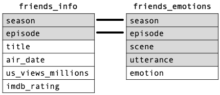
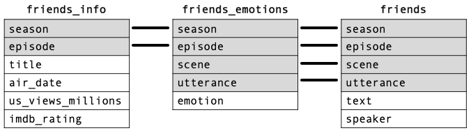
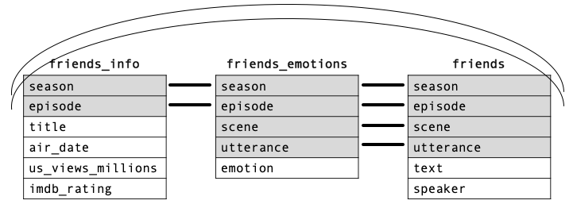

```{r setup, include=FALSE}
library(emo)
#library(icons)
library(kableExtra)
#library(betweenthepipes)
library(tidyverse)
library(showtext)
library(scales)
library(ggrepel)
library(friends)
library(palmerpenguins)
library(ggExtra)
options(knitr.kable.NA = '')
options(htmltools.dir.version = FALSE, htmltools.preserve.raw = FALSE)
knitr::opts_chunk$set(fig.retina = 3, 
                      warning = FALSE, 
                      message = FALSE,
                      fig.path = "figs/Lec6/")

font_add_google(name = "Open Sans",   # Name of the font on the Google Fonts site
                family = "open_sans")
font_add_google(name = "Source Serif Pro",   # Name of the font on the Google Fonts site
                family = "source_serif_pro")
showtext_auto()

cmu_theme <- function () { 
  theme_linedraw(base_size=11, base_family="source_serif_pro") %+replace% 
    theme(
      panel.background  = element_blank(),
      plot.background = element_rect(fill = "transparent", color = NA), 
      legend.background = element_rect(fill = "transparent", color = NA),
      legend.key = element_rect(fill = "transparent", color = NA),
      axis.ticks = element_blank(),
      panel.grid.major = element_line(color = "grey90", size = 0.3), 
      panel.grid.minor = element_blank(),
      plot.title = element_text(size = 18, hjust = 0, vjust = 0.5, face = "bold", margin = margin(b = 0.2, unit = "cm")),
      plot.subtitle = element_text(size = 12, hjust = 0, vjust = 0.5, margin = margin(b = 0.2, unit = "cm")),
      plot.caption = element_text(size = 7, hjust = 1, face = "italic", margin = margin(t = 0.1, unit = "cm")),
      axis.text.x = element_text(size = 13),
      axis.text.y = element_text(size = 13)
    )
}

friends <- friends
friends_info <- friends_info
friends_emotions <- friends_emotions

```

```{r xaringan-themer, include=FALSE, warning=FALSE}
library(xaringanthemer)

style_mono_accent(
  header_font_google = google_font("Open Sans"),
  text_font_google   = google_font("Source Serif Pro", "400", "400i"),
  code_font_google   = google_font("Roboto Mono"),
  link_color = "#bb0000",
  base_color = "#bb0000",
  extra_fonts = list(
    google_font("Lato")
  ),
  extra_css = list(
    ".title-slide h2" = list("font-family" = "Source Serif Pro"),
    ".title-slide h3" = list("font-family" = "Source Serif Pro")
  )
)
```

class: inverse, center, middle

# 36-315: Statistical Graphics and Visualization
## Lecture 6

Meghan Hall <br> Department of Statistics & Data Science <br> Carnegie Mellon University <br> June 4, 2021

---
layout: true
<div class="my-footer"><span>cmu-36315.netlify.app</span></div>
---

# From last time

<br>

.large[Line graphs]
<br>
.medium[Various techniques and considerations]

<br>

.large[Working with time]
<br>
.medium[`lubridate` package]

---

# Updates

.large[Homework]
<br>
.medium[due on Tuesday]
<br>
.medium[instructions!]

---

# Today

<br>

.large[Scatter plots]
<br>
.medium[Considerations, overplotting, line of best fit]

<br>

.large[Relational data]
<br>
.medium[Practicing joins with `dplyr`]

---

class: left

# Today's agenda

<br>

.large[

1. scatter plots

2. relational data

3. dealing with overplotting

4. bubble chart

]

---

class: left

# Today's agenda

<br>

.large[

1. **scatter plots**

2. relational data

3. dealing with overplotting

4. bubble chart

]

---

# The purpose of a scatter plot

<br>
<br>
.large[To study a relationship between two numeric variables]
<br>
.medium[can also view by a group (categorical variable)]
<br>
.medium[and sometimes with a third numeric variable]
<br>
<br>
--
<br>
.large[Line graphs (from Wednesday) are just a special kind of scatter plot]
<br>
.medium[with a chronological variable (or proxy of one) on the `x`]
<br>
.medium[and lines connecting the points to emphasize trends]

---

# Today's data

.center[]
<br>
<br>
.center[`friends_info`]<br>
.center[`friends_emotions`]<br>
.center[`friends`]<br>

---

# Questions to examine

<br>
<br>
.large[How does the relationship between viewers and IMDB rating look by:]
<br>
<br>
.medium[**season**]
<br>
<br>
.medium[predominant emotion of the episode]
<br>
<br>
.medium[focus character]
<br>

---

# Today's data

<br>
.center[`friends_info`]<br>

```{r head-1, echo = FALSE}
friends_info %>% 
  select(-c(directed_by:air_date)) %>% 
  head(10) %>% 
  kable("html") %>%
  kable_styling(font_size = 16, position = "center", full_width = F) %>%
  row_spec(0, bold = T, color = "white", background = "#bb0000")
```

---

# Basic scatter plot

```{r scatter-1, fig.align = "center", fig.height = 5}
friends_info %>% 
  ggplot(aes(x = us_views_millions, y = imdb_rating)) +
  geom_point()
```

---

# Basic scatter plot

```{r scatter-2, fig.align = "center", fig.height = 5}
friends_info %>% 
  ggplot(aes(x = us_views_millions, y = imdb_rating)) +
  geom_point(alpha = 0.5, color = "red", size = 2)
```

---

# Basic scatter plot

```{r scatter-3, fig.align = "center", fig.height = 5}
friends_info %>% 
  ggplot(aes(x = us_views_millions, y = imdb_rating)) +
  geom_jitter()
```

---

# Basic scatter plot

```{r scatter-4, fig.align = "center", fig.height = 5}
friends_info %>% 
  ggplot(aes(x = us_views_millions, y = imdb_rating, color = season)) +
  geom_jitter()
```

---

# Basic scatter plot

```{r scatter-5, fig.align = "center", fig.height = 4.5}
friends_info %>% 
  ggplot(aes(x = us_views_millions, y = imdb_rating, 
             color = as.character(season))) +
  geom_jitter()
```

---

# Basic scatter plot

```{r scatter-6, fig.align = "center", fig.height = 4.5}
friends_info %>% 
  ggplot(aes(x = us_views_millions, y = imdb_rating, color = season)) +
  geom_jitter(size = 2) +
  scale_colour_gradient(low = "#fafafa", high = "#191970", #<<
                        breaks = seq(1, 10, 1)) #<<
```

---

# Scatter plot with best-fit line

```{r scatter-7, fig.align = "center", fig.height = 5}
friends_info %>% 
  ggplot(aes(x = us_views_millions, y = imdb_rating)) +
  geom_jitter(size = 2) +
  geom_smooth(method = "lm") #<<
```

---

# Scatter plot with best-fit line

```{r scatter-8, fig.align = "center", fig.height = 5}
friends_info %>% 
  ggplot(aes(x = us_views_millions, y = imdb_rating)) +
  geom_jitter(size = 2) +
  geom_smooth(method = "lm", se = FALSE) #<<
```

---

# Scatter plot with best-fit line

```{r scatter-9, fig.align = "center", fig.height = 4.5}
friends_info %>% 
  ggplot(aes(x = us_views_millions, y = imdb_rating)) +
  geom_jitter(size = 2) +
  geom_smooth(method = "lm", level = 0.99, #<<
              color = "purple", fill = "#DCD0FF") #<<
```

---

# Questions to examine

<br>
<br>
.large[How does the relationship between viewers and IMDB rating look by:]
<br>
<br>
.medium[season]
<br>
<br>
.medium[**predominant emotion of the episode**]
<br>
<br>
.medium[focus character]
<br>

---

# Today's data

<br>
.center[`friends_emotions`]<br>

```{r head-2, echo = FALSE}
friends_emotions %>% 
  head(10) %>% 
  kable("html") %>%
  kable_styling(font_size = 16, position = "center", full_width = F) %>%
  row_spec(0, bold = T, color = "white", background = "#bb0000")
```

---

class: left

# Today's agenda

<br>

.large[

1. scatter plots

2. **relational data**

3. dealing with overplotting

4. bubble chart

]

---

# Relational data

<br>
<br>
.large[The collective term for multiple tables of (related) data]
<br>
.medium[can easily be combined thanks to *joins* (from `dplyr`)]
<br>
<br>
--
<br>
.large[**Mutating joins**: adds new variables (columns) to a data frame based on matching observations in another]
<br>
.medium[possible through *keys*: variables that uniquely identify observations]

---

# Today's data

.center.middle[]

---

# Today's data

<br>
.center[`friends_emotions`]<br>

```{r head-2, echo = FALSE}
```

---

# Data manipulation

```{r manip-1, eval = FALSE}
friends_joyful_sad <- friends_emotions %>% 
  group_by(season, episode, emotion) %>% #<<
  summarize(count = n()) %>% #<<
  add_count(wt = count) %>% 
  mutate(percent = count / n) %>% 
  filter(emotion %in% c("Joyful","Sad")) %>% 
  select(-c(count, n)) %>% 
  pivot_wider(names_from = emotion, values_from = percent) %>% 
  mutate(Sad = replace_na(Sad, 0))
```

---

# Data manipulation

```{r manip-2, echo = FALSE}
friends_emotions %>% 
  group_by(season, episode, emotion) %>% #<<
  summarize(count = n()) %>% #<<
  head(10) %>% 
  kable("html") %>%
  kable_styling(font_size = 16, position = "center", full_width = F) %>%
  row_spec(0, bold = T, color = "white", background = "#bb0000")
```

---

# Data manipulation

```{r manip-3, eval = FALSE}
friends_joyful_sad <- friends_emotions %>% 
  group_by(season, episode, emotion) %>% 
  summarize(count = n()) %>% 
  add_count(wt = count) %>% #<<
  mutate(percent = count / n) %>% #<<
  filter(emotion %in% c("Joyful","Sad")) %>% 
  select(-c(count, n)) %>% 
  pivot_wider(names_from = emotion, values_from = percent) %>% 
  mutate(Sad = replace_na(Sad, 0))
```

---

# Data manipulation

```{r manip-4, echo = FALSE}
friends_emotions %>% 
  group_by(season, episode, emotion) %>% #<<
  summarize(count = n()) %>% #<<
  add_count(wt = count) %>% #<<
  mutate(percent = count / n) %>% #<<
  head(10) %>% 
  kable("html") %>%
  kable_styling(font_size = 16, position = "center", full_width = F) %>%
  row_spec(0, bold = T, color = "white", background = "#bb0000")
```

---

# Data manipulation

```{r manip-5, eval = FALSE}
friends_joyful_sad <- friends_emotions %>% 
  group_by(season, episode, emotion) %>% 
  summarize(count = n()) %>% 
  add_count(wt = count) %>% 
  mutate(percent = count / n) %>% 
  filter(emotion %in% c("Joyful","Sad")) %>% #<<
  select(-c(count, n)) %>% #<<
  pivot_wider(names_from = emotion, values_from = percent) %>% 
  mutate(Sad = replace_na(Sad, 0))
```

---

# Data manipulation

```{r manip-6, echo = FALSE}
friends_emotions %>% 
  group_by(season, episode, emotion) %>% #<<
  summarize(count = n()) %>% #<<
  add_count(wt = count) %>% #<<
  mutate(percent = count / n) %>% #<<
  filter(emotion %in% c("Joyful","Sad")) %>% #<<
  select(-c(count, n)) %>%
  head(10) %>% 
  kable("html") %>%
  kable_styling(font_size = 16, position = "center", full_width = F) %>%
  row_spec(0, bold = T, color = "white", background = "#bb0000")
```

---

# Data manipulation

```{r manip-7, eval = FALSE}
friends_joyful_sad <- friends_emotions %>% 
  group_by(season, episode, emotion) %>% 
  summarize(count = n()) %>% 
  add_count(wt = count) %>% 
  mutate(percent = count / n) %>% 
  filter(emotion %in% c("Joyful","Sad")) %>%
  select(-c(count, n)) %>% 
  pivot_wider(names_from = emotion, values_from = percent) %>% #<<
  mutate(Sad = replace_na(Sad, 0))
```

---

# Data manipulation

```{r manip-8, echo = FALSE}
friends_emotions %>% 
  group_by(season, episode, emotion) %>% #<<
  summarize(count = n()) %>% #<<
  add_count(wt = count) %>% #<<
  mutate(percent = count / n) %>% #<<
  filter(emotion %in% c("Joyful","Sad")) %>% #<<
  select(-c(count, n)) %>%
  pivot_wider(names_from = emotion, values_from = percent) %>% #<<
  head(10) %>% 
  kable("html") %>%
  kable_styling(font_size = 16, position = "center", full_width = F) %>%
  row_spec(0, bold = T, color = "white", background = "#bb0000")
```

---

# Data manipulation

```{r manip-9, eval = TRUE}
friends_joyful_sad <- friends_emotions %>% 
  group_by(season, episode, emotion) %>% 
  summarize(count = n()) %>% 
  add_count(wt = count) %>% 
  mutate(percent = count / n) %>% 
  filter(emotion %in% c("Joyful","Sad")) %>%
  select(-c(count, n)) %>% 
  pivot_wider(names_from = emotion, values_from = percent) %>% 
  mutate(Sad = replace_na(Sad, 0)) #<<
```

---

# Data manipulation

```{r manip-10, echo = FALSE}
friends_emotions %>% 
  group_by(season, episode, emotion) %>% 
  summarize(count = n()) %>% 
  add_count(wt = count) %>% 
  mutate(percent = count / n) %>% 
  filter(emotion %in% c("Joyful","Sad")) %>% 
  select(-c(count, n)) %>%
  pivot_wider(names_from = emotion, values_from = percent) %>% 
  mutate(Sad = replace_na(Sad, 0)) %>% 
  head(10) %>% 
  kable("html") %>%
  kable_styling(font_size = 16, position = "center", full_width = F) %>%
  row_spec(0, bold = T, color = "white", background = "#bb0000")
```

---

# Joining data

```{r join-1, eval = FALSE}
friends_info %>% 
  left_join(friends_joyful_sad, by = c("episode","season"))
```

--

```{r join-2, echo = FALSE}
friends_info %>% 
  left_join(friends_joyful_sad, by = c("episode","season")) %>% 
  select(-c(directed_by:air_date)) %>% 
  head(5) %>% 
  kable("html") %>%
  kable_styling(font_size = 16, position = "center", full_width = F) %>%
  row_spec(0, bold = T, color = "white", background = "#bb0000")
```

---

# Basic scatter plot

```{r scatter-join-1, fig.align = "center", fig.height = 4.5}
friends_info %>% 
  left_join(friends_joyful_sad, by = c("episode","season")) %>% 
  filter(season <= 4) %>% 
  ggplot(aes(x = us_views_millions, y = imdb_rating, color = Joyful)) +
  geom_jitter()
```

---

# Basic scatter plot

```{r scatter-join-2, fig.align = "center", fig.height = 4}
friends_info %>% 
  left_join(friends_joyful_sad, by = c("episode","season")) %>% 
  filter(season <= 4) %>% 
  ggplot(aes(x = us_views_millions, y = imdb_rating, color = Joyful)) +
  geom_jitter() +
  scale_colour_gradient(low = "#fafafa", high = "#191970", 
                        breaks = seq(0.1, 0.4, 0.1))
```

---

# Basic scatter plot

```{r scatter-join-3, fig.align = "center", fig.height = 4}
friends_info %>% 
  left_join(friends_joyful_sad, by = c("episode","season")) %>% 
  filter(season <= 4) %>% 
  ggplot(aes(x = us_views_millions, y = imdb_rating, color = Sad)) +
  geom_jitter() +
  scale_colour_gradient(low = "#fafafa", high = "#191970", 
                        breaks = seq(0, 0.25, 0.05))
```

---

# Questions to examine

<br>
<br>
.large[How does the relationship between viewers and IMDB rating look by:]
<br>
<br>
.medium[season]
<br>
<br>
.medium[predominant emotion of the episode]
<br>
<br>
.medium[**focus character**]
<br>

---

# Today's data

<br>
.center[`friends`]<br>

```{r head-3, echo = FALSE}
friends %>% 
  head(6) %>% 
  kable("html") %>%
  kable_styling(font_size = 16, position = "center", full_width = F) %>%
  row_spec(0, bold = T, color = "white", background = "#bb0000")
```

---

# Today's data

.center.middle[]

---

# Today's data

.center.middle[]

---

# Data manipulation

```{r manip-11, eval = FALSE}
friends_top_actor <- friends %>% 
  group_by(season, episode, speaker) %>% #<<
  summarize(count = n()) %>% #<<
  add_count(wt = count) %>% #<<
  mutate(percent = count / n) %>% #<<
  filter(speaker %in% c("Chandler Bing","Joey Tribbiani",
                        "Monica Geller","Phoebe Buffay",
                        "Rachel Green","Ross Geller")) %>% 
  filter(percent == max(percent)) %>% 
  select(-c(count, n, percent))
```

---

# Data manipulation

```{r manip-12, echo = FALSE}
friends %>% 
  group_by(season, episode, speaker) %>% #<<
  summarize(count = n()) %>% #<<
  add_count(wt = count) %>% #<<
  mutate(percent = count / n) %>% #<<
  head(10) %>% 
  kable("html") %>%
  kable_styling(font_size = 16, position = "center", full_width = F) %>%
  row_spec(0, bold = T, color = "white", background = "#bb0000")
```

---

# Data manipulation

```{r manip-13, eval = TRUE}
friends_top_actor <- friends %>% 
  group_by(season, episode, speaker) %>% 
  summarize(count = n()) %>% 
  add_count(wt = count) %>% 
  mutate(percent = count / n) %>% 
  filter(speaker %in% c("Chandler Bing","Joey Tribbiani", #<<
                        "Monica Geller","Phoebe Buffay", #<<
                        "Rachel Green","Ross Geller")) %>% #<<
  filter(percent == max(percent)) %>% #<<
  select(-c(count, n, percent))
```

---

# Data manipulation

```{r manip-14, echo = FALSE}
friends %>% 
  group_by(season, episode, speaker) %>% #<<
  summarize(count = n()) %>% #<<
  add_count(wt = count) %>% #<<
  mutate(percent = count / n) %>% #<<
  filter(speaker %in% c("Chandler Bing","Joey Tribbiani","Monica Geller", #<<
                        "Phoebe Buffay","Rachel Green","Ross Geller")) %>% #<<
  filter(percent == max(percent)) %>% #<<
  head(10) %>% 
  kable("html") %>%
  kable_styling(font_size = 16, position = "center", full_width = F) %>%
  row_spec(0, bold = T, color = "white", background = "#bb0000")
```

---

# Joining data

```{r join-3, eval = FALSE}
friends_info %>% 
  left_join(friends_top_actor, by = c("episode","season")) %>% 
```

--

```{r join-4, echo = FALSE}
friends_info %>% 
  left_join(friends_top_actor, by = c("episode","season")) %>% 
  select(-c(directed_by:air_date)) %>% 
  head(5) %>% 
  kable("html") %>%
  kable_styling(font_size = 16, position = "center", full_width = F) %>%
  row_spec(0, bold = T, color = "white", background = "#bb0000")
```

---

# Basic scatter plot

```{r scatter-join-4, fig.align = "center", fig.height = 4.5}
friends_info %>% 
  left_join(friends_top_actor, by = c("episode","season")) %>% 
  ggplot(aes(x = us_views_millions, y = imdb_rating, color = speaker)) +
  geom_jitter(size = 2)
```

---

class: left

# Today's agenda

<br>

.large[

1. scatter plots

2. relational data

3. **dealing with overplotting**

4. bubble chart

]

---

# Overplotting

.large[When the sample size is large, *overplotting* can disguise trends]
<br>
<br>
.large[Techniques:]
<br>
.medium[use smaller dots and/or transparency]<br>
<br>
.medium[add color by group]<br>
<br>
.medium[add jittering]<br>
<br>
--
.medium[add a rug plot]

---

# Overplotting

```{r overplot-1, fig.align = "center", fig.height = 5}
txhousing %>% 
  filter(month == 1 & listings < 20000) %>% 
  ggplot(aes(x = median, y = listings)) +
  geom_point()
```

---

# Overplotting

```{r overplot-2, fig.align = "center", fig.height = 4.5}
txhousing %>% 
  filter(month == 1 & listings < 20000) %>% 
  ggplot(aes(x = median, y = listings)) +
  geom_point() +
  geom_rug(color = "purple", alpha = 0.1, size = 2)
```

---

# Overplotting

.large[When the sample size is large, *overplotting* can disguise trends]
<br>
<br>
.large[Techniques:]
<br>
.medium[use smaller dots and/or transparency]<br>
<br>
.medium[add color by group]<br>
<br>
.medium[add jittering]<br>
<br>
.medium[add a rug plot]<br>
<br>
.medium[add a marginal distribution]<br>

---

# Overplotting

```{r overplot-3, echo = FALSE, fig.align = "center", fig.height = 6.5}
p <- txhousing %>% 
  filter(month == 1 & listings < 20000) %>% 
  ggplot(aes(x = median, y = listings)) +
  geom_point()
  
ggMarginal(p, type = "histogram")
```

---

# Overplotting

.large[When the sample size is large, *overplotting* can disguise trends]
<br>
<br>
.large[Techniques:]
<br>
.medium[use smaller dots and/or transparency]<br>
<br>
.medium[add color by group]<br>
<br>
.medium[add jittering]<br>
<br>
.medium[add a rug plot]<br>
<br>
.medium[add a marginal distribution]<br>
<br>
.medium[create a hexbin]<br>

---

# Overplotting

```{r overplot-4, fig.align = "center", fig.height = 5}
txhousing %>% 
  filter(month == 1 & listings < 20000) %>% 
  ggplot(aes(x = median, y = listings)) +
  geom_hex(bins = 30)
```

---

# Overplotting

```{r overplot-5, fig.align = "center", fig.height = 5.5}
storms %>% 
  ggplot(aes(x = wind, y = pressure)) +
  geom_hex(bins = 30)
```

---

class: left

# Today's agenda

<br>

.large[

1. scatter plots

2. relational data

3. dealing with overplotting

4. **bubble chart**

]

---

# Bubble chart

<br>
.large[Adding a third quant. variable to size]<br>
<br>
.large[Not generally recommended!]<br>
<br>
.large[Why?]<br>
<br>
--
- .medium[encoding the same type of variable (numeric) on two different scales: position and size]<br>
--
- .medium[hard to compare the strengths of different associations]<br>
--
- .medium[much easier to perceive differences when encoded by position rather than size]<br>
--
- .medium[hard to see small differences in size]<br>
--
- .medium[difficult to match scale of circle size to scale of difference]<br>

---

# Bubble chart

```{r bubble-1, fig.align = "center", fig.height = 5}
penguins %>% 
  filter(species != "Gentoo") %>% 
  ggplot(aes(x = flipper_length_mm, y = body_mass_g)) +
  geom_point()
```

---

# Bubble chart

```{r bubble-2, fig.align = "center", fig.height = 4.5}
penguins %>% 
  filter(species != "Gentoo") %>% 
  ggplot(aes(x = flipper_length_mm, y = body_mass_g, 
             size = bill_length_mm)) +
  geom_point()
```

---

# Bubble chart

```{r bubble-3, fig.align = "center", fig.height = 4}
penguins %>% 
  filter(species != "Gentoo") %>% 
  ggplot(aes(x = flipper_length_mm, y = body_mass_g, 
             size = bill_length_mm)) +
  geom_point(alpha = 0.5, color = "red") +
  scale_size(range = c(0.1, 7), breaks = c(35, 40, 45, 50, 55)) +
  theme(legend.position = "top")
```

---

# Bubble chart

```{r bubble-4, eval = FALSE}
penguins %>% 
  filter(species != "Gentoo") %>% 
  mutate(label = case_when(flipper_length_mm == 192 & 
                             body_mass_g == 2700 ~ "Chinstrap",
                           flipper_length_mm == 184 & 
                             body_mass_g == 4650 ~ "Adelie")) %>% 
  ggplot(aes(x = flipper_length_mm, y = body_mass_g, 
             size = bill_length_mm, color = species)) + #<<
  geom_point(alpha = 0.5) +
  scale_size(range = c(0.1, 7), breaks = c(35, 40, 45, 50, 55), 
             name = "Bill Length (mm)") +
  geom_label_repel(aes(x = flipper_length_mm, y = body_mass_g, 
                       color = species, label = label), 
                   inherit.aes = FALSE) +
  scale_color_discrete(guide = "none") +
  theme(legend.position = "top")
```

---

# Bubble chart

```{r bubble-4, echo = FALSE, fig.align = "center", fig.height = 6.5}
```


---

# Upcoming

<br>

.large[Graphic critique due before midterm]
<br>
.medium[Details on syllabus]

<br>

.large[Homework 2 due Tuesday June 8]

<br>

.large[Lecture 7 on Monday June 7]

