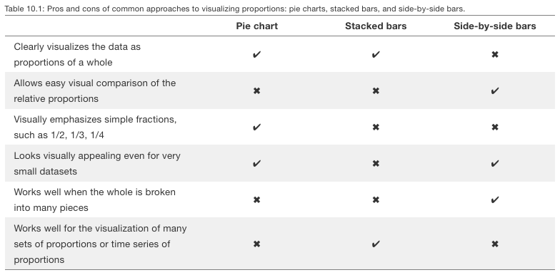
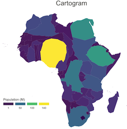

```{r setup, include=FALSE}
library(emo)
#library(icons)
library(kableExtra)
#library(betweenthepipes)
library(tidyverse)
library(showtext)
library(scales)
library(palmerpenguins)
library(statebins)
library(maps)
library(ggridges)
library(lubridate)

options(knitr.kable.NA = '')
options(htmltools.dir.version = FALSE, htmltools.preserve.raw = FALSE)
knitr::opts_chunk$set(fig.retina = 3, 
                      warning = FALSE, 
                      message = FALSE,
                      fig.path = "figs/Lec7/")

font_add_google(name = "Open Sans",   # Name of the font on the Google Fonts site
                family = "open_sans")
font_add_google(name = "Source Serif Pro",   # Name of the font on the Google Fonts site
                family = "source_serif_pro")
showtext_auto()

cmu_theme <- function () { 
  theme_linedraw(base_size=11, base_family="source_serif_pro") %+replace% 
    theme(
      panel.background  = element_blank(),
      plot.background = element_rect(fill = "transparent", color = NA), 
      legend.background = element_rect(fill = "transparent", color = NA),
      legend.key = element_rect(fill = "transparent", color = NA),
      axis.ticks = element_blank(),
      panel.grid.major = element_line(color = "grey90", size = 0.3), 
      panel.grid.minor = element_blank(),
      plot.title = element_text(size = 18, hjust = 0, vjust = 0.5, face = "bold", margin = margin(b = 0.2, unit = "cm")),
      plot.subtitle = element_text(size = 12, hjust = 0, vjust = 0.5, margin = margin(b = 0.2, unit = "cm")),
      plot.caption = element_text(size = 7, hjust = 1, face = "italic", margin = margin(t = 0.1, unit = "cm")),
      axis.text.x = element_text(size = 13),
      axis.text.y = element_text(size = 13)
    )
}

tx_data <- read_csv("https://raw.githubusercontent.com/meghall06/CMU-36-315-site/main/data/alldata.csv")

computer <- tribble(
  ~"y", ~"x", ~"temp",
  #--|--|----
  1, 1, 93,
  1, 2, 92,
  1, 3, 93,
  1, 4, 94,
  1, 5, 92,
  2, 1, 83,
  2, 2, 85,
  2, 3, 88,
  2, 4, 89,
  2, 5, 88,
  3, 1, 85,
  3, 2, 86,
  3, 3, 87,
  3, 4, 86,
  3, 5, 87,
  4, 1, 83,
  4, 2, 84,
  4, 3, 85,
  4, 4, 84,
  4, 5, 85,
)

```

```{r xaringan-themer, include=FALSE, warning=FALSE}
library(xaringanthemer)

style_mono_accent(
  header_font_google = google_font("Open Sans"),
  text_font_google   = google_font("Source Serif Pro", "400", "400i"),
  code_font_google   = google_font("Roboto Mono"),
  link_color = "#bb0000",
  base_color = "#bb0000",
  extra_fonts = list(
    google_font("Lato")
  ),
  extra_css = list(
    ".title-slide h2" = list("font-family" = "Source Serif Pro"),
    ".title-slide h3" = list("font-family" = "Source Serif Pro")
  )
)
```

class: inverse, center, middle

# 36-315: Statistical Graphics and Visualization
## Lecture 7

Meghan Hall <br> Department of Statistics & Data Science <br> Carnegie Mellon University <br> June 7, 2021

---
layout: true
<div class="my-footer"><span>cmu-36315.netlify.app</span></div>
---

# From last time

<br>

.large[Scatter plots]
<br>
.medium[Considerations, overplotting, line of best fit]

<br>

.large[Relational data]
<br>
.medium[Practicing joins with `dplyr`]

---

# Updates

<br>
.large[Homework]
<br>
.medium[due tomorrow!]
<br>
<br>
<br>
.large[Lab 5 tomorrow]
<br>
<br>
<br>
.large[Schedule going forward]

---

# Today

<br>

.large[Grab bag!]
<br>
.medium[maps, pie charts, heat maps]

<br>

.large[Data manipulation]
<br>
.medium[aggregating, joining, pivoting]

---

class: left

# Today's agenda

<br>

.large[

1. heat maps

2. dot plots

3. pie charts & parts of a whole

4. maps

]

---

# Today's data

<br>
<br>
<br>
.center[`tx_housing`]<br>
.center[`lincoln_weather`]<br>
.center[`storms`]<br>
.center[`penguins`]<br>
.center[`tx_data`]<br>
.center[`us_rent_income`]<br>

---

class: left

# Today's agenda

<br>

.large[

1. **heat maps**

2. dot plots

3. pie charts & parts of a whole

4. maps

]

---

# Heat maps

<br>
<br>
.large[Mapping data values onto color]
<br>
<br>
--
<br>
.large[Can be difficult to determine exact values]
<br>
.medium[but very useful for identifying broader trends]
<br>
<br>
--
<br>
.large[Order data in a way that's useful for your data/question]
<br>
.medium[if ordering is appropriate]
<br>
<br>
--
<br>
.large[Can also be used for chronological/time series data]

---

# Heat maps

```{r laptop, fig.align = "center", fig.height = 6.5, echo = FALSE}
computer %>% 
  ggplot(aes(x = x, y = -y, fill = temp)) +
  geom_tile() +
  scale_fill_gradient(low = "orange", high = "dark red",
                      breaks = seq(84, 94, 2),
                      name = " °F") +
  labs(title = "Temperature of the underside of my laptop",
      subtitle = "While knitting a large .Rmd file",
      x = "x",
      y = "y") +
  theme(axis.text = element_blank(),
        axis.ticks = element_blank()) +
  coord_cartesian(expand = FALSE)
```

---

# Today's data

<br>
.center[`txhousing`]<br>

```{r head-1, echo = FALSE}
txhousing %>% 
  head(5) %>% 
  kable("html") %>%
  kable_styling(font_size = 16, position = "center", full_width = F) %>%
  row_spec(0, bold = T, color = "white", background = "#bb0000")
```

--
<br>
<br>
.center[**how has the median listing price changed over time in Texas cities?**]

---

# Aggregating data

**two methods, depending on needs**

```{r agg-1, eval = FALSE}
txhousing %>% 
  group_by(city, year) %>% 
  summarize(mean_price = mean(median, na.rm = TRUE))
```

--

```{r agg-2, echo = FALSE}
txhousing %>% 
  group_by(city, year) %>% 
  summarize(mean_price = mean(median, na.rm = TRUE)) %>% 
  head(5) %>% 
  kable("html") %>%
  kable_styling(font_size = 16, position = "center", full_width = F) %>%
  row_spec(0, bold = T, color = "white", background = "#bb0000")
```

---

# Aggregating data

**two methods, depending on needs**

```{r agg-3, eval = FALSE}
txhousing %>% 
  group_by(city, year) %>% 
  mutate(mean_price = mean(median, na.rm = TRUE))
```

--

```{r agg-4, echo = FALSE}
txhousing %>% 
  group_by(city, year) %>% 
  mutate(mean_price = mean(median, na.rm = TRUE)) %>% 
  head(5) %>% 
  kable("html") %>%
  kable_styling(font_size = 16, position = "center", full_width = F) %>%
  row_spec(0, bold = T, color = "white", background = "#bb0000")
```

---

# Heat maps

```{r eval, echo = FALSE}
txhousing_mean <- txhousing %>% 
  group_by(city, year) %>% 
  summarize(mean_price = mean(median, na.rm = TRUE))

top_2015 <- txhousing_mean %>% 
  filter(year == 2015) %>% 
  ungroup() %>% 
  mutate(rank_2015 = rank(mean_price)) %>% 
  select(city, rank_2015)

txhousing_plot <- txhousing_mean %>% 
  anti_join(txhousing_mean %>% 
              filter(is.na(mean_price)) %>% 
              count(city), by = "city") %>% 
  left_join(top_2015, by = "city")
```

```{r heat-1, eval = FALSE}
txhousing_plot %>% 
  ggplot(aes(x = year, y = city, fill = mean_price)) +
  geom_tile()
```

--

```{r heat-1, echo = FALSE, fig.align = "center", fig.height = 5}
```

---

# Heat maps

```{r heat-2, eval = FALSE}
txhousing_plot %>% 
  ggplot(aes(x = year, y = reorder(city, rank_2015), #<< 
             fill = mean_price)) +
  geom_tile() +
  scale_fill_gradient(low = "#fafafa", high = "#191970", #<<
                      labels = dollar, name = "") #<<
```

--

```{r heat-2, echo = FALSE, fig.align = "center", fig.height = 4.25}
```

---

# Heat maps

```{r heat-3, eval = FALSE}
txhousing_plot %>% 
  ggplot(aes(x = year, y = reorder(city, rank_2015), 
             fill = mean_price)) +
  geom_tile() +
  scale_fill_gradient(low = "#fafafa", high = "#191970",
                      labels = dollar, name = "") +
  coord_cartesian(expand = FALSE) + #<<
  labs(title = "Listings Price in Texas Cities") +
  theme(axis.ticks = element_blank(),
        axis.title = element_blank()) 
```

---

# Heat maps

```{r heat-3, echo = FALSE, fig.align = "center", fig.height = 6.5}
```

---

# Today's data

<br>
.center[`lincoln_weather`]<br>

```{r head-2, echo = FALSE}
lincoln_weather %>% 
  select(CST, `Max Temperature [F]`) %>% 
  head(5) %>% 
  kable("html") %>%
  kable_styling(font_size = 16, position = "center", full_width = F) %>%
  row_spec(0, bold = T, color = "white", background = "#bb0000")
```

--
<br>
<br>
.center[**how did the max temperature change by day and month?**]

---

# Practice with `lubridate`

```{r date-1, eval = FALSE}
lincoln_weather %>% 
  select(CST, temp = `Max Temperature [F]`) %>% 
  mutate(date = ymd(CST), 
         month = month(date), 
         day = day(date))
```

--

```{r date-2, echo = FALSE}
lincoln_weather %>% 
  select(CST, temp = `Max Temperature [F]`) %>% 
  mutate(date = ymd(CST), 
         month = month(date), 
         day = day(date)) %>% 
  head(5) %>% 
  kable("html") %>%
  kable_styling(font_size = 16, position = "center", full_width = F) %>%
  row_spec(0, bold = T, color = "white", background = "#bb0000")
```

---

# Heat maps

```{r heat-4, eval = FALSE}
lincoln_weather %>% 
  select(CST, temp = `Max Temperature [F]`) %>% 
  mutate(date = ymd(CST), 
         month = month(date), 
         day = day(date)) %>% 
  ggplot(aes(x = month, y = day, fill = temp)) +
  geom_tile(color = "white") #<<
```

---

# Heat maps

```{r heat-4, echo = FALSE, fig.align = "center", fig.height = 6.5}
```

---

# Heat maps

```{r heat-5, eval = FALSE}
lincoln_weather %>% 
  select(CST, temp = `Max Temperature [F]`) %>% 
  mutate(date = ymd(CST), 
         month = month(date), 
         day = day(date)) %>% 
  ggplot(aes(x = month, y = day, fill = temp)) +
  geom_tile(color = "white") +
  scale_y_continuous(trans = "reverse", #<<
                     breaks = seq(1, 31, 5)) + #<<
  scale_x_continuous(breaks = seq(1, 12, 1)) #<<
```

---

# Heat maps

```{r heat-5, echo = FALSE, fig.align = "center", fig.height = 6.5}
```

---

# Heat maps

```{r heat-6, eval = FALSE}
lincoln_weather %>% 
  select(CST, temp = `Max Temperature [F]`) %>% 
  mutate(date = ymd(CST), 
         month = month(date), 
         day = day(date)) %>% 
  ggplot(aes(x = month, y = day, fill = temp)) +
  geom_tile(color = "white") +
  scale_y_continuous(trans = "reverse", 
                     breaks = seq(1, 31, 5)) + 
  scale_x_continuous(breaks = seq(1, 12, 1)) +
  labs(title = "Max Temp in Lincoln, NE in 2016") + #<<
  scale_fill_gradient(low = "blue", high = "yellow", #<<
                      breaks = seq(20, 90, 10), #<<
                      name = " °F") + #<<
  theme(axis.ticks = element_blank()) + #<<
  coord_cartesian(expand = FALSE) #<<
```

---

# Heat maps

```{r heat-6, echo = FALSE, fig.align = "center", fig.height = 6.5}
```

---

class: left

# Today's agenda

<br>

.large[

1. heat maps

2. **dot plots**

3. pie charts & parts of a whole

4. maps

]

---

# Dot plots

<br>
<br>
.large[Combines the advantages of a **lollipop chart**]
<br>
.medium[narrow profile means you can show a variable with many values]
<br>
.medium[dots draw the eye to the end point, making for useful comparisons]
<br>
<br>
--
<br>
.large[With the benefits of encoding data by position]
<br>
.medium[axis doesn't need to start at zero]
<br>
.medium[useful when zero isn't particularly relevant to your data]
<br>
<br>
--
<br>
.large[Values must be ordered for this to be effective]

---

# Today's data

<br>
.center[`storms`]<br>

```{r head-3, echo = FALSE}
storms %>% 
  select(-c(ts_diameter, hu_diameter)) %>% 
  head(5) %>% 
  kable("html") %>%
  kable_styling(font_size = 16, position = "center", full_width = F) %>%
  row_spec(0, bold = T, color = "white", background = "#bb0000")
```

--
<br>
<br>
.center[**what's the max wind speed of each hurricane from 2011 onward?**]

---

# Dot plots

```{r dot-1, eval = FALSE}
storms_agg <- storms %>% 
  filter(status == "hurricane" & year >= 2011) %>% 
  group_by(name, year) %>% 
  summarize(max_wind = max(wind))
```

--

```{r dot-2, echo = FALSE}
storms %>% 
  filter(status == "hurricane" & year >= 2011) %>% 
  group_by(name, year) %>% 
  summarize(max_wind = max(wind)) %>% 
  head(5) %>% 
  kable("html") %>%
  kable_styling(font_size = 16, position = "center", full_width = F) %>%
  row_spec(0, bold = T, color = "white", background = "#bb0000")
```

---

# Dot plots

```{r dot-3, eval = TRUE}
storms_agg <- storms %>% 
  filter(status == "hurricane" & year >= 2011) %>% 
  group_by(name, year) %>% 
  summarize(max_wind = max(wind)) %>% 
  mutate(name_date = paste0(name, " (", year, ")"), #<<
         wind_mph = max_wind * 1.151) #<<
```

--

```{r dot-4, echo = FALSE}
storms %>% 
  filter(status == "hurricane" & year >= 2011) %>% 
  group_by(name, year) %>% 
  summarize(max_wind = max(wind)) %>% 
  mutate(name_date = paste0(name, " (", year, ")"),
         wind_mph = max_wind * 1.151) %>% 
  head(5) %>% 
  kable("html") %>%
  kable_styling(font_size = 16, position = "center", full_width = F) %>%
  row_spec(0, bold = T, color = "white", background = "#bb0000")
```

---

# Dot plots

```{r dot-5, eval = FALSE}
storms_agg %>% 
  ggplot(aes(x = wind_mph, y = reorder(name_date, wind_mph))) + #<<
  geom_point(color = "dark blue", size = 2) +
  labs(x = "Max Wind Speed (mph)", y = "",
       title = "Max wind speed of hurricanes, 2011 to 2015")
```

--

```{r dot-5, echo = FALSE, fig.align = "center", fig.height = 4.5}
```

---

class: left

# Today's agenda

<br>

.large[

1. heat maps

2. dot plots

3. **pie charts & parts of a whole**

4. maps

]

---

# Parts of a whole

.center[]
.right[*Fundamentals of Data Visualization*, Claus Wilke]

---

# Pie charts

<br>
.large[Use with caution!]
<br>
<br>
--
<br>
.large[**Only when parts add up to 100%**]
<br>
<br>
--
<br>
.large[Only when number of categories is small]
<br>
.medium[otherwise too difficult to determine differences]
<br>
<br>
--
<br>
.large[Never show multiple pie charts over time]
<br>
.medium[generally another viz type would be better]

---

# Today's data

<br>
.center[`penguins`]<br>

```{r head-4, echo = FALSE}
penguins %>% 
  head(5) %>% 
  kable("html") %>%
  kable_styling(font_size = 16, position = "center", full_width = F) %>%
  row_spec(0, bold = T, color = "white", background = "#bb0000")
```

--
<br>
<br>
.center[**how many penguin species are represented in this data?**]

---

# Pie charts

```{r pie-1, eval = FALSE}
penguins %>% 
  count(species) %>% 
  ggplot(aes(x="", y = n, fill = species)) +
  geom_bar(stat = "identity", width = 1, color = "black") + #<<
  coord_polar("y", start = 0) #<<
```

--

```{r pie-1, echo = FALSE, fig.align = "center", fig.height = 4.5}
```

---

# Pie charts

```{r pie-2, eval = FALSE}
penguins %>% 
  count(species) %>% 
  ggplot(aes(x="", y = n, fill = species)) +
  geom_bar(stat = "identity", width = 1, color = "black") + 
  coord_polar("y", start = 0) +
  theme_void() #<<
```

--

```{r pie-2, echo = FALSE, fig.align = "center", fig.height = 4}
```

---

# Pie charts

```{r pie-3, eval = FALSE}
penguins %>% 
  count(species) %>% 
  mutate(label = paste0(species, "\nn = ", n)) %>% #<<
  ggplot(aes(x="", y = n, fill = species)) +
  geom_bar(stat = "identity", width = 1, color = "black") + 
  coord_polar("y", start = 0) +
  geom_text(aes(label = label), 
            position = position_stack(vjust = 0.5)) + 
  theme_void() 
```

--

```{r pie-4, echo = FALSE}
penguins %>% 
  count(species) %>% 
  mutate(label = paste0(species, "\nn = ", n)) %>% 
  head(5) %>% 
  kable("html") %>%
  kable_styling(font_size = 16, position = "center", full_width = F) %>%
  row_spec(0, bold = T, color = "white", background = "#bb0000")
```

---

# Pie charts

```{r pie-5, eval = FALSE}
penguins %>% 
  count(species) %>% 
  mutate(label = paste0(species, "\nn = ", n)) %>% #<<
  ggplot(aes(x="", y = n, fill = species)) +
  geom_bar(stat = "identity", width = 1, color = "black") + 
  coord_polar("y", start = 0) +
  geom_text(aes(label = label), #<<
            position = position_stack(vjust = 0.5)) + #<<
  theme_void() 
```

---

# Pie charts

```{r pie-5, echo = FALSE, fig.align = "center", fig.height = 6.5}
```

---

# Pie charts

```{r pie-6, eval = FALSE}
penguins %>% 
  count(species) %>% 
  mutate(label = paste0(species, "\nn = ", n)) %>% 
  ggplot(aes(x="", y = n, fill = species)) +
  geom_bar(stat = "identity", width = 1, color = "black") + 
  coord_polar("y", start = 0) +
  scale_fill_manual(values = c("#496185","#965641","#D7B377")) + #<<
  geom_text(aes(label = label), 
            position = position_stack(vjust = 0.5)) + 
  labs(title = "The distribution of penguin species") + #<<
  theme_void() +
  theme(legend.position = "none", #<<
        plot.title = element_text(hjust = 0.5)) #<<
```

---

# Pie charts

```{r pie-6, echo = FALSE, fig.align = "center", fig.height = 6.5}
```

---

# Today's data

<br>
.center[`penguins`]<br>

```{r head-4, echo = FALSE}
```

--
<br>
<br>
.center[**how does the distribution of body mass differ by penguin?**]

---

# Comparing dist. to a whole

**standard distribution with `geom_density`**

```{r dist-1, echo = FALSE, fig.align = "center", fig.height = 6}
penguins %>% 
  ggplot(aes(x = body_mass_g)) +
  geom_density(fill = "#bb0000", alpha = 0.75) +
  theme(axis.text.y = element_blank(),
        axis.ticks.y = element_blank(),
        axis.title.y = element_blank())
```

---

# Comparing dist. to a whole

**distribution comparison with `facet_wrap`**

```{r dist-2, echo = FALSE, fig.align = "center", fig.height = 6}
penguins %>% 
  ggplot(aes(x = body_mass_g)) +
  geom_density(fill = "#bb0000", alpha = 0.75) +
  facet_wrap(~species) +
  theme(axis.text.y = element_blank(),
        axis.ticks.y = element_blank(),
        axis.title.y = element_blank())
```

---

# Comparing dist. to a whole

**distribution comparison with `geom_density`**

```{r dist-3, echo = FALSE, fig.align = "center", fig.height = 6}
penguins %>% 
  ggplot(aes(x = body_mass_g, fill = species)) +
  geom_density(alpha = 0.5) +
  theme(axis.text.y = element_blank(),
        axis.ticks.y = element_blank(),
        axis.title.y = element_blank())
```

---

# Comparing dist. to a whole

**distribution comparison with `ggridges`**

```{r dist-4, echo = FALSE, fig.align = "center", fig.height = 6}
penguins %>% 
  ggplot(aes(x = body_mass_g, y = species)) +
  geom_density_ridges(alpha = 0.5, fill = "#bb0000")
```

---

# Comparing dist. to a whole

```{r dist-5, eval = FALSE}
penguins %>% 
  ggplot(aes(x = body_mass_g, y = ..count..)) +
  geom_density_line(data = select(penguins, -species), #<<
                aes(fill = "all penguins"), color = "transparent") #<<
```

--

```{r dist-5, echo = FALSE, fig.align = "center", fig.height = 4}
```

---

# Comparing dist. to a whole

```{r dist-6, eval = FALSE}
penguins %>% 
  ggplot(aes(x = body_mass_g, y = ..count..)) +
  geom_density_line(data = select(penguins, -species), 
                aes(fill = "all penguins"), color = "transparent") +
  geom_density_line(aes(fill = "species"), color = "transparent") + #<<
  facet_wrap(~species, nrow = 1) #<<
```

--

```{r dist-6, echo = FALSE, fig.align = "center", fig.height = 4}
```

---

# Comparing dist. to a whole

```{r dist-7, eval = FALSE}
penguins %>% 
  ggplot(aes(x = body_mass_g, y = ..count..)) +
  geom_density_line(data = select(penguins, -species), 
                aes(fill = "all penguins"), color = "transparent") +
  geom_density_line(aes(fill = "species"), color = "transparent") +
  facet_wrap(~species, nrow = 1) +
  scale_fill_manual(values = c("grey","#0C8346"), name = NULL, #<<
                    guide = guide_legend(direction = "horizontal")) + #<<
  labs(x = "Body Mass (g)") + #<<
  theme(legend.position = "top") #<<
```

---

# Comparing dist. to a whole

```{r dist-7, echo = FALSE, fig.align = "center", fig.height = 6.5}
```

---

class: left

# Today's agenda

<br>

.large[

1. heat maps

2. dot plots

3. pie charts & parts of a whole

4. **maps**

]

---

# Maps

<br>
.large[Various methods to make maps with R/`ggplot2`]
<br>
.medium[an easy option is the `maps` package]
<br>
<br>
--
<br>
.large[Choropleths & cartograms]
<br>
<br>
--
<br>
.large[Be careful with continuous vs. discrete color scales]
<br>
.medium[continuous allows for more nuance but makes it hard to mark a specific value]
<br>
<br>
--
<br>
.large[For choropleth maps, watch out for areas drawing disproportionate attention due to their size]
<br>
.medium[counts are almost never appropriate]

---

# Choropleth maps

**use `map_data` from the `maps` package**

```{r map-1, eval = TRUE}
tx_map <- 
  map_data("county", region = "texas")
```

--

```{r map-2, echo = FALSE}
tx_map %>% 
  head(5) %>% 
  kable("html") %>%
  kable_styling(font_size = 16, position = "center", full_width = F) %>%
  row_spec(0, bold = T, color = "white", background = "#bb0000")
```

---

# Choropleth maps

```{r map-3, eval = FALSE}
tx_map %>% 
  ggplot(aes(x = long, y = lat, group = group)) +
  geom_polygon(fill = "gray", color = "white") +
  theme_void()
```

--

```{r map-3, echo = FALSE, fig.align = "center", fig.height = 5}
```

---

# Today's data

<br>
.center[`tx_data`]<br>

```{r head-5, echo = FALSE}
tx_data %>% 
  select(County, Age, Total, Total_Male, Total_Female, Hispanic_Total) %>% 
  filter(County != "STATE OF TEXAS") %>% 
  head(5) %>% 
  kable("html") %>%
  kable_styling(font_size = 16, position = "center", full_width = F) %>%
  row_spec(0, bold = T, color = "white", background = "#bb0000")
```

--
<br>
<br>
.center[**how does the share of Hispanic people vary by county?**]

---

# Choropleth map

```{r map-4, eval = TRUE, echo = TRUE}
tx_data_agg <- tx_data %>% 
  filter(Age == "All Ages" & County != "STATE OF TEXAS") %>% 
  mutate(hispanic_perc = Hispanic_Total / Total) %>% 
  select(County, hispanic_perc) %>% 
  mutate(county_lower = str_replace_all(County, " COUNTY", ""), #<<
         county_lower = str_to_lower(county_lower)) #<<
```

--

```{r map-5, echo = FALSE}
tx_data_agg %>% 
  head(5) %>% 
  kable("html") %>%
  kable_styling(font_size = 16, position = "center", full_width = F) %>%
  row_spec(0, bold = T, color = "white", background = "#bb0000")
```

---

# Choropleth map

```{r map-6, eval = TRUE, echo = TRUE}
tx_map <- tx_map %>%  
  left_join(tx_data_agg, by = c("subregion" = "county_lower"))
```

--

```{r map-7, echo = FALSE}
tx_map %>% 
  head(5) %>% 
  kable("html") %>%
  kable_styling(font_size = 16, position = "center", full_width = F) %>%
  row_spec(0, bold = T, color = "white", background = "#bb0000")
```

---

# Choropleth map

```{r map-8, eval = FALSE}
tx_map %>% 
  ggplot(aes(x = long, y = lat, group = group, fill = hispanic_perc)) +
  geom_polygon(color = "white")
```

--

```{r map-8, echo = FALSE, fig.align = "center", fig.height = 5}
```

---

# Choropleth map

```{r map-9, eval = FALSE}
tx_map %>% 
  ggplot(aes(x = long, y = lat, group = group, fill = hispanic_perc)) +
  geom_polygon(color = "white") +
  scale_fill_gradient(low = "#fafafa", high = "#191970", 
                      breaks = seq(0, 0.75, 0.25),
                      name = NULL, labels = percent)
```

--

```{r map-9, echo = FALSE, fig.align = "center", fig.height = 4.25}
```

---

# Choropleth map

```{r map-10, eval = FALSE}
tx_map %>% 
  ggplot(aes(x = long, y = lat, group = group, fill = hispanic_perc)) +
  geom_polygon(color = "white") +
  scale_fill_gradient(low = "#fafafa", high = "#191970", 
                      breaks = seq(0, 0.75, 0.25),
                      name = NULL, labels = percent) +
  labs(title = "Percentage of Hispanic people by county in Texas", 
       subtitle = "2019 population estimate") +
  theme_void() +
  theme(legend.position = c(0.2, 0.8))
```

---

# Choropleth map

```{r map-10, echo = FALSE, fig.align = "center", fig.height = 6.5}
```

---

# Choropleth map

**binning data for a discrete scale**

```{r map-11, eval = FALSE}
tx_map %>% 
  mutate(perc_bin = case_when(hispanic_perc >= 0.8 ~ "80-100%",
                              hispanic_perc >= 0.6 ~ "60-80%",
                              hispanic_perc >= 0.4 ~ "40-60%",
                              hispanic_perc >= 0.2 ~ "20-40%",
                              TRUE ~ "0-20%"))
```

--

```{r map-12, echo = FALSE}
tx_map %>% 
  mutate(perc_bin = case_when(hispanic_perc >= 0.8 ~ "80-100%",
                              hispanic_perc >= 0.6 ~ "60-80%",
                              hispanic_perc >= 0.4 ~ "40-60%",
                              hispanic_perc >= 0.2 ~ "20-40%",
                              TRUE ~ "0-20%")) %>%  
  head(5) %>% 
  kable("html") %>%
  kable_styling(font_size = 16, position = "center", full_width = F) %>%
  row_spec(0, bold = T, color = "white", background = "#bb0000")
```

---

# Choropleth map

```{r map-13, eval = FALSE}
tx_map %>% 
  mutate(perc_bin = case_when(hispanic_perc >= 0.8 ~ "80-100%",
                              hispanic_perc >= 0.6 ~ "60-80%",
                              hispanic_perc >= 0.4 ~ "40-60%",
                              hispanic_perc >= 0.2 ~ "20-40%",
                              TRUE ~ "0-20%")) %>% 
  ggplot(aes(x = long, y = lat, group = group, fill = perc_bin)) +
  geom_polygon(color = "white") +
  scale_fill_manual(values = c("#EEEEFB","#BDBDEF","#8C8CE3", #<<
                               "#4A4AD3","#191970"), #<<
                    name = NULL) + #<<
  labs(title = "Percentage of Hispanic people by county in Texas",
       subtitle = "2019 population estimate") +
  theme_void() +
  theme(legend.position = c(0.17, 0.8))
```

---

# Choropleth map

```{r map-13, echo = FALSE, fig.align = "center", fig.height = 6.5}
```

---

# Cartogram

<br>
.large[By definition:]
<br>
.medium[a map in which geographic size is altered to be directly proportional to a selected variable]
<br>
.medium[can be tricky to interpret]
<br>
<br>
--
.center[]
.center[*data-to-viz.com*]

---

# Cartogram

<br>
.large[By definition:]
<br>
.medium[a map in which geographic size is altered to be directly proportional to a selected variable]
<br>
.medium[can be tricky to interpret]
<br>
<br>
<br>
.large[Cartogram heatmap is a popular variation]
<br>
.medium[shows each state as a colored square]
<br>
.medium[doesn't weigh states by shape or size, though it equalizes population]
<br>
<br>
--
<br>
.large[Use the `statebins` package]

---

# Today's data

<br>
.center[`us_rent_income`]<br>

```{r head-6, echo = FALSE}
us_rent_income %>% 
  head(5) %>% 
  kable("html") %>%
  kable_styling(font_size = 16, position = "center", full_width = F) %>%
  row_spec(0, bold = T, color = "white", background = "#bb0000")
```

--
<br>
<br>
.center[**how does the mean rent price vary by state?**]

---

# Cartogram

```{r cart-1, eval = FALSE}
us_rent_income %>% 
  select(-c(moe)) %>% 
  pivot_wider(names_from = variable, values_from = estimate)
```

--

```{r cart-2, echo = FALSE}
us_rent_income %>% 
  select(-c(moe)) %>% 
  pivot_wider(names_from = variable, values_from = estimate) %>%  
  head(5) %>% 
  kable("html") %>%
  kable_styling(font_size = 16, position = "center", full_width = F) %>%
  row_spec(0, bold = T, color = "white", background = "#bb0000")
```

---

# Cartogram

```{r cart-3, eval = FALSE}
us_rent_income %>% 
  select(-c(moe)) %>% 
  pivot_wider(names_from = variable, values_from = estimate) %>% 
  mutate(rent_bin = cut(rent, breaks = c(-Inf, 800, 1000, 1200, Inf), 
                        labels = c("< $800","$800 - $1000",
                                   "$1000 - $1200","1200+")))
```

--

```{r cart-4, echo = FALSE}
us_rent_income %>% 
  select(-c(moe)) %>% 
  pivot_wider(names_from = variable, values_from = estimate) %>% 
  mutate(rent_bin = cut(rent, breaks = c(-Inf, 800, 1000, 1200, Inf), 
                        labels = c("< $800","$800 - $1000","$1000 - $1200","1200+"))) %>%  
  head(5) %>% 
  kable("html") %>%
  kable_styling(font_size = 16, position = "center", full_width = F) %>%
  row_spec(0, bold = T, color = "white", background = "#bb0000")
```

---

# Cartogram

```{r cart-5, eval = FALSE}
us_rent_income %>% 
  select(-c(moe)) %>% 
  pivot_wider(names_from = variable, values_from = estimate) %>% 
  mutate(rent_bin = cut(rent, breaks = c(-Inf, 800, 1000, 1200, Inf), 
                        labels = c("< $800","$800 - $1000",
                                   "$1000 - $1200","1200+"))) %>% 
  rename(state = NAME)
```

--

```{r cart-6, echo = FALSE}
us_rent_income %>% 
  select(-c(moe)) %>% 
  pivot_wider(names_from = variable, values_from = estimate) %>% 
  mutate(rent_bin = cut(rent, breaks = c(-Inf, 800, 1000, 1200, Inf), 
                        labels = c("< $800","$800 - $1000",
                                   "$1000 - $1200","1200+"))) %>%  
  rename(state = NAME) %>% 
  head(5) %>% 
  kable("html") %>%
  kable_styling(font_size = 16, position = "center", full_width = F) %>%
  row_spec(0, bold = T, color = "white", background = "#bb0000")
```

---

# Cartogram

```{r cart-7, eval = FALSE}
us_rent_income %>% 
  select(-c(moe)) %>% 
  pivot_wider(names_from = variable, values_from = estimate) %>% 
  mutate(rent_bin = cut(rent, breaks = c(-Inf, 800, 1000, 1200, Inf), 
                        labels = c("< $800","$800 - $1000",
                                   "$1000 - $1200","1200+"))) %>% 
  rename(state = NAME) %>% 
  statebins(value_col = "rent_bin", name = "Average Rent", #<<
            round = TRUE, # creates a square w/ rounded edges #<<
            ggplot2_scale_function = scale_fill_manual, #<<
            values = c("#EEEEFB","#BDBDEF","#4A4AD3","#191970")) + #<<
  labs(title = "Average Rent Per State (2017)") +
  theme_statebins()
```

---

# Cartogram

```{r cart-7, echo = FALSE, fig.align = "center", fig.height = 6.5}
```

---

# Upcoming

<br>

.large[Homework 2 due Tuesday June 8]

<br>

.large[Lab 5 due Wednesday June 8]

<br>

.large[Lecture 8 on Wednesday June 9]

